# 706青年空间媒体及介绍
 

## 机构介绍XX
 

706青年空间是国内第一家青年空间，位于北京市海淀区五道口华清嘉园15号楼2007室，通过组织学术、科技、文化、艺术、公益等不同领域的活动来促进青年的社群连接与自我启蒙。706聚集了来自全世界好玩有趣的年轻人，是大学的延伸和补足。706鼓励青年人勇敢走出去和将想法实现出来，解决社会问题，参与公共生活，实践公益和创意的项目，做一些不同的事情，不断产出好的项目和个人，以及让这些精彩的案例和故事广泛传播。
 

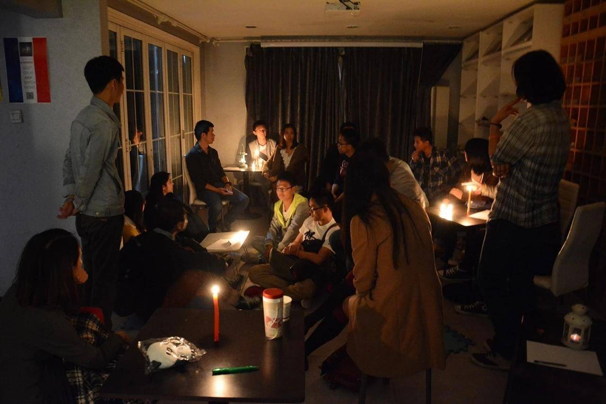
 

你是否想象过这样的场景？
 

在一个属于我们自己的温馨的空间，一群来自不同地域，不同专业背景，不同经历的温暖有趣的年轻人，无拘无束地讨论关于公益，音乐，电影，旅行，美食，创业，摄影等众多青年文化领域的不同观点，有人畅所欲言，有人认真聆听，互相学习，共同协作和创造，任何一个在工作和生活中遇到的问题，任何一个在脑袋里一闪而过的创新好玩的想法，在这里都可以分享并召集一小群志同道合的人，一起将想法变成行动。
 

 

为了给来自世界各地的青年人找到一个专属的交流平台，2012年参加完一个公益活动后，一群来自北邮，清华以及从国外留学回来的年轻人筹资在高校云集的北京五道口华清嘉园建立国内第一家青年空间，那个二居室公寓的房号是706。
 

成立以来，706青年空间作为一种新型组织形式受到社会广泛关注。新华社每日电讯文章评论706青年空间“青年一代寻求彼此之间更强的情感联系，需要一个社会性的场所分享成长经验进行情感交流。于是，一个古典意义上的东方‘士林’应运而生：706是精神的栖息地，也是梦想的暂安处。”在人民日报社举办的首届国家治理高峰论坛上，706被选为“慈善公益十佳”，人民论坛称706被推荐的理由是“在国内首创青年空间概念，也是最活跃和相对成熟的青年空间，所举办的青年活动辐射几十万青年人，成为北京十大线下活动主办方”。
 

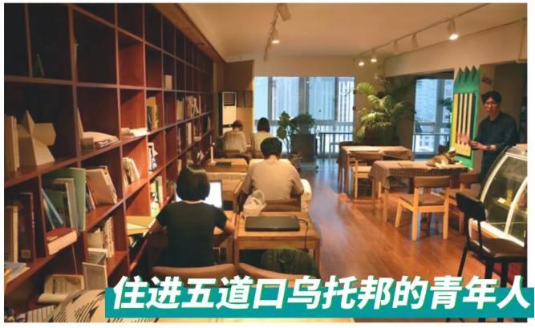
 

706希望呈现各种创新创意，生活方式，思想文化形态和价值观，创造一个让年轻人有能力有视野探索和实践属于自己独特的美好生活的空间，最终形成一个平等自治，有基本规则，公共对话原则，基本活动模式，鼓励公益与创意的微型的理想社会共同体，每个个体在这里成长并有所实践，探索生活的更多可能性。
 

至今，706青年空间共计举办了近2000场活动，发起了数十个公益与创意项目，有：给我三分钟，公益与创意沙龙，同道哲学读书会，苏格拉底式对话，女性主义交流，青年聚，同学社，绿色大学生论坛，田野调查，大学生公益共享计划，706客厅计划，五道口国际青年文化社区营造计划，706荒野计划，穿山甲志愿者乐园，公益图书馆等，共有超10万名年轻人来到空间参加活动。
 

教师，记者，学者，互联网从业者，修行者，画家，书法家，哲学家，作家，手艺人，独立音乐人，公益人，自由职业人，医务人员，公职人员，学生……全球各地各行各业热爱生活，怀抱理想和梦想，关心社会的年轻人，先后来到这里，分享阅历，学识，公益与创意。
 

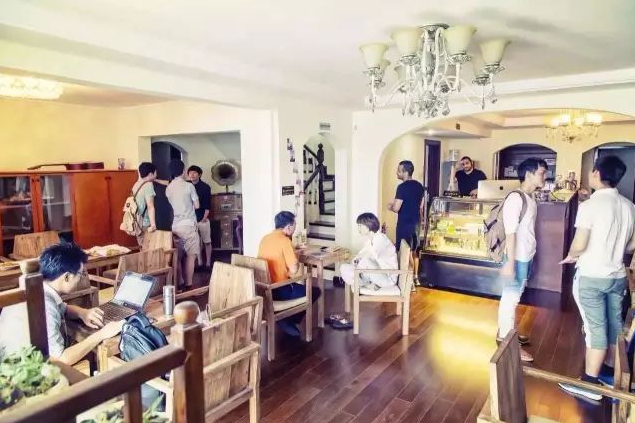
 

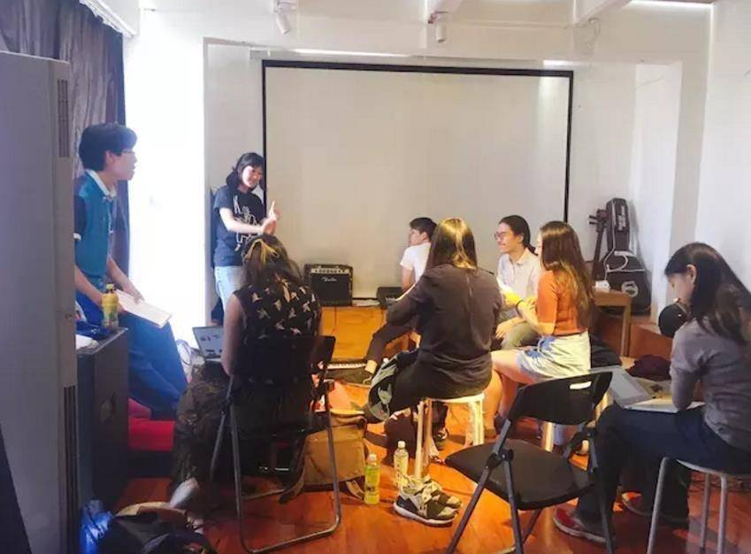
 

问及常来706的原因，有人说，“上大学的时候因为担心以后的工作压力，天天找实习，毕业工作了才发现我错过了大学各种公共生活的机会，参加公益，讨论文学的机会，现在希望来706得到补偿。我想试图在为了生存必须做的工作以外，还可以有自己的追求，有朋友，可以读读书，参加一些公益交流与实践，为我们身边有困难的人，为我们社会做些有意义的事。”
 

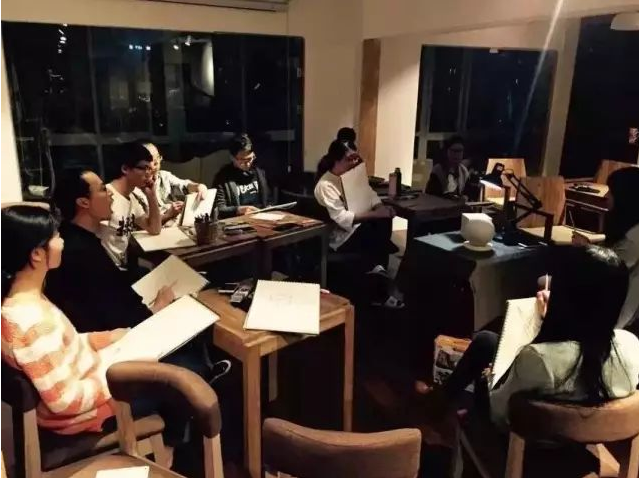
 

有人说，“在公司或社会，我接触的人往往是同一个圈子，思维方式差不多，而到706，每个人的职业生活方式和思维方式都是不一样的，一个理工科的，和一个学习艺术的，或社会学的，如果大家彼此有很强的互动，就可能会产生很多意想不到的有创造力的成果。”
 

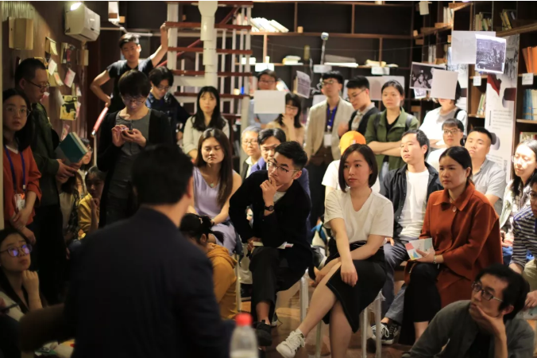
 

也有人说，“这个地方有些像美剧老友记里的那个公寓，总是热热闹闹人气旺盛；又有些像科学大爆炸里的那群人，喜欢谈些不那么现实不那么琐碎的事情；还有些像老版编辑部的故事里的那个编辑部，各种寻找着生活意义的年轻人来了又走走了又来。
 

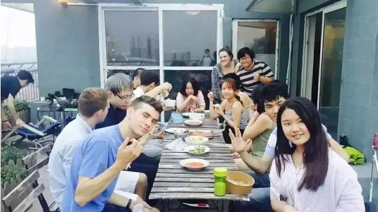
 

如何让年轻人更好地生活发展的问题，从古至今，人们从未停止过探索，从乌托邦到嬉皮士运动，从古希腊的犬儒主义到现今社会的得过且过的状态，都为我们打开了无数充满异质性和多样性的窗口和视角。每一个年代的青年人，都在为上一个年代没有完成的事情而努力。我们的不自由，将永远停留在过去的一代，而真正空前的自由世界，将由我们一代来完成。
 

706青年空间的存在，正是为了关注青年文化和青年发展，我们希望努力把有志于改变自己的你，有志于改变一代青年人的你，聚在一起，追逐我们自己的梦想，发出我们自己的声音，围绕社会公益的需要，我们青年人自身的需求，在中国绿发会专业公益指导下，共同营造一个“温度适宜、养料充足、孵化率高”的公益与创意的诞生与实践环境，如果你正在酝酿一个公益项目，却苦于无人协作；如果你想成立一个创意团队，却没有意中人选；那么，就来706吧！这里有你的拍档、有你的伯乐、有你的老师、还有你的队员……一个环保支教计划，一部反映城中村的纪录片，一次贵州乡村的田野调查，一个行为艺术，一个人文社科的读书会，...把一切有趣有益的想法创意在这里开始实践和创造。
 

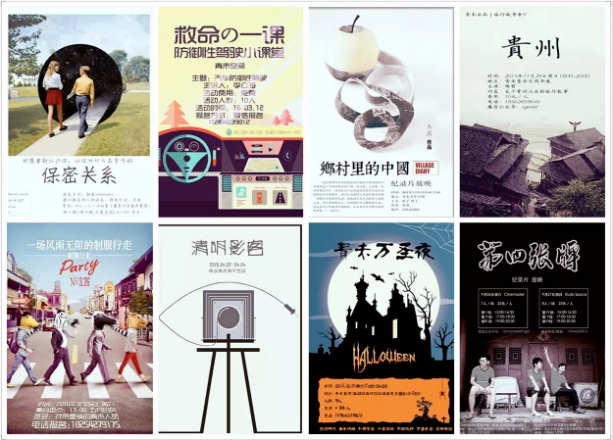
 

706青年空间最早位于北京市海淀区五道口华清嘉园，清华大学旁边。五道口被称为宇宙中心，周边环绕着北大、清华、北语、地大等八所高校，聚集了很多文化及创意类人才。华清嘉园最早为人所知是因为走出了校内网、饭否、美团、酷讯、抓虾、美丽说、酷我、一见等数百家互联网企业，这里也是周边高校清华北大老师的聚集地，同时居住着来自全世界100多个国家的国际留学生群体。
 

706青年空间目前已经从北京出发，散落到世界各个角落，北上广深，杭州 ，成都，南京，重庆，大理，泉州，纽约，旧金山，芝加哥，洛杉矶，波士顿，柏林，伦敦等等都可以看到706小伙伴的身影，活动，以及衍生的空间
 

## 机构的影响力
 

706从2012年初创到现在2020年持续8年，其中经历了理念价值观之争，管理模式，空间模式的探索期，也经历了商业化转型的失败，持续到现在2020年，706还走在探索的路上。
 

同时，706的品牌影响力也在逐年提升，在这么多年来，不仅邀请了各个领域的知名学者和老师，也和不同的社会文化机构合作，同时，也在众多媒体报道过，具体可以参考下面的信息：
 

### 来过706的部分嘉宾名单：
 

钱理群、秦晖、陈嘉映、罗振宇、汪永晨、张鸣、郭于华、信力健、方可成、杨朝辉、押沙龙、雷颐、马勇、杨汝清、老六、老狼、苗炜、史航、陈晓卿、土摩托、沈志华、余世存、周濂、刘苏里、许知远、加藤嘉一、查建英、梁晓燕、徐晓、郭于华、柳红、止庵、王俊秀、段永朝、胡泳、蓝方、宋轶、吴靖、王洪喆、王行坤、蒋洪生等等…
 

### **706曾经合作过的合作机构：**
 

广西师大出版社，理想国，同道读书会，东方历史评论，读库，政见，大象公会，暴风公益基金，好奇心日报，中国青年报等等
 

PEER, 美丽中国，为中国而教，万门大学，孤独的阅读者，自然之友，山水自然保护中心，南都基金会，壹基金，与人基金会，燕京里青年公寓，YOU+青年公寓等等
 

### **报道过706的媒体：**
 

关于706的媒体报道，从2014、2015年对公共对话和社会创新的关注，到2016年以纽约时报中文网，中国青年报冰点，NHK为代表的媒体，对生活实验室民主自治的关注；2017年，进入了媒体对706关注的低潮期。2018年开始，包括校园媒体、歌德学院、读库等新兴自媒体，好奇心日报、端传媒等非传统媒体、关注和报道706的焦点逐渐多样化。特定活动如五月风暴，最新生活实验室的自治实验如Minecraft共建空间；关注公共空间的衰落，以及对706与上阳台等艺术空间进行对比报道。
 

它们不仅仅反映了多年来706青年空间的翻覆变化，也折射出社会青年文化思潮的一次次的起伏波折。我们也期待，在19年之后的几年里，706青年空间能够突破媒体和大众对我们的想象和观察，以全新的面貌出现在大众眼中——“探索生活更多可能”。
 

~~北窗~~
 

报道时间：2014.05.12
 

报道机构：北窗
 

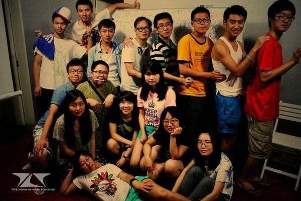
 

北窗 | 706：今天我们如何对话
 

[https://site.douban.com/143466/widget/notes/13331202/note/351247181/](https://site.douban.com/143466/widget/notes/13331202/note/351247181/)   豆瓣链接
 

“一代人有一代人的梦想和声音”，这个过去常用的口号强调的是青年通过自己创造舞台、向外争话语权的热血与干劲，当多种声音、多种价值都可以得到自由表达，即是在参与这个时代；而现在提得更多的“探索生活更多可能”，是通过内向的自省与提升，确立每一个个体独立人格必不可少的过程。而这向外与向内的两条路径，对于那个宏伟的愿景，其实是殊途同归。
 

### 社会创业家
 

报道时间：2015.02.09
 

报道机构：社会创业家
 

[706青年空间：年轻就是要折腾 | 社会创业家](https://mp.weixin.qq.com/s?__biz=MzU4NDU4NDEwMA==&mid=2247490190&amp;idx=1&amp;sn=c7aaec5ea9069ad740d1aab00b161f81&source=41#wechat_redirect)
 

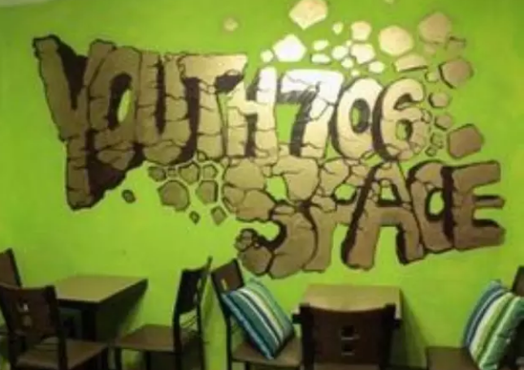
 

706青年空间对于邬方荣和程宝忠这一群年轻的创业者而言，正如邬方荣所说的，是“探索一种不同以往的创业模式”，这让706青年空间横跨了文化、商业、公益，成为社会创业中不同凡响的一个案例。
 

### 第一财经周刊
 

报道时间：2015.11.09
 

报道机构：第一财经周刊
 

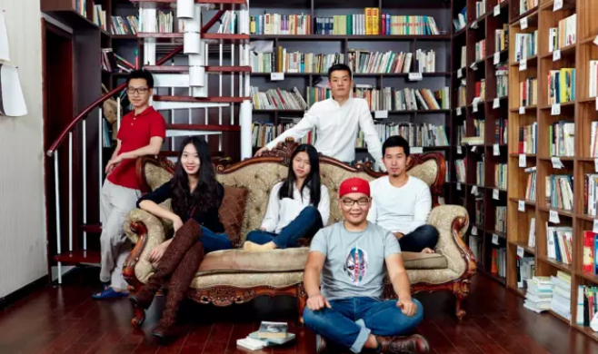
 

[新老友记：青年人共享居住的方式正在流行 | 第一财经周刊](https://mp.weixin.qq.com/s?__biz=MzU4NDU4NDEwMA==&mid=2247489928&amp;idx=1&amp;sn=af049df47c89b0a5ee2862810204fa1c&source=41#wechat_redirect)
 

几乎所有的长租公寓都留出了公共空间给租客们用来运动、娱乐和社交，像706青年空间一样，公寓设计者开始重视天台这类曾一度被忽视的空间。运营者们则想方设法地筹划各类活动，试图让租客与邻居、与公寓建立起一种更为亲密的感情。
 

### 新京报书评周刊
 

报道时间：2016.4.24
 

报道机构：新京报书评周刊
 

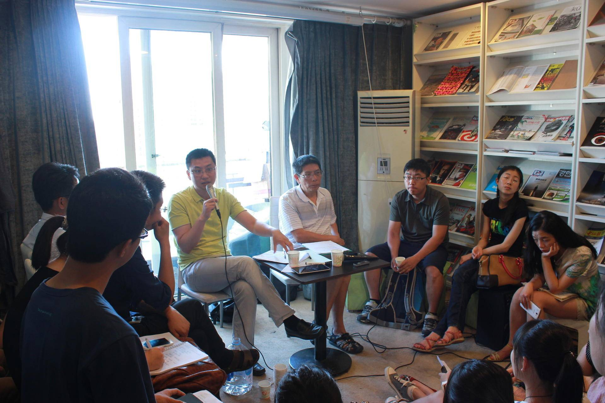
 

[逆行于时代的精神符号 | 公共读书会从孤岛进入平原](https://mp.weixin.qq.com/s/vZbiWs4-wWCjN0lXMAYWHw)
 

“这个公共空间是我们用力挤出来的”。“爱思想的青年”读书会创立者王大鹏说，言中所指正是706青年空间。2012年8月，爱思想读书会开始创办，至今已满79期。维持4年，他触摸到当代青年巨大的需求：年轻人需要一个空间去表达忧患意识和公共关怀。无处交流，便会有人沉于不痛快甚或痛苦的状态。而且，大多数青年有意愿在公共空间中交流。一个健全的社会应该有人在公共空间中发声。而公共空间与公民，当相互孵化。
 

### 中青报冰点周刊
 

报道时间：2016.4.28
 

报道机构：中青报冰点周刊
 

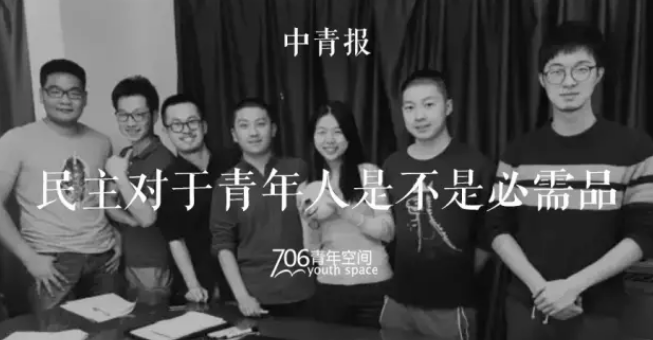
 

[群居生活的民主实验 | 生活实验室 · 中青报报道](https://mp.weixin.qq.com/s/ZrlLMH7Lt28UUwzn0WDv2A)
 

其实，袁满说他自己对民主也谈不上什么深刻认识。“我觉得‘民主’这个东西，你把它当做一个工具还好，但如果只是说概念就没多大意义了。”袁满说，“我期待的是在这里参与过一些公共事务的人会觉得这种方法挺好的，那他之后比如说做了老师，在遇到一些问题的时候也会用这样一种民主的方式来处理，那就很棒了。”
 

### 纽约时报中文网
 

报道时间：2016.6.30
 

报道机构：纽约时报中文网
 

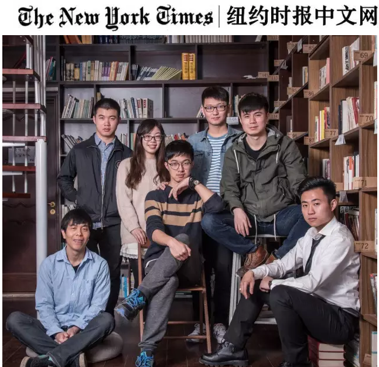
 

[北京青年玩儿自治：现实困境下的706 | 纽约时报中文网报道](https://mp.weixin.qq.com/s/CDfiPnksE2EwYnbNzAx07g)
 

“我之前从来没有听说过这样的组织，住在一起的人，真的像一个嬉皮士一样，订立一个公约，我们来一起遵守，我们来一起生活，说实话其实很共产主义。”
 

对于更多对此表示观望或是漠不关心的住客，706管理人员觉得他们忽视了民主生活跟每个人的相关度。“其实他们以后工作也好，出国，或者进行小区选举，这是他的第一步。他现在可能没有意识到，不过以后可能会感谢这个地方。”
 

### NHK电视台
 

报道时间：2016.8.10
 

报道机构：NHK电视台
 

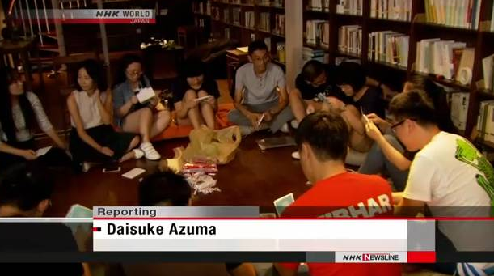
 

[NHK镜头下的706青年空间](https://mp.weixin.qq.com/s?__biz=MzU4NDU4NDEwMA==&mid=2247489680&amp;idx=2&amp;sn=831502a3a163eb00676e74f3ddaecaeb&source=41&key=&ascene=1&uin=&devicetype=Windows+10&version=62060426&lang=zh_CN&winzoom=1)
 

NHK（日本放送协会）的国际频道对706青年空间进行了报道。
 

“中国的青年人正在找办法去克服社交孤立感，于是一种新型的公共空间出现，青年人可以在一起交流想法。”
 

青年空间，“a place to connect”，青年人交流连接和探索生活可能性的平台。
 

### 博客天下
 

报道时间：2016.8.30
 

报道机构：博客天下
 

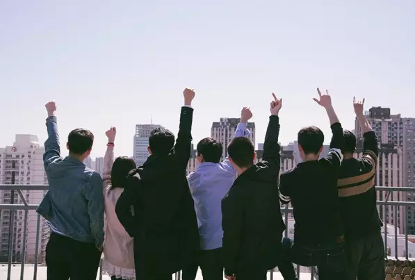
 

[空间：互联网进化出了“不正常”青年的乌托邦？| 博客天下](https://mp.weixin.qq.com/s/_JrtdrpaeyVraCUvGAn-HA)
 

就像Airbnb和Uber，程宝忠和邬方荣想将包括品牌和渠道在内的一切资源分享出来，和青年们互动，用大量小而美的产品实现社群经济的目标。他们想用706青年空间把大量青年集中起来，再把这些人和五道口的优质公司、机构连接起来，用他们的创意营造出一个优质的公共空间。之前，他们希望这里可以让青年们的灵魂得到休息；现在，他们还希望这里可以帮助青年们实现想法。
 

### 中国经济信息杂志
 

报道时间：2016.8.31
 

报道机构：中国经济信息杂志
 

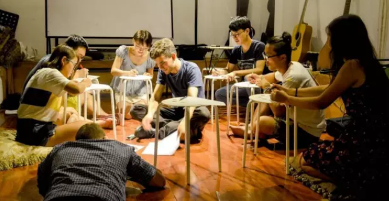
 

[北京青年玩起了“共享社区”](https://mp.weixin.qq.com/s/NFwgfooZcI8pomvDs6GENQ)
 

社群经济研究院评论员刘裴在接受《中国经济信息》记者采访时分析，706因其或许有些标新立异的风格，吸引了一群年轻人聚集在一起，形成社群效应。他们相互影响、融合，并愿意为这种生活去付费。“这不单是为了自己享有的三四平米付费，而是为自己所能拥有的社交机会和文化氛围埋单，因为他们更认可这种生活的价值。”刘裴说。
 

### 新华社每日电讯
 

报道时间：2016.9.01
 

报道机构：新华社每日电讯
 

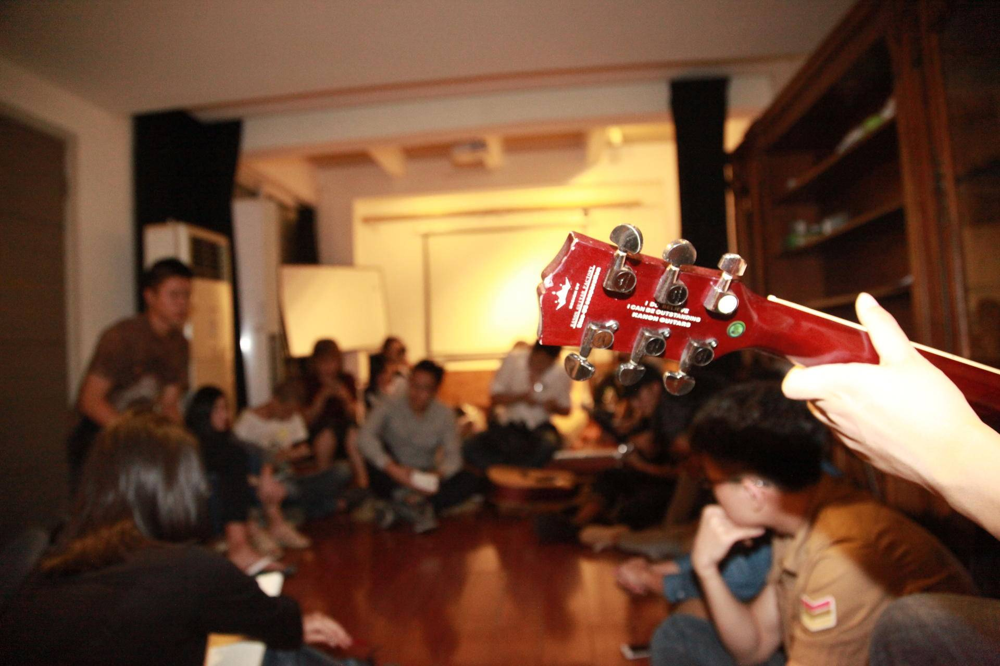
 

[中国的青年人正在找办法去克服社交孤立感](https://mp.weixin.qq.com/s/77SuHvAU_mSA9aC8Vfijtw)
 

正在做青年空间研究的首都师范大学盖琪老师，在谈及706青年空间出现的社会原因时说道：“当代青年和父母之间的代沟比较大，青年一代开始寻求彼此之间更强的情感上的联系，需要有一个社会性的场所去进行情感交流。”
 

NHK(日本放送协会)也注意到706青年空间：“中国的青年人正在找办法去克服社交孤立感，于是一种新型的公共空间出现，青年人可以在一起交流想法。”
 

“如果有一天，‘706青年空间’变成一个人人熟稔的词条，听到的人会‘哦哦’，不需要再向每个人解释什么是‘706青年空间’了，那这事儿就算成了。”这是706青年空间里的每个人都在念叨着的共同愿景。
 

### VICE
 

报道时间：2016.9.22
 

报道机构：VICE
 

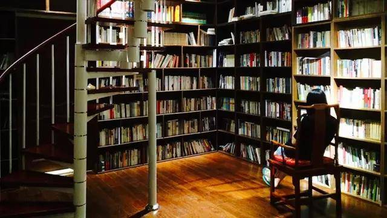
 

[青年空间的乌托邦筑城记](http://www.vice.cn/read/utopian-youth-space)
 

706一直想做连接，将各种各样有趣的人连接在一起，类似同辈教育的概念，大家相互学习、交流， “碰撞出有趣的东西。” 最低的期待，宝忠说，“哪怕是能帮青年们在交流中明确找到自己的定位，让他们了解自己到底喜不喜欢自己的专业，不要大四了才想着去换专业。哪怕是能够让他们更有能力去辨别什么才是自己喜欢的职业。都已经不错了，有的人太迷茫了。”
 

青年空间的创办者大多对学校的教学内容有或大或小的失望，转而把青年空间看作是学校教育的补充。
 

所有人都有或多或少的焦虑，透露出或大或小的疲惫，虽然忧心忡忡，虽然眼中有光。
 

可是路太远了，直到现在，没有人知道，这座乌托邦的城池，能修筑成什么样子。
 

### 中青报冰点周刊
 

报道时间：2016.9.30
 

报道机构：中青报冰点周刊
 

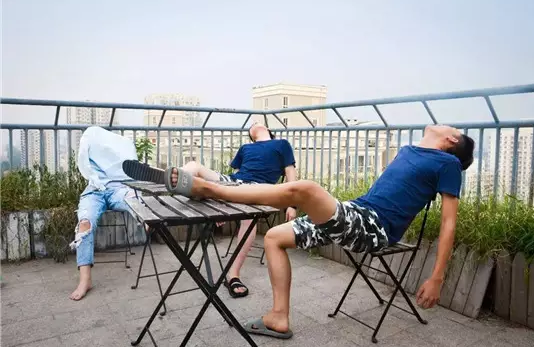
 

[“我才刚刚23岁，为什么要那么早决定一切？”  中青报冰点周刊 ](https://mp.weixin.qq.com/s?__biz=MzU4NDU4NDEwMA==&mid=2247489666&amp;idx=1&amp;sn=44f56759886e75f0f2e227aa8838379c&source=41#wechat_redirect)
 

在这个706号房间里，到底要装下些什么东西，12位创始人意见不一。有的人觉得应该请来导师给大家讲课，有人则坚持空间里应该让年轻人自己碰撞观点。“美国有派对文化，大家都习惯了在一起平等交流，我们老是习惯有一个中心，就连春游都会有一个领队。”
 

程宝忠记得那时候“几乎天天晚上都会讨论、吵架”。后来意见不合的创始人渐渐离开。终于有一天，贴在706号房间外的宣传口号从“一代人有一代人的声音和梦想”，变成了“探索生活更多可能”。
 

### 检察日报社主办的法治新闻期刊方圆杂志 
 

报道时间：2016.12.30
 

报道机构：检察日报社主办的法治新闻期刊方圆杂志 
 

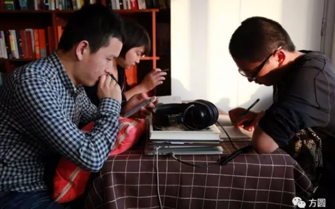
 

[北京最牛出租屋里住的谁？入住需要面试！](https://mp.weixin.qq.com/s/UdS6h6CR-Ay1T8Q8gnj3NA)  
 

“因为气质相似，706的住客之间很容易能交到朋友”，在财新传媒做经营的张扬威和小羽及袁满就是三个要好的伙伴。张扬威半年前就搬出706去三里屯工作了，但周末时间还是愿意回来找袁满他们玩。“大家开开玩笑，一起读读书，或是玩场狼人杀，时间过得很快”。
 

### ~~新周刊~~
 

报道时间：2017.2.09
 

报道机构：新周刊
 

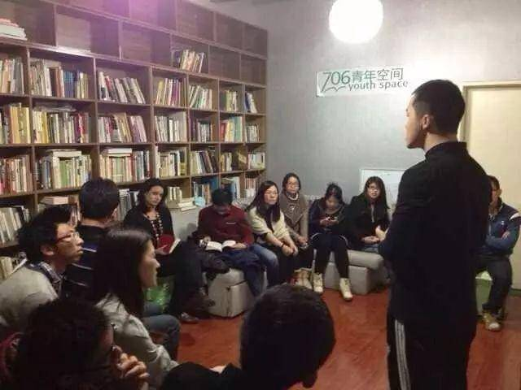
 

知乎链接：[https://zhuanlan.zhihu.com/p/63051011](https://zhuanlan.zhihu.com/p/63051011)
 

这些青年有别于酒吧街里的摇滚青年，他们受过良好的教育，需要一份理想的工作，同时又将精神需求放在很重要的位置，追求着诗和远方。程宝忠更愿意将他们称之为“现实的理想主义者”。当然其中不排除一些迷茫的青年，包括程宝忠自己，他也不知道30岁以后要做什么。“他们的迷茫我也觉得正常，只要他们不是赖在这里不工作，每天还想着倒腾一点事情，我觉得就是很好的迷茫状态。时间就是用来浪费的，哪怕没有得到实质上的回报，至少通过尝试不同的东西可以帮助自己成长。而这里就是提供不同可能性的地方。”
 

### 清华大学清新时报
 

报道时间：2017.12.30
 

报道机构：清华大学清新时报
 

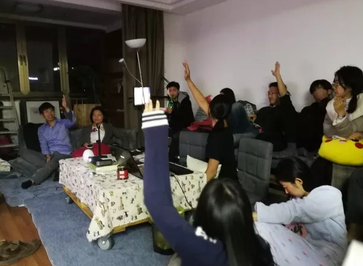
 

[专题 | 生活实验室：三个月的“自治共同体”尝试](https://mp.weixin.qq.com/s/wMwFe_cxxKoblss1ENiTIA)    清华大学清新时报 
 

“我们设定规则的目的，不该是为了去执行，不是为了强调它的权威性，而是让706更好。我只是希望每一个人都很快乐。”坐在垫子上的李慧斌回答：“将来某个规则（如果）和最初目的冲突，我们应该认为规则是无效的，这样可以解决我们大家都跟她很好，她也即将住进来，但因为玩晚了打地铺的冲突。”
 

李慧斌所谓的“希望每一个人都能快乐”的最初目的，在生活实验室更多称为“核心理念”或“愿景”，类似写入美国宪法的“人人生而平等”，是规则的背后的价值基础。“制定规则是为了井然有序，是为了减少矛盾，但大家还是像学生一样，先把规则制定好，每个人履行一下，假装和谐。”他总结几次会议后的感受。
 

主张用核心理念规范生活实验室的李慧斌自称“左派”，而崇尚“法律高于道德”、主张用规则界定成员义务的邹俏也成为“右派”。
 

这场左右之争至今仍没有结果：理念与规则是二选一还是并行不悖，成为住客决定生活实验室自治方向的分水岭**。**
 

### 读库
 

报道时间：2018.05.14
 

报道机构：读库
 

[在宇宙中心相互认出彼此](https://mp.weixin.qq.com/s/mKgAEN3Lb_auYpyY6O2UFA)
 

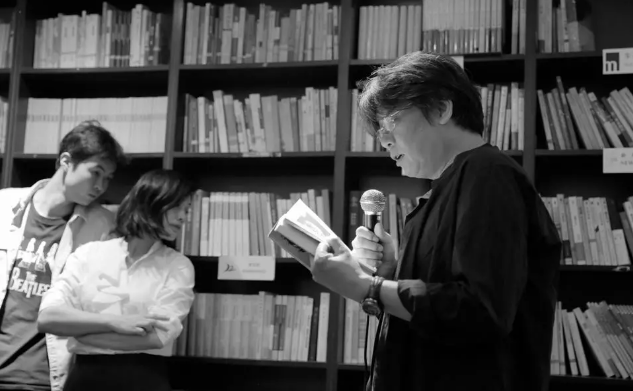
 

老狼走到话筒前，他用手机播放出一首歌，大门乐队的This Is the End，开始念Jim Morrison传记《此地无人生还》中的一段。老狼因为带着孩子来的，需要提前退场，所以也提前上场。
 

戴着老花镜的老狼，映衬着Jim Morrison永远停在27岁的脸。我想起《乌托邦年代》里的一句话：1968年的这些年轻人永远不会老去。他们自带年轻属性，青春永在。
 

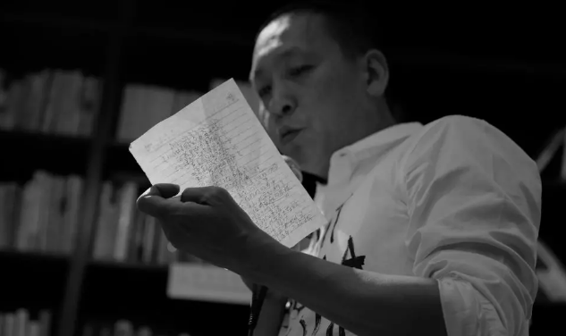
 

苗炜苗师傅出场，他恰好是1968年出生的。他和老六俩人现在加起来有99岁了。99年前，1919年，发生了什么？五四运动。上溯至三五十年，1868年，又发生了什么呢？洋务运动。然而，历史不是这样计算的，历史不以任何个人命运为尺度。他说。
 

苗师傅要念的是食指写于1968年的诗《四点08分的北京》。食指写这首诗时，苗炜八个月大。
 

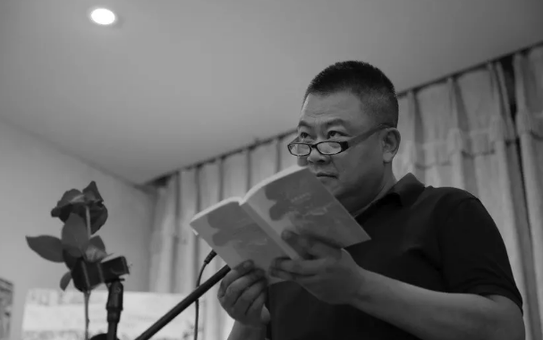
 

像老狼一样，陈晓卿老师把他的老花镜处女秀献给了这次活动。他用低沉的嗓音朗读了《乌托邦年代》中的一节，8月21日夜，即苏联入侵布拉格的当夜。
 

### 好奇心日报
 

报道时间：2018.06.06
 

报道机构：好奇心日报
 

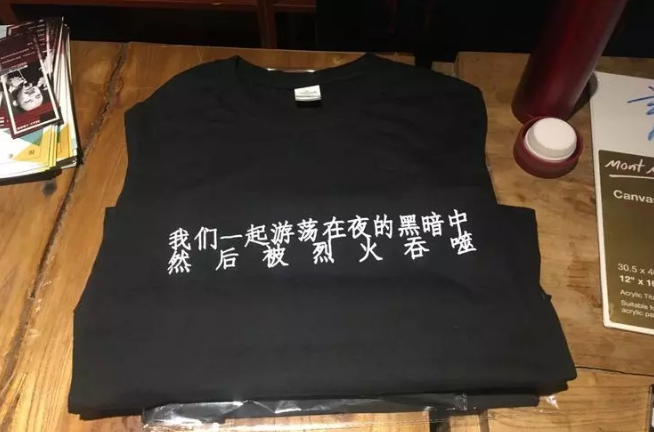
 

[有想法的人都向往 706，因为它尝试各种可能 | 这里是五道口，年轻人很多②](https://mp.weixin.qq.com/s/m7OnIOVSFWxc-GjGcBdflw)
 

时钟指向晚上 6 点半。706志愿者们唱起了《国际歌》，穿着红色外套的“福柯”准时跳上椅子发表演讲。
 

“朋友们，欢迎你们来到法国巴黎。我是你们的战友福柯，这注定是一个让历史铭记的日子。今年是 1968 年，这是一个资本主义横行霸道的时代，在今天，知识被资本异化为信息资源，森林被资本异化为树木资源，就连我们人类本身也被资本异化为人力资源。人不再是目的，而变成了资源，变成了工具。人们只关注如何套路，如何消费。他们忘了为什么要消费，为什么要套路。人们忘记了爱，忘记了真诚。今天，就在今夜，我们要让全世界铭记。理性，你不是肉体的牢笼，不是！战友们，出发！”
 

楼梯拐角处，诗人“金斯伯格”开始了另一番演讲：“欢迎来到纽约！爱之夏这个自由的活动已经进行了两个月。我们已经厌烦了美国政府所说的自由和民主。越南战争，一个全美国都不想打的战争，就为了他们嘴中所说的那个帝国主义的理想。我们在这里宣扬爱与和平。这里没有权威！这里……对，没有权威。这里就是我们的乌托邦！”706里面的人群因为他的忘词发出了一阵哄笑。
 

（706青年空间的五月风暴的系列活动开幕式场景）
 

###
 

### 德国歌德学院
 

报道时间：2018.12.30
 

报道机构：德国歌德学院
 

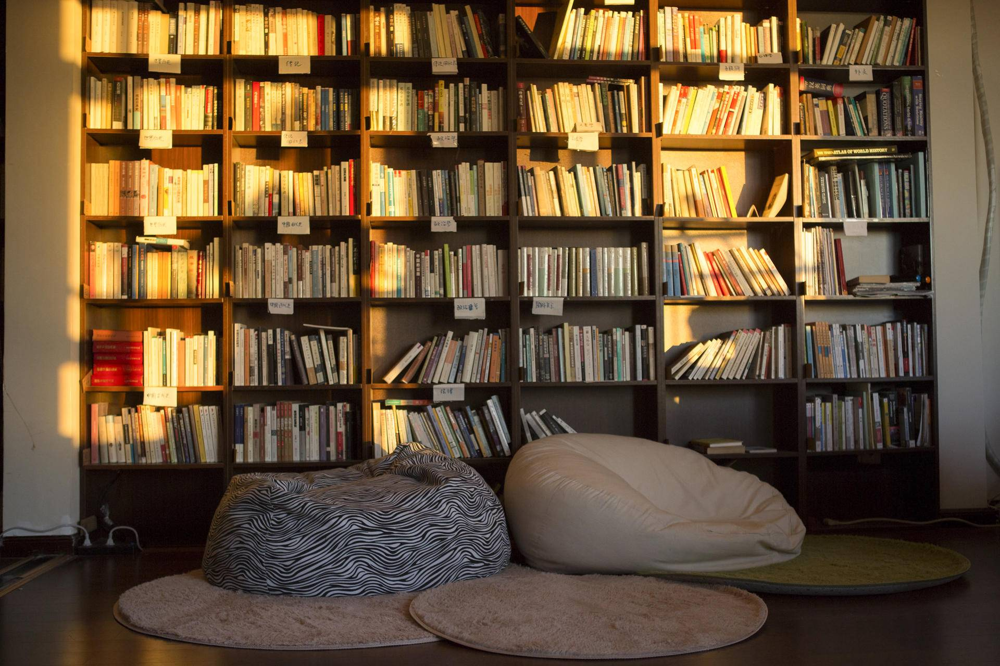
 

[北漂另类合租指南](https://mp.weixin.qq.com/s/EqzwFqDCLP-Xr_guk74Z0w)  （中文版）
 

目前已经有了好几个生活实验室，每一个的经营方式都不一样。有些完全不受制于706生活实验室，经济上也保持独立，对自己的经费负全责。另一些实验室至少在经济上由706负责管理。方荣认为，应该设立一个由较为独立的合租房屋共同构成的组织，彼此支持，当出现单独合租房屋不能解决的较大问题时，可以共同出面协调解决。这让人想到“天下”之说，想到赵汀阳提倡的“天下体系”。这是具有中国特色的合租房屋。
 

### 107调查
 

报道时间：2019.01.01
 

报道机构：107调查
 

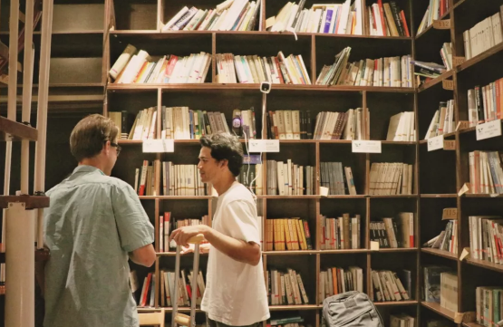
 

[青年实验室：自由+公共+社群=？](https://mp.weixin.qq.com/s/mcN7tfXEbIDaxl62YtHg8g)
 

曾经，“稍有点想法”的青年聚集在这里，从女权、性少数群体的权利谈到劳工问题，从国家转型谈到东亚局势。话题的敏感性引起了相关部门的关注，“有关部门”有时还会直接打电话“劝告”邬方荣取消活动。仅2014年，被迫取消的活动至少有5场。如今，706开始自我规避，转而倾向组织更贴近生活、轻松好玩的娱乐活动。
 

最近，706的几位工作人员正在构想一种全新的社群运作模式，并计划未来能够编纂成书出版。然而，国内尚无参考先例，理论的不足和现实的困境让这个蓝图还停留在最初始的阶段。邬方荣似乎很乐观，用一如往常的平缓语气说：“我没有一个准确的答案，但我个人觉得，还是要慢慢地摸索，这不是大问题。”
 

### 澎湃
 

报道时间：2019.04.22
 

报道机构：澎湃市政厅
 

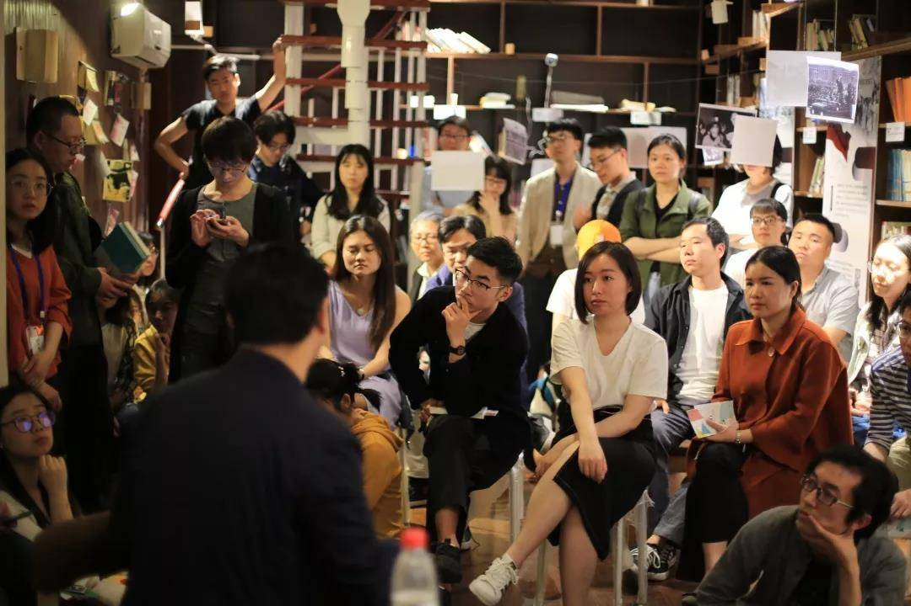
 

[706青年空间：一点点消失的五道口](https://mp.weixin.qq.com/s/u_1b0FcD0SbkM5h1WEg4uQ)
 

七年来，706经历数次人员更替，也在价值观上出现了微妙变化。最初，这是一个偏向精英的、自由主义的言说空间，邀请的嘉宾在公众认知中也多是自由主义者。而近两年，随着人流变化以及大环境改变，706不再是某一种观念的承载体，而是影响青年人的多种观念的汇流地。
 

这里依然保持了自由主义色彩的读书会，同时也会举办保守主义的思想活动，既有右翼的，也有左翼的。706内部的热门书目变化也反映了这种情况——三年前，706最受追捧的读物是《1984》、《论美国的民主》、《论自由》、《黄金时代》、《规训与惩罚》等，如今，被争相研读的则是《诸众的语法》、《守望公众领域》、《日常生活批判》、《空间与政治》、《世界的苦难——布尔迪厄的社会调查》、《寻求空间正义》、《叛逆的城市》、《偶然、反讽与团结》、《事实改变以后》。
 

但方荣不认为706有明确的价值观，更多是因为活动的调性，传递出不同的价值色彩，这是活动发起人的原因，不能说明706本身有什么价值倾向。
 

在他眼里，706建立的是一个半开放的空间，允许人们在这里自由谈论思想。人们来到这里，渴望解释自己和这个世界。
 

### 中传大设计
 

报道时间：2019.05.29
 

报道机构：中传大设计
 

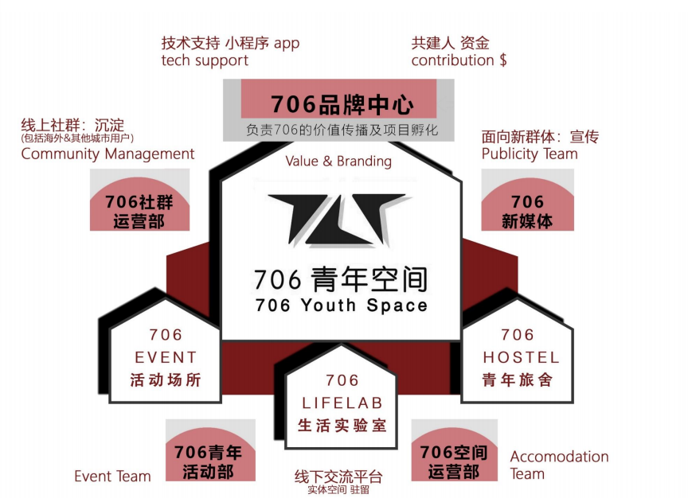
 

[青年公共文化空间：当代青年的“救心丸”？| 特别观察](https://mp.weixin.qq.com/s/4Q9C_0ctseyY1jFMzgR-ag)
 

 随着大环境的转向以及经营者基于多元主义价值观的运营理念，706从最开始的一个偏向精英的、自由主义的言说空间，到后来成为多种价值观汇集的场域。虽然其讨论的价值倾向走向模糊或者说多元，但是愈加明显的作用是，706这个物质空间，容纳了思想讨论的可能性以及成为一个稳定的承接载体，已经从物质空间中生产出一种“第三空间”的精神空间。
