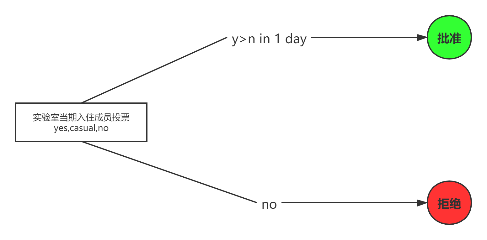

1. 总则作为706生活实验室的官方规则，本质是为了保证各个生活实验室符合自治的理念，并保障规则的完整性和合理性。在此基础之上，706方不会主动介入任何生活实验室，不会对生活实验室自身的特色和发展做出任何管理和限制。

2. 总则的修改必须由706生活实验室协调委员会召集各个生活实验室的代表开会来决定，即706生活实验室的集体会议，属于正式会议。

（简洁版附上完整版链接）

**注1：**y(es):同意票数, n(o):反对票数, c(asual):中立票数, ->表示进入下一流程, S(um):总人数, J(oin):参加人数, V(ote):投票人数

# 一、生活实验室理念

1. 生活实验室的模式是**共居+自治+开放**，其中自治是生活实验室最核心的特征。

2. 为了保证各个实验室能够符合自治的理念，建设一个良好的社群环境和生活环境，需要制定一系列的规则来实现自治。即所有实验室应有成文且可执行的规则，住客在形成共识的基础上制定并落实规则，共同建设空间的未来。

3. 所有成员应本着**平等、包容、守信、负责**的原则完善并遵行规则。

# 二、总则主张

1. 所有住客的权利来源，依据总则，可以规定，知情权，投票资格，投票人权利，会议权利。

2. 一切规则和会议，由全体实验室当期入住成员决定，但必须符合**总则**。在**总则主张**第一条的基础之上，赋予了会议决定权，任命权，处罚权，立法权，监督权等一切基本权利，以及会议通过并赋予的所有衍生规则的有效性。

3. 当期入住成员可判决前期入住成员制定的任意规则失效。

4. 实验室成员较多（＞7人）时，各个实验室内部可以开会讨论决定是否建立一个有效委员会讨论决策，至少提前两天安排会议时间并通知实验室全体当期入住成员，且有效的委员会至少由1/3住客组成。

注：

    1. 人数规模程度特别大时，共识的建立难度大幅提高，在很多事务上会出现歧义，对于每个个体而言不一定能寻找到一个最优解，但至少要建立一个对实验室长期运营最好的规则。有效委员会就是在歧义出现时，考虑是否需要找到一个折衷的方案重新发起讨论与投票。

    2. 被否决的事务由该事务的发起人来决定是否继续寻找解决办法，也可以选择求助有效委员会。

5. 根据会议执行和讨论的成本决定，决议的通过顺序如下，其中投票必须包含中立项。投票结果必须呈现在会议记录中。

原则上同意票必须大于反对票，且投票结果需在一天内发布。关于某项具体事务批准所需的同意人数由生活实验室内部决定。

1.1. 无有效委员会的投票流程

1.2. 存在有效委员会的投票流程

6. 每个住客应当尊重总则赋予的权利，并同时尊重其他人被总则赋予的权利，任何人不得干预，剥夺他人的基本权利。

7. 鼓励分享进步的思想，禁止单边价值观输出。

8. 在保证各方安全和权利的前提下，言论自由和多元化的边界由当期实验室成员决定。

    9. 为了规避风险，现阶段706各个生活实验室的所有活动避免涉及到女权，性别，劳工或现实政治类议题（已发布还未组织的就低调做完）。不太清楚活动主题是否适合举办的，私聊方荣， 具体之后什么时候可以办，到时候再通知。

# 三、706生活实验室规则框架

706生活实验室基础的规则文档组成：

1. 总则

2. 生活实验室准入、考核、退出机制

3. 财务制度：财务透明，生活实验室账目表，公共基金相关。

4. 实验室内部运营规则：

    1. 职能分配

    2. 每月至少一次的住客例会

    3. 共同讨论和决策机制

    4. 冲突解决机制

    5. 反性骚扰机制

    6. 空间维护规则

5. 入住与退宿规则。

6. 对外规则：沙发客，公共空间使用与申请。

**各个生活实验室必须满足基础的规则文档组成。在此基础之上，可以根据自身的特殊情况，结合706提供的规则工具包和自身生活实验室的特点，来修订和增加规则。**

# **四、**规则制订和修改准则

1. 不得制定出违背总则的其他规则。

2. 一切规则，会议，必须满足基础的**706生活实验室规则框架**，且不得违背**生活实验室准入/退出机制**的最低要求（9分）。（详见生活实验室考核机制）

3. 应当尽量制定具有执行效力的规则，不应当滥用文本，导致规则失效或过度使用。

4. 规则应得到具体执行，从而维护规则的效力。

5. 各个生活实验室对规则进行的修订和增加，有义务告知706生活实验室协调委员会，以便进一步完善和维护规则框架和工具包。

# 五、职能规范和组织办法

## 职能分配

生活实验室赋予各个职能所需要的权利帮助实验室维持正常的运转，并规定补偿资金金额，各岗位统称司务员，职能细节参**生活实验室职能分配。**

## 住客例会

住客例会作为一种组织方法，用于保证生活实验室的充分自治，加强内部沟通协作和实际解决住客问题等。

1. 住客例会是生活实验室的决策机构，由具体的生活实验室的所有住客组成，所有人一人一票，就重要问题进行表决。

2. 生活实验室必须确保至少每月一次的住客例会，即月底的财务汇报和司务员的工资发放。

3. 在下述四项的基础之上，其他事务是否纳入住客例会的讨论范围由生活实验室内部决定。该四项是指——住客例会第二条所指的月底的财务汇报和司务员的工资发放，规则的修订和增加，对不同场合票数限制的修改，会议执行流程的更改。可以根据事务的重要性和成员的时间成本等来定夺是否有必要发起住客例会，如无必要，可直接在群里进行自由讨论或选择其他方式。

4. 生活实验室成员想要发起住客例会可以告知事务协调员，由事务协调员执行会议发起流程，也可自行发起关于某项事务的会议讨论。

5. 会议发起流程：至少提前两天安排会议议程和会议时间并通知实验室全体当期入住成员（提前通知的时间天数可以由生活实验室内部决定，但有关规则的事务必须遵守**程序性规则**中所规定的至少提前两天）。

6. 会议参加人数的规定可以根据不同事务的性质来决定，但有关规则的事务必须遵守**程序性规则**中所规定的1/2人数。

7. 未参加例会的成员需要阅读会议记录，并投票。

8. 实验室全体成员有责任参加住客例会，生活实验室内部可制定成员多长时间或连续多少次不参加会议的相关处罚措施。

9. 必须做好会议记录和结果公示，保证所有生活实验室成员知晓会议内容和结果。

（在所有住客同意的前提下，可以不按照总则规定天数）

## 投票机制

为减少会议成本，缩短会议时间，由现住客组成的投票和公告微信群（不局限于微信群，可以选择更加有效的工具），在无特殊说明的情况下，任何条款的投票流程，应当符合**总则主张**第五条，投票期限过后若没有进行投票，则被视为**自愿放弃投票权**。

# 六、程序性规则

1. 是用于保证程序上的权利义务关系为主要内容的规则，是正确实施执行顺序的保障。

2. 若有不正当执行流程，视为无效。当所有住客遵守程序性规则的执行时，若存在为达到某种目的而未通知所有住客，擅自执行程序，是对所有住客投票权、知情权和表达权等基本全权利的侵犯。

3. 但同时，我们尊重每个个体的思考和建议，，而**不能以小群体为主随意执行流程**。

    1. 有效的规则至少有1/2的住客参加会议讨论，至少提前两天安排会议时间并通知实验室全体当期入住成员。

    2. 此条必须经过充分的讨论，征求大家意见。

    3. 必须做好会议记录和结果公示，保证所有生活实验室成员知晓会议结果。

        1. 规则增加和修订的动议---------------------------宣传 ≥2天–>投票[y>n]–>结果公示–>加入规则

        2. 对不同场合票数限制的修改---------------------- 宣传 ≥2天–>投票[y>n]–>结果公示–>加入规则

        3. 会议执行流程------------------------------------ 宣传 ≥2天–>投票[y>n]–>结果公示–>更改

        4.  ......

**具体的宣传时间和票数规定可以由生活实验室内部决定。**

对权利与义务的探讨

