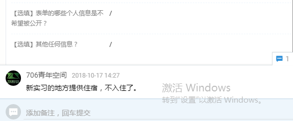

## **第一章 总则**

空间运营部负责住宿安排、场务安排、账目管理等各项工作，具体包括对网络申请入住者的沟通审核、入住手续的办理、续住手续的办理、退住手续的办理、住宿日常服务、场务活动安排等等。  

管家每日上午11点上班，晚上10点下班。**每日工作常规流程**为：  

1. 收敛地铺物品；

2. 对接一日清单；

3. 检查麦克表单；

4. 回复咨询消息；

5. 板书当日活动；

6. 检查房态变动；

7. 完成场务安排；

8. 复查麦克表单；

9. 整理票据设备；

10. 自我检查工作。

管家特定日期的工作内容还包括：  

1. 巡视住宿空间；

2. 检查场务设备。

上述工作流程将同时记录于**《管家一日流程清单》**中，该清单将同时包括常规周期（一日）的任务和特殊周期的工作任务，管家可以依照该清单开展工作。

### **第一节 收敛地铺物品**

管家应及时收敛地铺用品，将地铺收拾好完毕装入篮筐的地铺用品统一放置于咖啡馆阳台，以供其晚间自取。  

管家应每日检查保洁人员是否已经清理图书馆和咖啡馆并将杂物收进咖啡馆小阳台杂物箩筐。  

### **第二节 对接一日清单**

     管家应查看昨天上一任值班管家留下的“一日清单”，查看昨日管家遗留下来的交接工作，包括咨询住宿的，待收取定金的，待入住的，待带看房子的等等待办事项。

### **第三节 检查麦克表单**

麦克表单的审核规则如下： 

1. 查看申请者的住宿时间段是否有空置床位，若没有，结束审核，通知其审核结果；

2. 若有空置床位，继续本次审核，查看申请者的申请信息；

3. 辨别表单内容，若表单填写内容丰富、真实、有趣的，通常予以通过。原有住客的申请通常予以通过，具体操作由小管家裁量。入住人员不能互为家庭成员，也不能年龄偏大(40岁以上，也可酌情调整) 。若其不符合要求，结束审核，通知其审核结果。若符合要求，则通过审核；

4. 表单难以确认，则使用“706小管家”添加其微信好友，查看其朋友圈，由小管家裁量其是否适合入住；

5. 若申请者是长住，在审核申请信息后，还需要与之电话沟通，判断此人是否合适。电话沟通应告知对方706已收到其住宿申请并予以感谢，询问对方选择706的原因和个人背景信息，询问其生活习惯(作息时间、学习/工作时间、是否打鼾)，询问其兴趣爱好并询问其是否有意愿加入706兴趣小组，询问其是否有意愿参与各项活动，告知其在706住宿的利弊。最后请其等待回复通知。

6. 若两个申请者床位冲突，只能接待其中一个的，以申请信息为依据优先通过更为优秀者，如果申请信情况相类似，则优先通过住宿时间更长者。

   

按照上述要求完成审核后将审核结果记录于麦克表单：  

* 只点亮左侧“绿勾”表示审核通过；

* 只点亮左侧“五角星”表示审核未通过，没有通过原因包括申请入住的时间无法安排或者申请者自身情况不符合要求，管家应当为未能审核通过但是条件优异者添加备注说明情况；

* 同时点亮左侧“五角星”与“绿勾”表示审核通过且已经缴纳定金或房费，应为其安排房间。

  

### **第四节 回复咨询消息**

管家应及时回复申请入住者的咨询消息，包括回复未接电话和微信咨询信息。首先应回拨未接电话，告知其添加微信账号"xiaoguanjia706"，在微信端处理具体工作。  

管家应按照本规范中有关沟通审核规则的有关规定与咨询者或生活实验室成员沟通。

  

### **第五节 板书当日活动**

管家应参考石墨文档中指定的活动安排表单，按照指定模板格式将当日将会举行的活动书写于前台黑板。  

### **~~第六节 购置蔬菜粮油~~**

~~管家应与后勤负责人员沟通，确认是否需要购买蔬菜粮油，并及时购买。~~

### 第七节 预查房态变动

       管家应每日检查是否有成员将于明日入住或退住，并于检查当日将有关入住与退住规定再次告知对方，提请对方注意，并且告知对方我们上班时间，以免对方过早或过晚过来。

       检查后若发现仍有空置床位，管家应在豆瓣和朋友圈等平台回复706已经发布的有关宣传文案，以推广宣传706青年空间。（交给非值班管家）

### 第八节 完成场务安排

       管家应每日活动开始前半小时清理场地，确认是否需要投影等设备。

### 第九节 整理票据设备

       管家应及时整理收据、入住协议，财务凭证单，放置在规范的夹子里面（需要每个夹子贴个标签说明），以防丢失。

       管家应在“每日清单文件”自己检查并打勾，并且备注明天待处理的事项（包括咨询住宿，缴纳定金，待看房的，明天待入住人员的到达时间，等等信息）

整理前台电脑、手机、打印机等设备，及时关机，需要充电的要及时充电。

       每周一例会后，706生活实验室开小会，并共同检查上周遗漏或疏忽的工作。

### **~~第十节 发送午餐消息~~**

~~管家除每周二外，每日应于晚上10点在“706生活实验室现有成员交流群”中按照模板格式发送明日的午餐订购消息。~~

### **第十一节 自我检查工作**

管家应及时自我检查各项工作，部门负责人也应不定时检查协助及指导各项工作，并于每日下午9点按时进行检查

应作出以下检查：  

确认明天到期的住客是否续住，明天新入住的伙伴是否知道地址，确认到达时间。

1. 麦克表单是否已经妥善审核；

2. 微信消息是否已经妥善回复；

3. 工作文件是否按规定记录明晰完整；

4. 蔬菜粮油是否已经购置；

5. 其他工作。  

如部门负责人发现问题，应及时予以处理。

## **第二章 沟通审核规则**

### **第一节 沟通审核**

管家应按照规定流程规定审核麦克表单。  

麦克表单审核通过后，应检查是否已经添加其微信，并修改其备注，备注格式为："姓名-学校(或者单位职务)"。  

管家应按照规定回复电话以及微信咨询。积极与咨询者沟通交流，若对方咨询时尚未填写麦克表单，应按照指定模板回复对方，请对方填写表单；若对方曾经是706生活实验室的成员，且已经提交过麦克表单，则不必重复提交。  

管家与咨询者初次沟通时，需要向对方发送2份文件，分别为**《706生活实验室服务手册》和《706生活实验室布局图》**。（见附件）

[706生活实验室布局图.pdf](https://attachments-cdn.shimo.im/bhvKDLN1OgsQW5ex/706生活实验室布局图.pdf?fileGuid=E5Q0QEkzYzg3QhGV)

[706生活实验室服务手册.pdf](https://attachments-cdn.shimo.im/BX7WlgtQ1MsGH38w/706生活实验室服务手册.pdf?fileGuid=E5Q0QEkzYzg3QhGV)管家还可以参考《706生活实验室常用问答模板》与《706生活实验室细则》解答咨询者的有关问题。

管家应使用石墨连接向通过审核的咨询者发送一份《706生活实验室入住协议》，并且提醒对方注意续住及退宿规则，并告知其正式入住须签订《706生活实验室入住协议》以避免纠纷。  

### **第二节 预定床位**

咨询者确定入住的，应要求其按照《706空间运营部工作规范细则》中的价目表及有关规定交纳定金或全额房费，付款方式可以为微信支付、支付宝支付或现金支付。在对方交纳定金后，管家应于住宿管理网站”番茄来了“之中为其录入相关信息以更新房态，为其预定床位。  

住宿管理网站”番茄来了“之中，应录入生活实验室新成员的以下信息：

1. 姓名

2. 手机

3. 实际的住宿时长；

4. 实际的住宿价格；

5. 收取房费类型：现金还是支付宝还是微信

6. 收取押金类型：现金还是支付宝还是微信

7. 麦克表单中的4、5、6、7、8项（从家乡到微信号）及第17、18、19、20项（从个人技能那一项开始）。

如果成员将会连续多月住宿以致于需要在”番茄来了“中分多条记录登记的，应在每条番茄记录中重复记录，且保持记录完全一致。  

### **第三节 群组管理**

706城市群

应将所有咨询706小管家的，首先确认他所在的城市（定居或大学所在地），如果觉得比较优秀的，可以邀请拉入“706城市群”，优秀的判断条件包括：对706理念的认可度、成员个人潜力与能力等。 

常用话术：

你好，如果你没有填写住宿申请，你可以在微信文字简单自我介绍下，所在城市（北京具体到某个区域），教育和社会经历，未来最想做的事情，需要706提供什么帮助，然后我会根据你回复情况，来邀请你加入你所在城市的706城市群，如果已经填写了706住宿申请，我直接拉你下；

706五道口群/706望京群/706双井群

管家应该将所有咨询706北京各个生活实验室长租的，从咨询的那一刻起，只要觉得满足706基本住宿要求的，即使未来不住706，也都可以提前先拉到706北京的各个区域群，比如所有咨询双井国贸的，拉到706双井群； 所有咨询望京住宿的，都先拉到706望京群，所有咨询五道口这边的（包括富润及北大清华的），都拉到706五道口群；

常用话术：

你好，706北京有丰台，东西城，西二旗，望京，双井，五道口，魏公村群等区域，你可以告诉我下你所在的区域，谢谢。

706生活实验室2020年交流群

管家应将交付定金或房费的新成员马上加入“706生活实验室2020年交流群”。昵称改为“名字-某生活实验室名称”。

新成员入群后，管家应根据”番茄来了“中备注的有关个人信息，在成员群中向大家介绍新成员。应注意保护其个人隐私，不可将新成员在麦克表单中明确表示不希望公开的内容予以公开。管家应根据实际情况灵活予以介绍，注意语言的亲和力，尽力帮助其融入新空间。

706才艺换宿老外微信群

应将才艺换宿的老外拉入到相应的短期才艺换宿老外微信群。

706青年社区3号群

在新住客入住一段时间后，706小管家可以挖掘不错的住客（比如比较积极参加活动的，或者在自己所在的生活实验室很活跃的，或者确实认可706生活实验室理念，或者想在706志愿做点事情的），可以将这些住客拉到706青年社群3号群；

## **第三章 入住办理规则**

### **第一节 确认到达时间**

管家应按时打开住宿管理网站查看房态，检查明日是否有人入住，须要向入住者以电话或者微信的形式发送消息，询问其办理入住的时间，并告知其可以办理入住的时间段，相关的信息备注于网站”番茄来了“。  

### **第二节 前台入住手续**

生活实验室的新成员正式入住前，应于706本部前台办理相关入住手续。

入住富润家园生活实验室的新成员，也可以先去富润家园放置行李，网络转房租，后续再到706本部前台办理入住手续。

办理手续时

1）706小管家需要查看706生活实验室成员的身份证，将其身份证号码及户籍地址(户籍地址须与身份证上所著严格一致)备注于住宿管理网站”番茄来了“。

2）新成员须补足应缴房费及押金（如果需要门禁，也需要缴纳50元门禁卡押金），之后，706小管家要及时在“番茄来了”的状态表如下第5，第6栏里面填写清楚收款房租或押金金额（包括1个月的押金及门禁卡押金），并且选择是现金/支付宝/微信哪种收款方式；并且，应该在备注里面加入收取押金金额。

A.收取定金后登记在房态上并点击确认预订

B. 确认预订后订金会直接转换为房费（注：不是押金），原先需要交2500元的房费，番茄来了上会显示需补房费2000元。

    

  C.入住后填写收取房费2000，押金一个月加门禁卡共2550，点击确认预订。

D.订单完成。

3）并且需要同步填写财务凭证单，参考如图：

4）住客收据

 

如果新成员需要收据，管家应为其当场书写收据，收据可以将房费和押金写在同一个收据，房费应写明金额和对应租赁日期，收款单位注明"706青年空间"，缴费者签字后将副联交付对方保留。新成员需要开具发票的，管家可以与财务负责人联系办理。  

       **租金收据范本**

**押金收据范本**

遇有事前并未沟通审核、当场提出住宿要求的咨询者，应告知对方需要填写报名表，提请对方按照流程申请办理住宿。如果情况较为急迫，可以根据对方的实际情况灵活处理，原则上允许符合规定要求的人员入住，若对方不符合本工作规范所规定的有关要求的，优先推荐到附近酒店、青旅等其他各类机构，也可依实际情况临时允许当晚住宿。  

完成上述手续后，管家应将房态的变动记录于当日的管家工作表的房态页面。  

5）签订协议

所有入住3个月及以上的人员，706小管家都需要和他签订一份协议。

### **第三节 床位交接**

管家应将干净的床单、被罩、枕套共计三件物品交付长住新成员，告知其所居住空间的详细地址，必要且条件允许时可带领其前往。  

使用地铺的新成员办理入住手续时，管家须将地铺用品自储物间中取出，并为其贴上标签，标签上须注明使用该套物品的成员姓名、地铺物品使用的起止日期；将地铺用品整套放置于咖啡馆阳台，告知新成员晚上11点后可以使用，并告知其使用地点。  

### **第四节 行李安置**

管家应告知新成员其专属橱柜的位置或确定方法，并告知其放置更多行李的地点，帮助地铺使用者将个人物品归置于指定地点。  

## **第四章 住宿服务规则**

### **第一节 物品供给**

如生活实验室成员反应某处应由706提供的物品设施出现毁损、缺失、故障、不洁等情况，应引导其在石墨文档中指定的维修表单中按需求填写。需要维修的事项交由工程部处理，需要购置的由本部门负责人审核后依照其决定处理，需要更换、清洁的由管家酌情处理。  

空间运营部负责人应每日浏览《生活实验室购物维修建议清单》，于当日做出回复，在石墨表格中及时反馈，并私信联系。其他管家也可以随时浏览该清单，需要更换、清洁的可自行处理。

## **第六章 退住办理规则**

### **第一节 退租日期的确定**

     签订季/半年等协议者，管家应在每个月规定的房费缴纳日期催缴该周期的房租，在租赁合同约定的最后一个房费缴付周期中催缴房租的同时，应询问其下一周期是否续租，若其不再续租，管家应当提醒其需要在当日下午2点前办理退住手续，并以此判断是否可以安排新的成员在租约届满后入住。 

   签订“月”协议或短住者，管家在当天到期前提醒其需要在当日下午2点前办理退住手续。

 

### **第二节 前台退租手续**

华清嘉园生活实验室成员离开空间时，应来706本部归还床单、被罩、枕套，在前台交给小管家，还应归还门禁卡和押金条，管家在收到全部上述物品之后应退还相应的押金；如果押金条丢失须写明丢失声明，部门负责人确认后也可以退押金。管家应当将床单、被罩、枕套集中存放于咖啡馆阳台的收纳篮。  

富润家园生活实验室成员离开空间时，如果不方便来本部办理退宿，可以联系富润家园的706的工作人员办理退宿，将床单、被罩、枕套、门禁卡给相应的工作人员或者放置在富润家园空间指定的地方，并且将押金条拍照给706小管家，小管家在确认后退还押金。

管家应当在成员离开前台前提醒其带走其私人物品，如有丢失不能负责。

  

生活实验室成员退房后，管家应当在住宿管理系统中进行“办理退房”操作，记录退还押金条目。

### **第三节 群组管理**

老成员离开706的，原则上应将其移出706生活实验室2020年交流群，同时将觉得不错的，加入到706青年社区3号群。（如果3号群满了，再开通4号群）

## **第七章 场务服务规则**

### **第一节 活动板书**

管家应每日查看石墨中指定位置的活动日历，将活动介绍写明于前台黑板。活动介绍应包括活动名称、活动时间、活动场所等等。  

### **第二节 场务布置**

活动的设备需求等各项要求会写明于石墨文档的指定表格之中，活动正式开始前半小时应按表格中的要求准备投影仪、音响、话筒、桌椅等。  

### **第三节 设备检测**

每周二下午管家应根据实际情况选择时间测试各项设备。测试时间也可以由负责人灵活调整于该周其他日期，未经特别调整则定于周二。测试的设备包括各台投影仪、音响、话筒、线材等等。如有损坏遗失应及时报请部门负责人添购。活动结束之后需要及时清理场地。  

### **第四节 人员接待**

706小管家在时间允许时可以接待来访参观人员等等，依对方意愿主动添加对方微信等联系方式，将其有关个人信息记录于石墨文档中的《访客登记表》。管家可以向来访者介绍706，也可以根据对方的需求对接给706相应部门的工作人员，活动公关应对接给706负责人。  

## 第八章  注意事项

### 第一节  微信群公告注意

      706小管家尽量不要发布“禁止”，“不行”，“不可以”等带有否定或禁止或命令或负面情绪的公告，如果必须得发布，那么，需要在706全职工作人员群征求大家建议后，才可以发布。如果涉及到私人问题，可以私聊沟通。

### 第二节   706大门保证随时关闭

 因为隔壁邻居的问题，我们706青年空间的大门必须保持随时关闭，除了需要特别提示以外，706小管家值班时期必须随时确保706大门关闭。

### **第三节 编辑建议文件**     

        管家应将工作中的有关建议记录于**建议表**，有关记录应该包括给定表格中要求的各项内容，更多信息记录于备注中：

  

## 第九章  706工程部常规工作

06工程部隶属于空间运营，做的是706基础设施的安全施工与维护工作，解决706各个空间里的软硬件故障，工作内容包括但不限于：

一、网络安全与设备维护【光猫、路由器、集线器、AP控制器、网络服务器、AP、监控系统等】；

二、电力安全与设备维护【配电箱、空开、照明开关、插座、插座转接头、插线板、电线等】；

三、燃气安全与设备维护【燃气阀、燃气表、壁挂炉、燃气灶、燃气管道等】；

四、用水安全与设备维护【包括壁挂炉、热水器以及自来水管道、空调管道等】；

五、门锁以及密码锁安全与设备维护【门锁、密码锁、球形锁、插锁等】；

六、床铺设施安全与维护【上下铺、沙发床、单人床、行军床等】；

七、用电设备安全与维护【照明、空调、电脑、打印机、电热水器、电冰箱、洗衣机、电饭锅、电磁炉、电热水壶，投影与幕布等】；

八、空间其他硬件与维护【墙体防水、墙体修复、桌椅、衣架衣柜、书柜等】.

以上，是706工程部所辖工作内容.

706工程部工作流程：

A.首先，住客或者工程部发现问题，报修；

B.工程部先行评估，预算投入时间和资金，酝酿解决方案；

B1.事件涉及其他相关部门的首先进行部门间沟通，综合考虑，制定相对全局化、长远化实施方案，并随时反馈沟通。

C.采购原材料【现有就用】，并且通知相关人员和住客何时何处施工，然后，试着按照既定的方案解决问题；

C1.相关施工一定尽早通知住客处理个人物品，如有必要前期还应咨询调研相关长期住客。

D.问题解决之后，发通知告知相关人员和住客，何事已经完成；

E.问题未解决，则或者经由失败总结经验，重新拟定解决方案，或者呼救外援，找专业人员解决；

F.工程部每日工作内容做好记录，写入相应石墨文档，以备查询，工作内容记录格式：何日处理何种事宜；

G.工程部每个月月初可以从小管家财务那里预支5000元【资金池】，需要缴上上个月报销账目，备案；如果事项超支，且紧

706空间工程部工作人员应按规定巡视各空间，管家可予以提醒。

706空间工程部工作人员须在每月的第一个周一和第三个周一去各个空间定期检查燃气表与电表的余额，电表余额低于50度，燃气表余额低于50方时应及时通知管家充值。管家应根据其反馈信息及时缴费。

