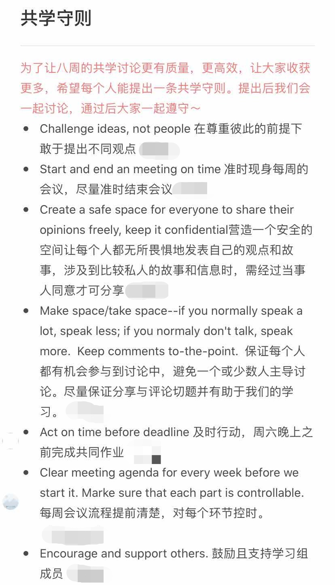

（持续编辑中）


# 一、价值基础


## 1.弗莱雷的解放教育学


著有《被压迫者教育学》的著名教育家弗莱雷曾说过，“沒有人能教別人，也沒有人能教自己，而是透過人與人之間的互動，彼此教導”。


他认为传统的教育是一种填鸭式教育（banking education），学生被视作一个被动的知识容器；而要培养一个富有批判意识的人，需要提问式教育（problem-posing），在对话的情境中共同探究知识。在提问式教育中，传统的“师生关系”被转变了——老师也是学生、学生也是老师。


当然，解放教育学不仅是将人们从传统的师生关系中解放出来，而且还希望我们从生活实际一直链接到社会议题、时代议题上。


总而言之，弗莱雷提醒我们学习作为一种解放实践的意义。把它放在最前边也许是因为我不希望共学工具包服务于功利的目标。


## 2.社会学习


“社会学习”最早是由班杜拉所提出的概念：


```plain

班杜拉的社会学习理论所强调的是这种观察学习或模仿学习。在观察学习的过程中，人们获得了示范活动的象征性表象，并引导适当的操作。观察学习的全过程由四个阶段(或四个子过程)构成。注意过程是观察学习的起始环节，在注意过程中，示范者行动本身的特征、观察者本人的认知特征以及观察者和示范者之间的关系等诸多因素影响着学习的效果。在观察学习的保持阶段，示范者虽然不再出现，但他的行为仍给观察者以影响。要使示范行为在记忆中保持，需要把示范行为以符号的形式表象化。通过符号这一媒介，短暂的榜样示范就能够被保持在长时记忆中。观察学习的第三个阶段是把记忆中的符号和表象转换成适当的行为，即再现以前所观察到的示范行为。这一过程涉及到运动再生的认知组织和根据信息反馈对行为的调整等一系列认知的和行为的操作。能够再现示范行为之后，观察学习者(或模仿者)是否能够经常表现出示范行为要受到行为结果因素的影响。行为结果包括外部强化、自我强化和替代性强化。班杜拉把这三种强化作用看成是学习者再现示范行为的动机力量。

```


## 3.雅克托的普遍教育法


雅克托教育的原则是“先学某件事，再将它联系到其余一切，并依从这条原则：所有智力皆为平等。”


“我们不是要培养学者，而是要启发那些自认智力低劣的人，带他们走出陷身的泥沼：他们陷身之处不是无知，而是对自己的轻视，是理性存在的自以为是的轻视。”


普遍教育法相信的是每个人都有自学的能力，学习也不需要依赖一个有知识的老师，它只需要一个“无知的教师”，确认大家在学习中没有屈从于自己的软弱。它并不是一个“教学法”，更不可能是一个进步的方法，因为如果我们相信每个人都能学习的话，又何必有一个比以往更好的学习/教学方式来取代旧有的方式呢？在言说进步的时候，我们只是在瓦解原有的权力分配，我们革了那些掌握旧方法的人的命，却还是有人对“有知”进行掌权。因此普遍教育法“不会兴盛，它在社会中无以立足，但也不会消亡，因为它是人类心智的自然方法，所有人都用它去探寻自己的道路。”


我认为普遍教育法是共学非常重要的价值基础，因为它讨论了为什么我们不需要一个“教师”的角色，同时也提醒我们，任何共学的经验、方法都不该成为一种“更好的方法”。


# 二、创造共学小组


## 1.实践社团


```plain

知识管理专家埃蒂纳·温格提出了“实践社团”的概念：

“实践社团就是这样一群人，他们有共同的关注点，同样的问题或者对同一个话题的热情，通过不断发展的基础上互相影响，加深在这一领域的知识和专业技术。”


从这个定义出发，埃蒂纳·温格提出了实践社团的三个要素：领域，社团和实践。


领域是社群成员共同关心的主题：社群要创造什么样的知识？要达到什么样的深度？

社团是指社群的结构和互动关系：哪些人可以加入社群？社群成员间如何互动？社群的组织结构是什么？

实践是社群为创造知识、行动和作品所采取的活动：我们如何获得知识、如何应用知识、如何讨论、如何分享以及如何记录我们的知识？


这个定义也同样适合学习社群。

```


### (1) 领域


“领域是社群成员共同关心的主题：社群要创造什么样的知识？要达到什么样的深度？”


“加深在这一领域的知识和专业技术”是共学小组的直接目标，这个加深不仅仅是从特定的材料当中获取一些新的知识和专业技术，而是在共同的基础上主动地去抓取材料再以互动创造新的知识。


对于筹备者来说，自然是先从自身感兴趣并且希望拓展的部分出来，来招募自己的同行者。具体来说，可以选择用特定议题为切入点——“教育资源不平等，资本扮演了怎样的角色”，也可以用共同材料作为切入点——“马克思主义理论”。


### (2) 社团


“社团是指社群的结构和互动关系：哪些人可以加入社群？社群成员间如何互动？社群的组织结构是什么？”


良好的社群需要有合适的准入门槛，并且提供社群成员互动的基本框架。在共学小组当中，这体现在招募的标准（如：需要有相关的学习/实践经历吗？需要保证多少时间的投入？），以及后续共学的设置（如：是否有讨论的规则？每周进行一次线上会议，又或者是灵活地在群内进行？）当中。


根据大家的实际情况，可以由筹备者先行设计好一部分，又或者在招募好成员以后一起来讨论如何进行共学。


### (3) 实践


“我们如何获得知识、如何应用知识、如何讨论、如何分享以及如何记录我们的知识？”


像在最常见的读书会形式中，其实已经为我们预设了关于“实践”的一些事项：我们通过阅读指定书目和讨论获得知识、通过汇报来分享知识以及通过读书笔记来记录知识。如何讨论是比较灵活的，像有分组汇报以后他组提问就是非常常用的一种；而应用知识在学校里可能是写论文，又或者并不直接设置在读书会的议程当中。


共学往往会让人想到读书会，但是我们还可以选择用对话与行动来获得知识，具体可以参考PEER的[教师共学小组](http://peerchina.org/7584/)。


参考：[如何设计你自己的学习社群|慢学校实践社团](https://mp.weixin.qq.com/s?__biz=MzUzMzQwNzE5OQ==&mid=2247488240&idx=1&sn=519122cb0fcb57bae9be723b52cb340e&chksm=faa52640cdd2af56121f701c0ef2cc06f54a596e13e1ed913d5846cbd432b0fbf112ab59dc12&mpshare=1&scene=1&srcid=0731bnGdnU4IaKsCgtaU2ErW&sharer_sharetime=1598100010403&sharer_shareid=0acfc58cdadbba60f6368012ca88a8d7&key=2d5df049eab5d768b48778061e90b10b0b1eac5ad9262e727c6d22580a5b7162a42f99ede59faada3abd9fadadb734b4d9a7e35a1a256d3e8e25eb1317b8032ad327cd38421c4f60cbb482fdee16cbe69ba8a521de10b94e9642f814b2b44a11114ccbb005d1863ca09202652173884163dfc96cd795c02c488f7c80fb424d4f&ascene=1&uin=MjA1OTY0NDkyMA%3D%3D&devicetype=Windows+8.1+x64&version=62090529&lang=zh_CN&exportkey=AUcnROJirEdV5KnANCZ%2FZSk%3D&pass_ticket=XFbHDhFzBkvKP3EBBa%2FTpLXhPgZilYihfDk0y5mNgZMxsoUxp9s2UVu3OhPwjPWi)


对于团队希望通过共学提升工作能力、解决工作问题时，同样也可以采取共学的形式。这里需要再引入“行动学习”（action learning）的概念：


```plain

行动学习是指一种特定的基于工作场所的专业发展模式，是由瑞文斯(Reg Revans)首创的，从大约1945年起在英国的产业领域开始广泛运用，随后开始传播到欧洲大陆以及世界上其他地区。行动学习这一术语含义广泛，很难用明确的定义把它固定下来，在实际的使用中，也有许多不同的方式和原则被运用到相同的或不同的所谓行动学习过程中，但是为了交流的便利，行动学习这一术语一般用来指称瑞文斯及其后继者的工作。


简单地说，行动学习是一个持续的、高度集中的小组学习过程，在小组学习的过程中，小组成员依靠相互帮助解决当前面临的实际问题——同时从中获得学习。学习的主要来源，是学习者试图解决生活和工作中遇到的实际问题的持续的行动，以及对这些行动所进行的反思。显然，这与传统的学习形成了鲜明的对比，传统的学习总是汇集大量认为日后可能会有用的知识和材料。而在行动学习中，学习者以小组为单位，通过共同解决问题、相互支持和协作，从行动、反思中获得学习。因此，概括地说，行动学习是一个反复进行的、体验的过程，在这一循环的过程中，体现了实践性知识的社会化共享、外化及转化为新的实践性知识的过程。行动学习的循环包括：行动一反思一改进的计划一新的行动。

```


可以看到，其实实践社团、行动学习还有更广泛的“共学”概念有非常多交叠、相似的地方。简单来说，行动学习指向问题解决与团体成长，在商业领域的应用相对其它概念要来得广泛。所以也方便有对应需求的人可以检索进一步的学习路径或是操作指南，我在这里不做过多的介绍。


---


## 

## 二、共学小组流程


### 1.招募


**封闭小组**，即有人数、周期规定的小组在招募时，理想情况应该提前确定好共学的周期、共学的地点/平台、会面/讨论的频次及单次时长、每周完成任务大致需要的时间、共学的基本框架（进度安排）等。建议在确定后撰写详细的招募文案，尽可能澄清组织者对共学的期待，附上确定好的基本内容，使用电子表单进行招募。电子表单可以涵盖的内容有基本信息（姓名、所在地、微信号、手机号、邮箱）、自我介绍、每周可为共学付出的时间、为什么希望参与这次共学、对共学的期待是什么（希望在共学中获得什么）、可以在共学中贡献什么以及“其它还有什么想说的”。


可以通过表单填写情况直接进行筛选，时间、精力允许的话还可以进行电话/视频面试，根据表单邀请对方再具体谈谈他们填写的内容，进一步询问对方对共学是否还有不确定的地方、并进行澄清。如果共学中有很多共创的成分，这个时候可以着重讨论“可以在共学中贡献什么”，譬如可以生产可视化的笔记、分享某个议题的田野经验等等。


在确认好大致的名单之后，再重新和参与者确认对方在交流中得知的共学是否符合预期，以及询问能否遵守自己的时间承诺，进行最终的确认。


顺带一提，招募表单的内容可以试着作为共学一开始讨论的内容，还可以在共学历程中回顾表单的内容，重新唤起大家一开始的愿景或是发现自己调整了的期望并且确认共学的进程是否与之符合。


**半封闭小组**，和封闭小组非常类似。它们的区别在于半封闭小组一般为期更长，有退出与进入的机制，比如开展了八周的共学过后，一部分组员会退出，招募几名新组员后继续开展下一轮的共学。又或者设置了核心参与者和边缘参与者的位置，譬如做一个以阅读为主题的共学，轮流领读、讨论的有六人，还有其他人可以不定期参加到讨论或旁听当中。


**开放小组**，大多数微信社群都可以视作一个“开放小组”，但从严格的意义上来说，不少微信群并不能称之为“社群”或者“小组”。因为不论是“社群”还是“小组”都需要有一定的共同体感和内部动力，不少群聊只能说是一个“分享群”而已。


开放小组随时可以进入和退出，人员的流动使得开放小组很容易马上开启，但是很难建立起氛围并维系下去。在招募层面，有两种方式可以改善：一方面是可以大量招募成员，以大基数来保证热度、参与度等；另一方面是在招募过程中仍要设置门槛，并要求参与者进行承诺或是提出自己的想法。


对于先前已经认识的朋友、同事，前边的许多部分可以略去，但还是要做好澄清的工作，包括彼此参与的原因、能够投入的时间等等。假如因为相熟而直接开展共学，在进行过程中会发现许多需求、承诺上不一致的情况，有的人还会因为是朋友加入进来而感到“不好说”，怕伤感情。


### 2.破冰


强烈建议封闭、半封闭小组在招募结束后，都花一到两次的讨论，用来**熟悉彼此、澄清共学期待**。


这里有一个破冰的方式可供参考：


1. 大家在群内/线上会议中各自做自我介绍，互相感兴趣的两两成为一组。

2. 各组的两人私下约时间，做互相的认识，在下一次的共学介绍彼此。

3. 在结束彼此的介绍之后，鼓励大家把这份介绍记录下来。在这个部分，可以结合共学的主题，采取民族志、非虚构写作、人生故事、作词、绘画等形式。


当然，也未必要有一次专门的环节用于互相认识，破冰可以直接从大家对于“我对共学有怎样的期待”、“我希望接下来的共学有什么内容/形式”的讨论开始。


在结束第一次讨论之后，可以设置几个议程，包括但不限于“共学规则”（讨论原则、请假制度等等）、“推荐的共学素材”、“彼此生命故事的记录”、“往后的分工”（比如每周讨论都会有一个当值负责整理的人）等等，可以使用石墨文档进行共创。每一个议程都可以交由一组或者一个人负责，由负责人确保大家都对这些议程发表了自己的意见。





“素食主义”共学小组的共学守则


关于“了解彼此的学习期待、制定共学的愿景和约定”可以参考善导Q小组第一节的内容（[线上版](https://www.yuque.com/shandaogongyifazhan/he42zy/gsti47)、[线下版](https://www.yuque.com/shandaogongyifazhan/qgroup/tdovcd)）。


### 3.进行


产出是持续激励一个小组的良方。


### 4.结束


复盘和未来行动计划是结束一个周期的上佳选择。


---


# 三、线上工具


善导公益发展对线上工具有过详细的分析，直接推荐大家阅读他们的推文


[协作者On Air｜技术篇：线上网课/会议神器指南［瞩目&石墨］](https://mp.weixin.qq.com/s/ZQ6-q5a3VwqV1MakeERxtQ)


* 在线上协作之前，我要思考什么问题？

* 我可以用什么方法/工具，来帮助参加者提前准备和进入？

* 线上协作过程中，我该如何提升参加者的参与度？

* 线上协作过程中，我该怎么做信息的收集和归纳？


[要准备线上会议/工作坊啦?莫方,先看看这篇经验文！](https://mp.weixin.qq.com/s?__biz=MjM5ODAzMTQ4MA==&mid=2650227228&idx=1&sn=c542259cbbb84a5f5a721b2a5911ead5&chksm=bed31b0b89a4921d524d263d5d6a7bda1174b25587abbc333e42c3493252470469eab2fe8a1e&scene=21#wechat_redirect)


* **上：瞩目**


当下推荐原因；注册、登陆；作为主持人开会议室及会议邀请；作为参与者进会议室；功能操作；开关麦克风、集体关麦；举手；怎么用留言板（聊天）；怎么共享屏幕；怎么放音乐；分组讨论；如何录屏；


* **中：石墨**


最好用&安利的地方；注册和新建；公开分享设置——多人在线共写必要前提；共写时的注意事项；


* **下：瞩目&石墨双剑合璧**


开好一场线上会议/工作坊；会前、会中、会后；瞩目和石墨两个工具如何合作成神器


---


# 四、热身工具


### Check-in


非常推荐**每次共学小组的开始都可以做一个check in**，让每个人都做一个发言，谈论自己现在的状态，可以选择分享的主题有：今天我做了些什么、这周我最开心或者最down的事情等。


这样的热身能够帮助大家进入讨论的状态、增加大家的链接，在线上时还能顺带测试网络和语音的稳定性。


### 屏幕热身


首先邀请大家一起调整好手机/电脑的摄像头，再尝试大家一起用手指画出视频的边缘。


### 续写游戏


根据总人数的一半为数，由大家提出几个主题。以六人的共学小组为例，可以列出三个主题，如“邱园”、“成长”和“发霉的种子”。拿出三张大白纸分别写上三个主题，间隔一位参与者给到这张白纸，进行两分钟的自由写作；两分钟后，将白纸折上，只露出最后一行，交给相邻的下一位参与者。如此重复几轮。最后让几位参与者志愿读出最终写成文本，并让大家交流在续写游戏中的感受。


如果续写游戏在线上进行，可以提前将参与者进行编号，在一个石墨文档里写下几个标题，每一位参与者写完之后用文本高亮遮盖文字。示例：文本高亮


---


# 五、阅读工具


阅读是共学非常重要的一种形式，所以在这里提供给大家一些关于阅读的工具。


### 阅读原典的原则


#### (1) 解释学的谦卑原则


罗尔斯假定，“我们正在研究的这些思想家总是比我聪明得多。如果他们不比我聪明的话，我为什么要在他们身上浪费我的时间和同学们的时间呢？如果我在他们的论辩中发现了某个错误，我便假定，他们也发现了它，并且必定对它做了处理”。


#### (2) 密尔原则


密尔在评价西季威克时曾指出：“在以其最佳形式得到评判以前，一种学说不可能真正得到评判”。《政治哲学史讲义》的译者杨通进在前言里总结到，罗尔斯总是力图以一种最为合情合理的方式来阐释和呈现他所研究的这些哲学家的政治哲学思想，使他们的思想显得更为连贯，更具有说服力。


如果这些哲学家的思想在某个地方出现了不一致或自相矛盾之处，罗尔斯就力图挖掘这些思想的更为深层的理论基础，从而向人们展示，他们思想中那些显得不一致或矛盾的地方，与他们思想的根本原则并无矛盾之处；或者，从他们思想的那些更为核心的原则出发，这些不一致或矛盾的地方可以得到消除。


#### (3) 科林伍德原则


科林伍德曾经说过，“政治理论的历史，不是对同一个问题提出不同答案的历史，而是对某个或多或少持续变化的问题提出不断变化的答案的历史。”因此，罗尔斯认为，我们必须要“尽我们所能最大限度地融入到每一个思想家的思想脉络中去，并尽量以他们的角度（而非我们的角度）来理解他们的问题以及他们对这些问题提供的解决方案。”


摘自《政治哲学史讲义》


---


### 原典阅读的思考问题


在閱讀原典的時候，要注意幾點：


1. 作者到底想表達什麼？主旨何在？他的說法夠不夠清楚？

2. 他的立論有何根據？根據是否可靠？或是只是純粹推理？有沒有反駁的餘地？

3. 他的論證和論證之間是否矛盾？

4. 作者在立論時都參考哪些人的哪些著作？儘量找出作者是在和誰對話？或者只是獨語？

5. 要勇於發現到底是自己的能力太差所以不能了解所閱讀的內容，還是作者的表達能力太差，沒能把該講清楚的事情講清楚？如果您來做，您會改用怎樣的方法？

6. 記下讀不懂的以及有疑問的地方。找出讀不懂得原因，並且在課堂上討論。並整理您的疑問，能夠用清楚明白的話說給別人聽的懂，以便討論。


来源：[孙中兴教授《社會學理論專題研究》](http://ocw.aca.ntu.edu.tw/ntu-ocw/ocw/cou/102S201)，“第一講  課程簡介”讲义


---


# 六、讨论工具


### **世界咖啡馆会话法**


1. 4－5 个人围坐在类似咖啡座的桌子旁，或围坐成一个谈话小组。

2. 展开每次为时 20-30 分钟的渐进式谈话（通常为 3 轮）。

3. 各小组同时开始探讨与工作、生活或社区密切相关的同样的话题。

4. 鼓励各桌的桌主及成员们将讨论中出现的重要的想法、意见记录在桌布或铺在桌子中间的纸上。

5. 完成第一轮讨论后，每桌请一个人留在原位做桌主，其余的人则做“旅行者”或者“意义大使”，将主要的想法、主题、或者问题带到新的讨论中。

6. 请桌主欢迎新来的伙伴，简单介绍刚刚讨论中的主要想法、主题及问题，并鼓励新来的朋友将这桌的想法与他们刚刚各自讨论的内容联系起来。大家要注意互相倾听，在各自的贡献上做更深入地思考。

7. 几次讨论的机会会将各种想法、主题及问题开始联系在一起。在第二轮讨论结束后，所有桌子讨论的内容都会和前一轮讨论的见识相互结合。

8. 第三次的讨论，所有的人可以回到原位综合整理自己的发现，也可以转移到新的桌子继续讨论，留在座位上的可以是第一次的桌主，也可以是新的桌主。有时候，第三次讨论可以是一个更为深入探讨问题的新题目。

9. 几次讨论之后，全体一起分享发现和各自的见解。在这些城镇会议式的讨论中，相同的问题可以被确定下来，集体的智慧在成长，行动的可能性也涌现出来。 


来源：[http://www.theworldcafe.com/wp-content/uploads/2015/07/Cafetogo_Chinese.pdf](http://www.theworldcafe.com/wp-content/uploads/2015/07/Cafetogo_Chinese.pdf)


### 一致性练习


指导语


1. 阅读每句话，并思考自己是否同意句子中的观点。

2. 选择另一位成员，并与他对这些观点取得一致的看法。为了达成一致，可以改变或增加一些词语。如果双方实在无法达成共识，这需要对该观点进行修正，以获得双方的共同认可。

3. 双方就每一个观点达成一致后，选择另一组已取得共识的两位成员进行进一步讨论，以对每一个观点达成一致。

4. 四人组取得一致后，与另一个四人组接着讨论以获得一致。


观点示例


1. 性教育是家庭的责任，学校不应当涉及这部分内容。

2. 学习障碍儿童主要是指精力旺盛但不认真听讲并且懒惰的儿童。

3. 对于学校管理的科目设置，学生没有权利发言。

4. 有色人种各方面的能力都比白人差，他们应当被区别对待。

5. 罪犯和有前科的人是不能够信任的。

6. 法律和秩序能够纠正当今社会问题。

7. 用红色阵营和蓝色阵营来描述社会的政治属性是合适的比喻。

8. 应该不计一切代价来保障个体的自由。

9. 美国军队作为警察力量，对于全社会的稳定、对民主政治的保护和维排是至关重要的。

10. 对于专业咨询师的训练和发展来说，自我反省和自我表露是必要前提。

11. 艾滋病如今已经得到了社会公共部门及私营部门的足够关注。

12. 提出你自己的观点吧！


来源：《咨询师与团体：理论、培训与实践》，P41-42


---


# 七、反思工具


### 4F反思


4F反思由Fact（事实）、Feeling（感受）、Finding（发现）和Future（未来）四个部分组成。事实部分是“客观”描述发生了什么，感受部分是过程中的情感反应，发现部分是在过程中“学到”的知识，而未来部分是总结发现并思考如何运用到自己未来的学习、研究或是实践。4F反思提供了一个容易记忆的反思框架，可以帮助参与者在多个维度上反思自己的学习经历，适用于偏体验式、偏实操的学习。


4F反思有两种运用方式：


    * 在交流、研讨等活动的尾声，大家通过抽取扑克牌选择分享内容，对全程进行总结。抽到方块的分享“事实”、抽到红桃的分享“感受”、抽到黑桃的分享“发现”还有抽到梅花的分享“未来”。

    * 在交流、研讨等活动结束后，大家各自在空闲时间完成4F反思报告。4F报告还可以发送给其它参与者，或者反馈给活动带领者或者邀请到的嘉宾等等。


查看更多：[The four F's of active reviewing](https://www.ed.ac.uk/reflection/reflectors-toolkit/reflecting-on-experience/four-f)


更多反思工具包：[REFLECTION TOOLKIT](https://www.ed.ac.uk/reflection)


### Check-out


对应热身工具里的Check-in，每次讨论/活动结束后，可以邀请大家分享自己最后想要说的东西，能说的东西基本囊括在了4F里了，但这是个更非结构化的操作。也有一些带领者会设置一些问句：


    * 在今天你最有收获的部分是什么

    * 可以在最后表示一下你对大家的感谢

    * 你对这一次活动有什么感到满意和感到遗憾的地方吗

    * ……

# 八、案例分享


[善导公益发展 Q小组](https://www.yuque.com/shandaogongyifazhan/qgroup/shvuzk)


类型：参与式/体验式学习小组


结构：体验+反思+知识的进一步建构+应用


[PEER毅恒挚友 “分层教学”主题共学](http://peerchina.org/7584/)


类型：行动研究小组


结构：确定共学主题——背景调研与资料学习——生成行动问题——澄清行动问题——拟定行动计划——行动——评估成效——反思


[三有项目式学习 教师共学策略](https://mp.weixin.qq.com/s?__biz=MzUxMjk0Njc3MQ==&mid=2247486653&idx=1&sn=15be339796cc5d94e1ecd6a43674696c&chksm=f95deb81ce2a62979a78d7343ba8ea6f9676ab79eac00fe3fac47ac7ca875f8cd9b4eafa1133&mpshare=1&scene=1&srcid=1215hhixAEn7FcmeBBaVYi3c&sharer_sharetime=1607999154424&sharer_shareid=0acfc58cdadbba60f6368012ca88a8d7&key=f84b0970d30a3f0e1758f59eb6c16add71634b3d43de5bcf91140cecde4605541af7a42c01553876b5198cfa7f0ee61f5ec0aad1a5cd214ae8d9a7960b77c028364b7c1a3364d10c7fc75ce8240d92bcdae3bcd0afac9dbdc6e9f240c778811dc3e8558c9211e4ff55149e1b4a43cfc91dc7489078aafb199153726274b131b0&ascene=1&uin=MjA1OTY0NDkyMA%3D%3D&devicetype=Windows+10+x64&version=63000039&lang=zh_CN&exportkey=AYslecDEkznHcmu%2BZ6o24Rs%3D&pass_ticket=eh%2F65pCwKwNiIJHhHQoi3SN5udVY9SrPuokijeoyQhiUbQEv8bom%2BcBkwEsJnjGw&wx_header=0)


结构：会前角色设定与参会邀请——主持人明确会议目标——共学发起者分享——共学参与者独立思考——共学参与者讨论——共学发起者加入讨论——共学发起者总结收获


[“高地江湖”](http://mp.weixin.qq.com/mp/homepage?__biz=MzIyNzUyNzk2Nw==&hid=1&sn=019662a6fef0040731e9ee37b87eac9c#wechat_redirect)


类型：共学社群


# 九、参考阅读


## 协作


George Lakey, Facilitating Group Learning Strategies for Success with Adult Learners


英格里德·本斯，《引导》


## 学习


诺瓦克，专著《概念图》


## 批判行动研究


李易昆，博论《逆风行者：朝向“解放-社会变革”的成人学习之路》


夏林清，专著《斗室星空：家的社会田野》


夏林清，论文《走在解殖的路径中：拮抗同行的社会学习》


古学斌，论文《行动研究与社会工作的介入》


## 底层价值


韦伯，专著《学术与政治》


弗莱雷，专著《被压迫者教育学》


朗西埃，专著《无知的教师》


舍恩，专著《反映的实践者》


## 组织学习


温格，专著《实践社团》/《知识社群》


## 团体工作


夏林清，专著《大小团体动力学》


欧文·亚隆，专著《团体心理治疗》


詹姆斯·特罗泽，专著《咨询师与团体》


