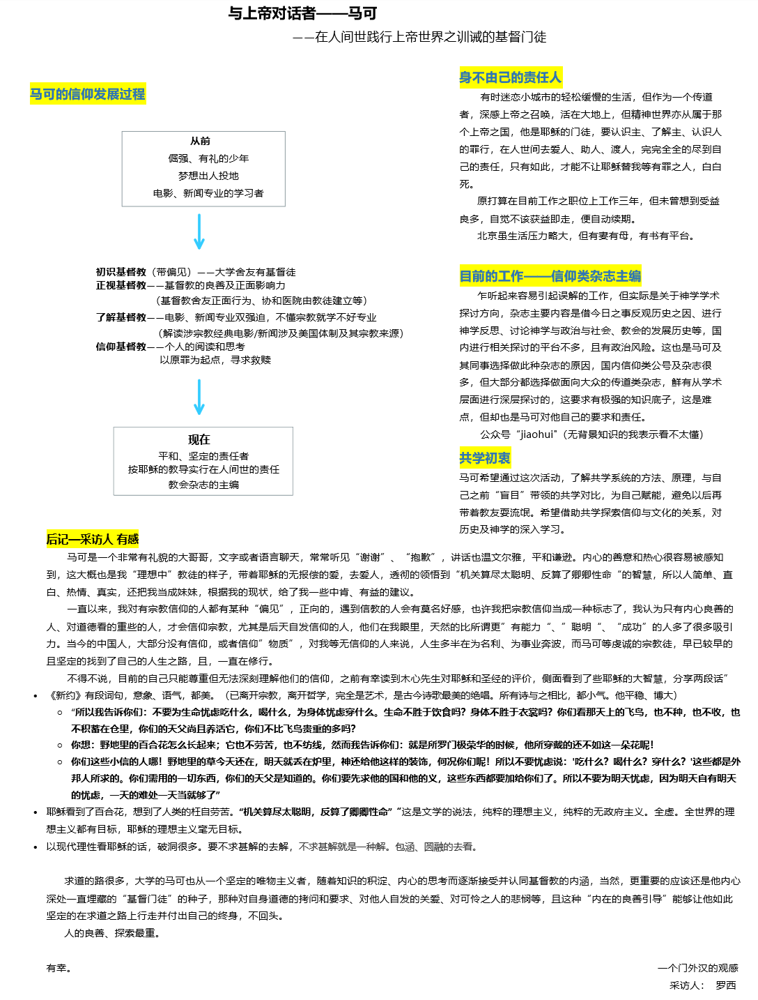

# 一、介绍

706共学行动小组是在疫情的情况下，对“共学”进行探索与实践的行动小组。所谓共学，是对共同对特定的材料进行学习、并从彼此的生命经历、学科背景中学习的实践。行动小组本身在六月的时候已经招募结束，六名参与者、四名观察员、一名协调和三名筹备组成员会在七月至九月进行四周的共学和八周的实践，我们会在行动小组当中开展对“共学”可复制模式的探索。

在招募成员的过程中建立的“706共学行动小组交流群”，一开始作为咨询群，现在则作为行动小组的延伸，是分享行动小组产出的平台。同时，也作为一个“共学”的交流空间，开放给希望招募自己共学伙伴的朋友。

## 价值基础

著有《被压迫者教育学》的著名教育家弗莱雷曾说过，“沒有人能教別人，也沒有人能教自己，而是透過人與人之間的互動，彼此教導”。他认为传统的教育是一种填鸭式教育（banking ），学生被视作一个被动的知识容器；而要培养一个富有批判意识的人，需要提问式教育（problem-posing），在对话的情境中共同探究知识。在提问式教育中，传统的“师生关系”被转变了——老师也是学生、学生也是老师。

而我们还可以对自我教育、同辈学习还有社会学习有更多的期待。老师的角色可以被转化为协作者（facilitator），甚至我们还可以不要协作者的存在。但现实是，越是拥有社会、文化和经济资本的人，越是有自我学习和同辈学习的能力或机会。所以有一个开放的共学平台及简单易得的共学工具是至关重要的。所以我们希望借由共学行动小组，以行动研究的方式，打开更多的空间、整理更多的工具。

# 二、面向想要组织或参与共学小组的朋友

我们先前在群里发布了石墨文档——“[706共学行动小组自由组队](https://shimo.im/docs/RrDRcKRXytw9PcGH/)”，可点击超链接进入该页面，由“已成队/待成队”和“寻找同伴区”两部分组成。

对于有明确共学议题/书目/内容的朋友，可以在前者放上组织者的微信号或是群二维码，对于还没有明确意向的朋友可以放上自己的个人信息或是找已经放上信息的朋友交流。

另外，706青年空间正在筹备学术版生活实验室，具体可以参看微信推文 [不只是网课：共建我们的共居共学空间 | 706北上广深等城市招募](https://mp.weixin.qq.com/s?__biz=MzU4NDU4NDEwMA==&mid=2247499903&idx=1&sn=38ff0f548a161c0f759b180189b4f42a&chksm=fd951eb4cae297a2474dc368988ad8635b57bf86f2242d8ef6d7e67c81d8ae9e19bc873e7388&mpshare=1&scene=1&srcid=0725GETHtLtl3id5i6AGaTQX&sharer_sharetime=1595692460901&sharer_shareid=adba40b62e1f2d338aa3996a2caf50fc&key=9b9af4fa8e2c96d751ff4d8d08b43f5694a24310ca3c05b2d22ed35a2b1862ad00fa42a23b6b0727ee906f5c4c78fe79d7a9f38b97649518939d28af12deade35153ae99d4e67d038693c3da51fddde3&ascene=1&uin=MjA1OTY0NDkyMA%3D%3D&devicetype=Windows+8.1+x64&version=62090529&lang=zh_CN&exportkey=AQWLC8T8SwiUBH7p7U47W0s%3D&pass_ticket=CABDjnuq7bTLOLivsx98ou5hzKh3KHpqovp8WydfDokBkAbzNNEkwumVSe27fhah) ，期待未来线下开展的共学小组

## Q&A

### Q：行动小组和共学小组有什么区别？

A：行动小组的目标是一起摸索如何共学并在后八周开展共学小组，已经结束招募。而共学小组可以是读书会、研讨会，可以约着群里或者自己的朋友一起看书、学技术或者彼此交流，大家自行进行组织或者参与。

### Q：我该怎么组织共学小组？

A：大家在群里喊一声，譬如“有没有人想要一起听翻转电台，一边来讨论的？”、“最近在研究关于边疆的问题，有很多文献需要读，大概有……，有没有人想要一起读？”或者“我正在备考/攻读某某专业，想要找人一起交流”等等。这样感兴趣的人可以直接回应你，你们就可以建群讨论如何进行啦。

为了方便后入群的朋友也能参与到已经组织的小组，也为了我们行动小组的人看到我们带来的涟漪效应，非常欢迎再到页面上po上自己待组队/已成队的信息。

如果大家对组织、开展共学小组有什么疑问，也欢迎大家在群内交流，这个总文档也会不断产出关于“共学”的工具包等内容。

如果需要更多支持，欢迎联系我（彬华，微信号：mychant）。

# 三、行动小组的阅读材料

* **夏林清《斗室星空》期刊论文及书籍**

* 夏林清《拮抗同行的社会学习》

* **李易昆《逆风行者》博士论文**

* 韦伯《学术与政治》

* **弗莱雷《被压迫者教育学》**

* [Paulo Freire的教育哲學](https://mp.weixin.qq.com/s?__biz=MzU0OTU4NDg4MA==&mid=2247484371&idx=1&sn=c74768e66656184c17615072c3c72e1a&chksm=fbace94cccdb605ac90630e4da593e575b4d249f1b6c41d7eb3abf0089083d1615a6044ed3c0&token=1602787605&lang=zh_CN#rd)

* 波瓦《被压迫者剧场》

* 古学斌《行动研究》期刊论文

* The Sage Handbook of Action Research

* 亚隆《团体心理治疗》

* [如何设计你自己的学习社群|慢学校实践社团](https://mp.weixin.qq.com/s?__biz=MzUzMzQwNzE5OQ==&mid=2247488240&idx=1&sn=519122cb0fcb57bae9be723b52cb340e&chksm=faa52640cdd2af56121f701c0ef2cc06f54a596e13e1ed913d5846cbd432b0fbf112ab59dc12&mpshare=1&scene=24&srcid=0731bnGdnU4IaKsCgtaU2ErW&sharer_sharetime=1596127041784&sharer_shareid=0acfc58cdadbba60f6368012ca88a8d7&key=519b8bbaea533f94f4510e8425f2f31556b3af3d384b8cab60967021cbd47c5f3b627d5f3cce2b0305c04973f5c015034600f8df26e9012f9584344eb34ac2cdfa23dbdfc5626f6a699ac8460aeaf35e&ascene=1&uin=MjA1OTY0NDkyMA%3D%3D&devicetype=Windows+8.1+x64&version=62090529&lang=zh_CN&exportkey=AeV4RCEQ9ZJZeIh2aNmsms0%3D&pass_ticket=WTItFianwOjDqVCMz%2F1v6rKPIigbF6emEB0HrnXWgBRIrHBLhUQPC6hb22KoPtov)

* 《世界咖啡》

* 《创造知识的方法论》

* 《实践社团》

……（持续增加中）

# 四、共学小组工具包

为了支持更多的人开展自己的共学小组，行动小组在不断尝试中试图总结出一些原则和工具，单独开设了一个工具包的页面，便利大家参考及使用。（刚刚建立）

[https://shimo.im/docs/PrYhtrvRKRgQYTvJ/](https://shimo.im/docs/PrYhtrvRKRgQYTvJ/) 《706共学小组 工具包》，可复制链接后用石墨文档 App 或小程序打开

# 五、行动小组的进程

为了让大家都能够对行动小组的进程和产出有所了解，让有需要的朋友有所参照，我们将持续更新行动小组每周的进程和产出。

## 第零周线上见面

在第零周的线上见面会中，我们畅聊了两个半小时，了解了彼此基本的情况以及参与行动小组的

原因。组织者重新介绍了行动小组的目标和愿景、整体的安排，让大家进行《斗室星空》和《行动研究》两篇论文的阅读，并在结束后开展互相采访的活动。全员都完成了采集，部分同意分享给大家：

《鹿 · 路》，[https://shimo.im/docs/qrRhY6VxtPVPg9Yq/](https://shimo.im/docs/qrRhY6VxtPVPg9Yq/) 

## 第一周线上讨论

第一周的线上讨论，我们对于“共学行动小组”做了进一步的明晰，我们在整个行动的过程中去体验如何共学、在之后开展共学，不断去反思和产出关于共学的知识。接着大多数成员用了四分钟左右的时间对于之前阅读的两篇论文有感触、有疑问或有批判的地方进行了分享，大家的分享当中也对于彼此的分享进行了呼应。最后组织者询问大家对于接下来共学的需求，听到了对于共学具体技巧、共学的理论脉络等各方面的需要。

在这周的讨论当中，出现了几个比较核心的议题：

**1.行动研究的方法**

行动研究是我们行动小组的基本方法，但它对大多数人来说非常陌生。行动研究强调行动者要自觉地对自己的价值、实践成效进行反思，强调研究者不能只是一个外部的观察者来进行研究。于是涉及到了行动研究的中立性、介入性等问题，也进一步拓展到了权力关系方面的讨论。

对于行动研究的方法，有人表示相见恨晚，有人感到非常亲切，也有人对自己成为一个充分发挥能动性的行动者而感到有些振奋。

**2.权力关系**

行动研究者整体来说还是偏向一个外部专家的角色，而古学斌老师论文中举例的社会工作者同样也是一个外部的力量。那么就存在着外部角色带着自己的受训背景、预设进行协助的问题，这种协助强调了多元性和平等，但它是否真的落实了自己宣称的价值？在这种协助中会不会还是将服务对象引入了传统的窠臼或是现代社会的逻辑中？外部的力量是一种干预还是催化？

同时，也有讨论者提出要一定程度上悬置权力关系的问题，或是在实践中、实践后进行反思。

在开展共学小组的时候，如何面对自己的价值观和预设，如何看待“师生”关系和“共学”关系的区别，也是在隐含讨论中的议题。

**3.家的社会田野**

在《斗室星空》的论文中，着重笔墨讲述了“家的社会田野”，许多人都在这篇论文中感到了不同程度的共鸣。家在我们的生命历程中扮演怎样的角色？它如何影响了我们的社会化，或是我们三观的形成？“家的社会田野”这个视角如何能够帮助我们理解“社会学习”的概念？“沉默”究竟意味则什么？

## 第二周线上讨论

第二周的线上讨论，我们分组对《逆风行者》的各个章节进行了领读，领读首先概述了章节的内容，接着大家结合对开展共学的需要和期待，分享《逆风行者》的内容对我们有什么帮助。

共读产出：

[《逆风行者》 各组导读](https://shimo.im/docs/jGWp8DwH8hpTvkwx/)

在结束了第二周的线上讨论后，大家提出了一些任务：

* 思考：接下来想开展怎样的共学

* 分享：自己在组织共学中可能面临的最大挑战/恐惧是什么？

* 行动：希望要发起共学小组的伙伴写写自己的发起思路。推荐用思维导图的方式梳理出每个步骤需要厘情的问题和组织者对应的to do list

## 第三周线上讨论

第三周的线上讨论，我们结合了“接下来想开展怎样的共学”以及“自己在组织共学中可能面临的最大挑战/恐惧是什么”回返参看了之前三周的体验。

我们注意到第零周的互相采访活动，大家都非常用心，而这些用心的材料没有得到充分的讨论，是我们在小组进行中的一个遗憾。在这部分的讨论里，我们延展出了一些讨论。譬如，在招募报名时，我们都有提到自己的愿景和期待，这些期待应该在我们整个共学的进程中不断去核对。

## 第四周线上讨论

（待更新）

