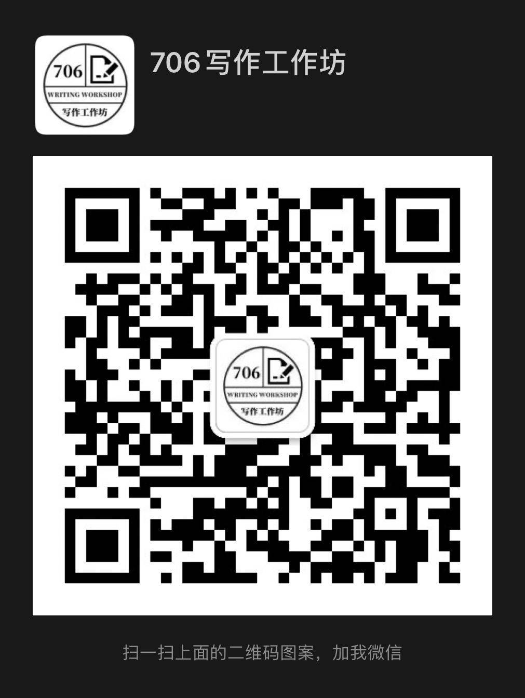

**参与工作坊请尊重并保护其他参与者的作品版权，在取得原作者许可前，不可将讨论作品传出工作坊之外。违者须承担相应的法律责任。**

# 工作坊参与

706 写作坊是一个开放的线上青年写作社区。不同类型的写作者们每周末会在线上讨论彼此的作品，互相提出创作建议。

## 活动信息

工作坊目前根据不同的写作文体，已建立 ：影像组、影评组、现代主义小说组、现实主义小说组、类型小说组、科幻组、新诗组、非虚构组、名作共读组。

* **影像组：**讨论作品包括并不限于短片电影剧本、长片电影大纲、舞台剧单元剧剧本等。

* **影评组：**主要讨论影评写作。

* **现代主义小说组：**现代与后现代文学，鼓励实验写作。

* **现实主义小说组：**讨论作品主要为讨论现实生活的严肃文学。

* **类型小说组**：包括但不限于言情、科幻、悬疑、玄幻等通俗文学。

* **科幻组：**科幻作品写作

* **新诗组**：主要讨论现代诗歌作品。

* **非虚构组：**非虚构写作。

* **名作共读组：**工作坊内唯一的阅读小组，定期共读一本书并做分享。

**各组可能有不定时补位席，补位信息会在工作坊关注群中发布。**

## **作品要求**

**5000 字以内的叙事体裁的文本。**

工作坊成员可每周提交不断修改后的同一个作品，也可每周提交不一样的文本讨论。

## 参与方式

### **A. 加入咨询/关注群**

（1）扫码加入“706写作工作坊”二群，关注各组最新招募动态并咨询。

### **B.**添加“706写作工作坊”微信号，关注各组最新招募动态并咨询。

### C. 建立新的小组

1. 根据自己的兴趣，想到一个新的小组类型。

2. 在工作坊大群内，提出自己的意见，并积极与感兴趣的小伙伴一起讨论。

3. 与兴趣相投的成员，共同组建小组的小群，并分享到大群，持续引进感兴趣者。

      并邀请工作坊官方号进群。

4. 在小群内，讨论并确定，参与人数、开展时间等细节。

5. 向工作坊官方号报备，并登记进工作坊流程文件、成员登记表。

6. 在工作坊总目录下建立小组共享文件夹，开展活动**。**

### D. 旁听各组讨论

**本文档为每周开放旁听的各组会议链接汇总，欢迎加入旁听及分享本文档。**

[https://shimo.im/docs/3QpRhVyYK9rtVcRx](https://shimo.im/docs/3QpRhVyYK9rtVcRx)

旁听礼仪：为保证网速，请旁听者闭麦并关闭摄像头。

旁听工作坊请尊重并保护其他参与者的作品版权，在取得原作者许可前，不可将讨论作品传出工作坊之外。违者须承担相应的法律责任。

---

# 工作坊流程

## 准备工作

1. **注册石墨文档账号 & 下载腾讯会议APP：**本次工作坊将通过**石墨文档**和**腾讯会议**展开。

    1. **石墨文档**是一款在线编辑文档，无需下载，可在电脑客户端使用微信登陆，我们将使用石墨文档共享彼此的写作内容。**在完成石墨账号的注册后，我们会将参与共享文件夹的协作入口发给参与者。**

    2. **腾讯会议**是一款线上会议软件，工作坊进行时我们会使用腾讯会议进行交流，每周会议链接将由当周主持人发给大家。

2. **完成自我介绍**：[https://shimo.im/sheets/8g98Wkrq8jWvDrPX/ ](https://shimo.im/sheets/8g98Wkrq8jWvDrPX/ )

    1. 请填写自己以往可公开的作品，让其他参与者了解到你的创作风格和类型。

    2. 请填写#自己目前的创作方向。

    3. **已完成报名并入组者方可填写该表。**

3. **建立自己的写作文件夹：**请按照自身所在组别，在 [影像组](https://shimo.im/folder/YtqhCv8JxxCwjyXQ)**、**[童话寓言组](https://shimo.im/folder/XjYvJctrypXCh8cr)**、**[现代主义小说组](https://shimo.im/folder/cQ6TcpCWhpJvrWTt)**、**[类型小说组](https://shimo.im/folder/6PkPKyyYvyHTctyv)**、**[现实主义小说组](https://shimo.im/folder/whVX38GTj9tGCKpR)**、**[新诗组](https://shimo.im/folder/tDycDqTvHJ9XytqD) **等****自己小组的文件夹（请联系小组协调获取链接）**里建立以自己昵称为标题的文件夹。

    1. **每周五晚上前**，参与者们需要自己的文件夹中更新希望本周讨论的作品。

    2. **每周工作坊讨论前**，参与者们需要阅读完其他参与者希望的作品。

    3. 如果愿意，欢迎将其他创作的作品共享在文件夹里，促进彼此间更多的交流。

    4. * 我们希望可以建立一个信任度较高的写作社区，**鼓励参与者们工作坊期间的一个月，直接通过石墨文档进行创作**，从而方便其他参与者们看到实时最新的修改动向，并可使用石墨文档的评论功能添加意见。

    5. * 我们希望参与者们可以不仅仅只依赖于每周固定的工作坊时间讨论，我们鼓励大家彼此之间有更多的交流。

4. **流畅的网络 & 开启摄像头：**为了工作坊进展流畅，希望大家能**确保自己所使用的网络速度**。为了提升参与感，并给参与者们彼此更多的反应回馈，我们鼓励大家开启摄像头。

## 讨论流程

**成员将轮流担当主持人，当周主持人将引导大家按顺序依次作为被讨论者。**

1. 故事作者先分享自己创作该文本的历程与想法。

2. 主持人首先分享自己的建议。

3. 主持人按顺序引导大家进行发言，对每一个参与者的发言内容进行简短总结。

4. 在所有人发言结束后，被讨论者可针对意见，进行回应。

5. 讨论中，参与者可以利用腾讯会议的表情功能“举手”，即时发言，随机“插入”。

## **各组讨论时间**

每周末进行三小时讨论活动，具体时间由成员协商决定。

---

# 工作坊讨论礼仪共识

* **友善，礼貌，不做价值判断。**

* **尊重不同的审美偏好，就作品本身展开讨论。**

* **避免涉及政治相关性太强的作品与作家，避免在讨论中过多涉及政治。**

* **尽量只讨论艺术作品本身的审美性，只从文本的技术层面来讨论，不过多输出个人价值观。**

**工作坊如何给他人提意见参考：**[https://shimo.im/docs/wqyxptWgDqY8qhDw](https://shimo.im/docs/wqyxptWgDqY8qhDw)

---

# **附：706写作工坊反性骚扰制度**

**参考文档：**[706性别友好和反性骚扰机制](https://mp.weixin.qq.com/s/YIrZcvn3goFVTLG-_aG_Wg)

## 性骚扰零容忍

* 不纵容、不沉默，一旦发生就要处理

* 骚扰就是骚扰，任何时候都不给骚扰者犯错的机会和借口

* 706 应对小组调查的过程中，一定给予双方足够的陈述机会，保证公平公正

* 只要 706 知晓并且在 706 能力范围内的案例，706 一定有所作为；不在能力范围的案例，706 也将积极配合调查、取证，交由施害者原单位或警方处理。

**如果您在706写作工坊遇到以下行为，感受到不适，可直接对行为人进行批评和拒绝；如果迫于压力不能当场指责和拒绝，或对此行为感到困惑、不能判断，也可通过706监督小组或专门的渠道进行正式或非正式投诉，706监督小组会在第一时间给予响应。**

* 公开讲黄色笑话、有性别歧视色彩的笑话；

* 在公共场所发表带有偏见的贬低女性/跨性别者的言论；

* 在公共场合索要他人联系方式，被拒绝后仍然继续纠缠；

* 被拒绝后，仍持续地进行令人厌恶的私下邀约；

* 通过短信、微信、邮件等方式向对方传达带有性意味的令对方感到不快的信息；

* 通过活动或者社群的渠道和关系，私下进行微信或口头聊天，使用“约炮”、“上床”等词汇提出性邀约

* 利用关系/地位/等级强迫对方做与性相关的事。

## **监督小组和投诉渠道**

**706监督小组**由706主导（多个工作人员统筹）和其他角色辅助（志愿者、住客及活动参与者提供监督以及反馈）组成。职责如下：

1. 负责监督。

2. 及时查看投诉/申诉渠道的反馈。

3. 将反馈资料提交至【706应对和处理小组】

**正式投诉/申诉的渠道和方式**

• 邮箱实名或匿名发送邮件：邮箱地址（wufangrong706@sohu.com）

• 微信公众号里留言或者发送消息：微信公众号（706青年空间）

• 向706工作人员投诉（官方账号：706写作工作坊，706社群小伙伴）

• 向社群、活动负责人当面投诉

## 性骚扰问题处置机制

对被举报人的处置措施以事实调查为基础依据，并根据双方协商的意见进行判定，当小组成员对情节严重程度认定意见不一致时，采取投票方式（超半数）决定程度。

**与706间接相关的当事人：嘉宾、组织者（非706官方人员）、志愿者（非706官方人员）、认识很久的老朋友、经常来的人、住客、活动参与者、偶尔来的人、不认识的人：**

* **如有单次的、言语上的侵犯，情节轻微的，给予以下处罚：**

    1. 给予批评警告

    2. 要求其对受害者及706进行道歉（包括手写道歉信，签名手印等）

* **如有持续性的、言语上的侵犯及单次的、行为上的侵犯，情节严重的，给予以下处罚：**

    1. 禁止进入706：1天到永久。

    2. 在社群内公开其道歉信（包括手写道歉信，签名手印等）

* **如有持续性的、言语上的侵犯及持续性的、行为上的侵犯，情节特别严重，给予以下处罚：**

    1. 在社群公开其行为及道歉信，社群范围如住客群、活动微信群、工作号微信朋友圈、公众号（与双方协商一致，并在法律允许范围内）

    2. 要求其进行赔偿（与双方协商一致，并在法律允许范围内）

    3. 向所在单位的人事部门递交举报材料

    4. 报警

**与706 直接相关的当事人：**

除以上措施外，对于706工作人员和组织者的处罚还包括：降职、调动、劝退、辞退等。

---

**工作坊所有运营文档索引**：

[https://shimo.im/docs/zXNFktsqBKkCVDo0/](https://shimo.im/docs/zXNFktsqBKkCVDo0/)

**参与工作坊请尊重并保护其他参与者的作品版权，在取得原作者许可前，不可将讨论作品传出工作坊之外。违者须承担相应的法律责任。**

