# 本地录屏指引：

## 录屏软件

1. 有很多软件，推荐OBS[https://obsproject.com/](https://obsproject.com/)和Quicktime，其他的可以自行探索

2. 推荐理由：OBS功能比较多，可以录屏、降噪、直播，是一款相对专业的开源录屏软件；Quicktime是苹果电脑自带的，可满足最基本的录屏需要

## 插件

1. soundflower，可以自行搜索下载，因为苹果电脑不支持录制系统内部声音，需要下载这个插件录制系统声音，确保不会录制到外部的杂音，安装地址[https://github.com/mattingalls/Soundflower](https://github.com/mattingalls/Soundflower)

2. 安装教程[https://blog.csdn.net/justidle/article/details/104819964](https://blog.csdn.net/justidle/article/details/104819964)

## 本地录屏步骤

### 准备事项

    1. 退出微信、飞书等软件，或者关掉微信、飞书等无关的系统提示音

    2. 调整电脑声音设置，输入选择soundflower,输出选择多输出设备（如下图）

    3. 提前两个小时左右测试网络、录制效果，确保遇到问题可以有充足的时间解决

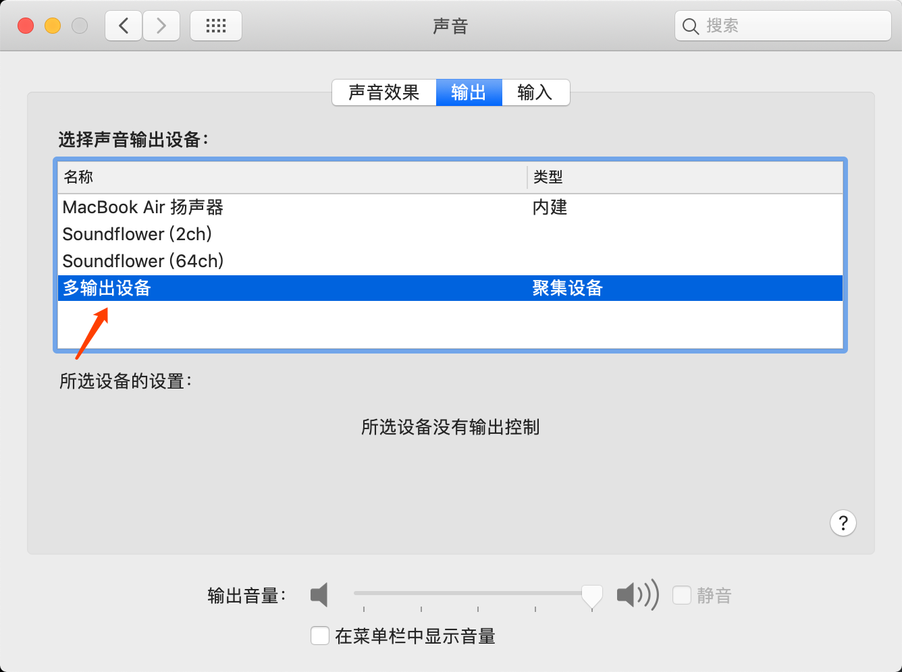

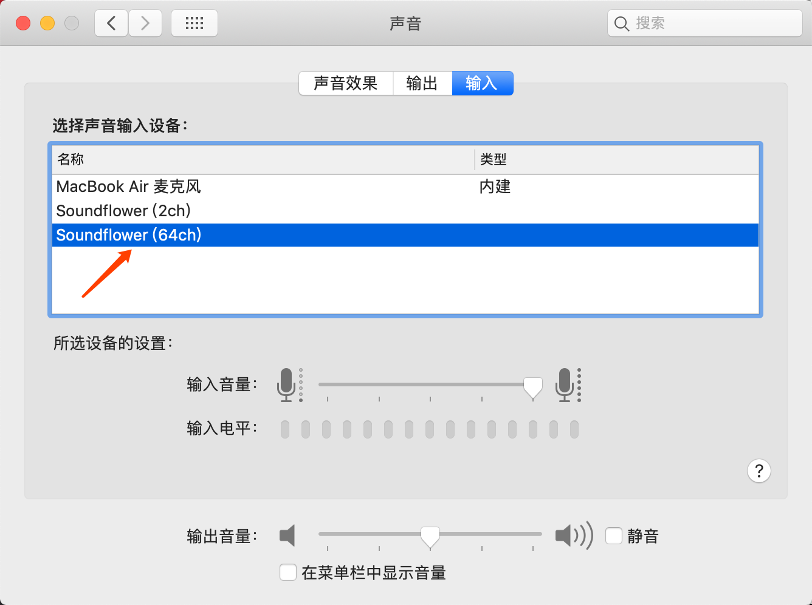

### OBS录屏设置

    1. 基本设置

        1. 设置视频——视频比特率可以设置为8000Kpbs，音频比特率可以设置为320 Kbps，有更多的设置需求可以自行了解这些概念～

        2. 桌面音频——soundflower

        3. 热键——设置快捷键，设置开始录制、结束录制等快捷键，方便录制

        4. 其他的设置可以自己探索一下

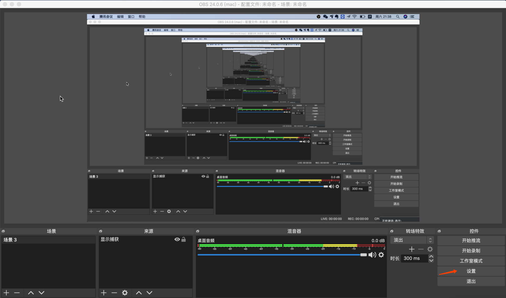

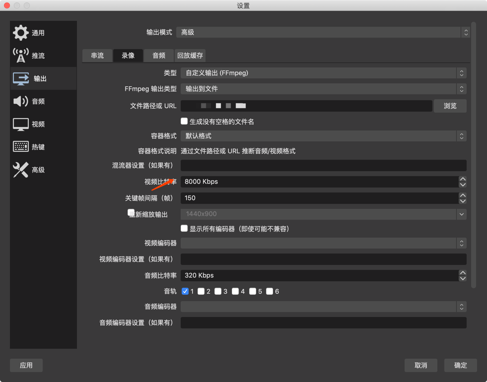

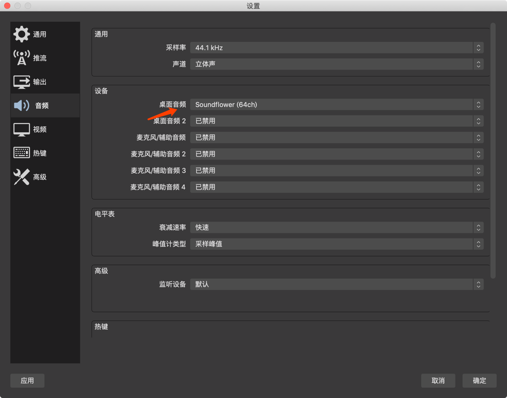

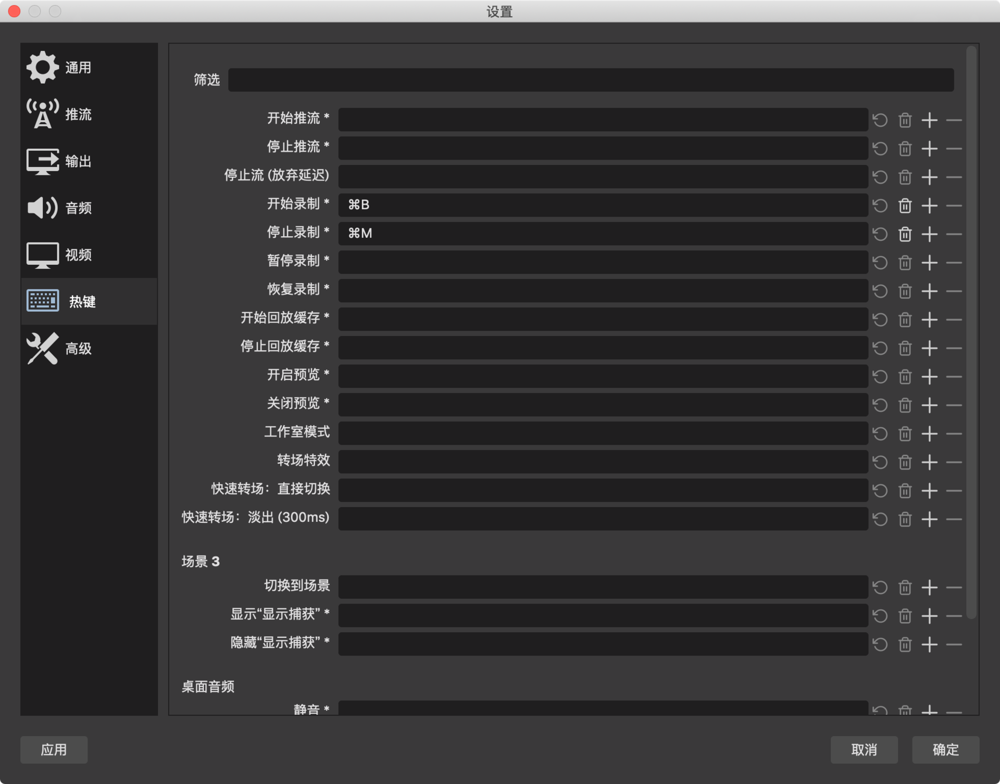

    1. 开始录制

        1. 点击「来源」下面的加号，选择「显示捕获」，其他捕获也可以，显示捕获会录制当前看到的界面

        2. 点击右侧「开始录制」，最后点击「结束录制」

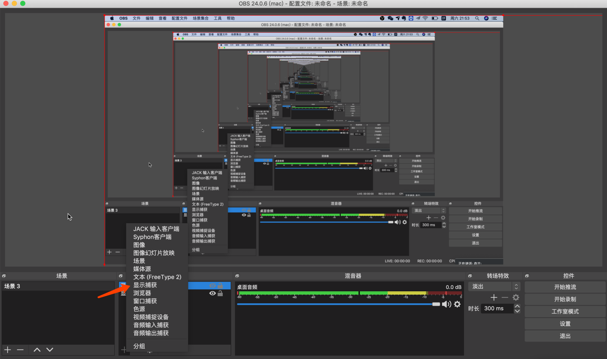

最后，这些是最简单的录屏方法，关于OBS的其他功能，可以一起学习～

### Quicktime录屏

    1. 准备事项之后，打开Quicktime，点击「文件」——「新建屏幕录制」——点击「开始」按钮，开始录制，最后结束录制

# QuickTime本地录音

    1. 做好准备事项，设置好音频等，点击「文件」——「新建音频录制」——点击「开始」按钮，开始录制，最后结束录制

# zoom转播

* zoom设置：安排新的会议——填写会议主题和时间——取消勾选选择会议密码（706活动都是直接点击会议链接可以进入，不需要输入密码）——主持人和视频默认关闭（视情况而定）——会议选项（**取消勾选启用在主持人之前加入会议**，勾选☑️进入时**将参与者设置为静音**）

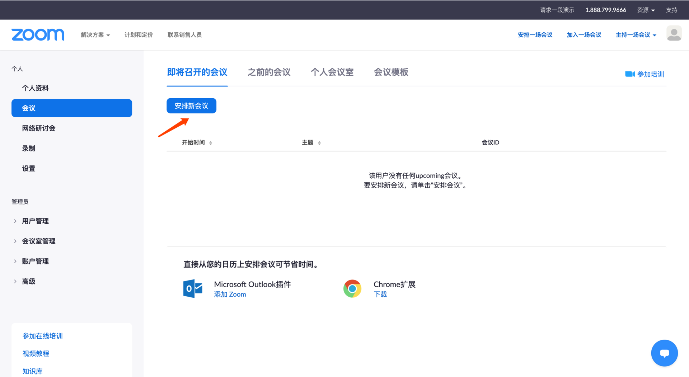

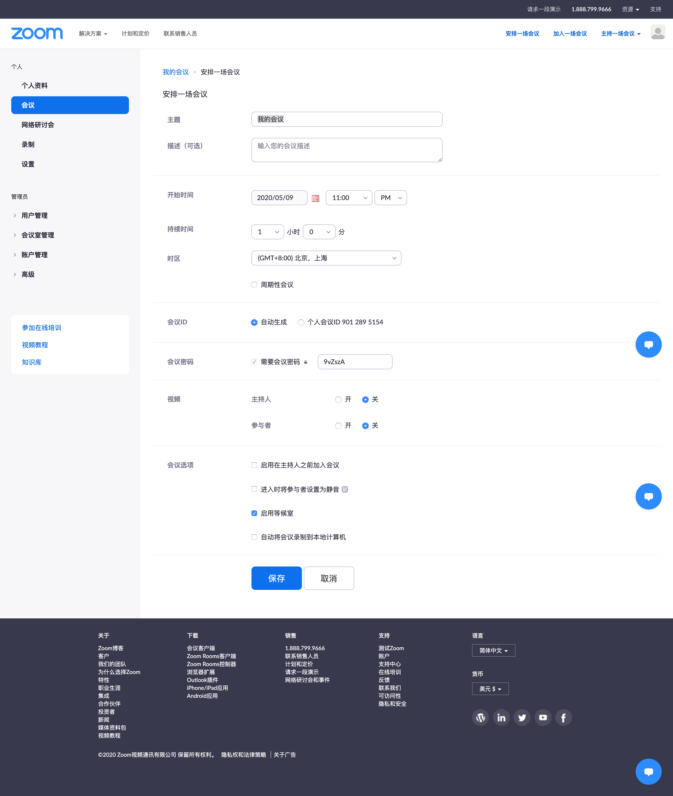

* 录制设置：已经设置好，一般不需要更改，音频和视频分开录制

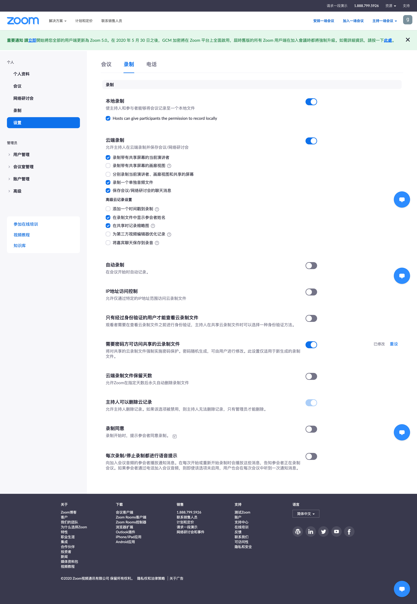

* 会议设置：全体静音——并且取消勾选「允许参会者自行解除静音」，避免中途参会者解除静音造成杂音

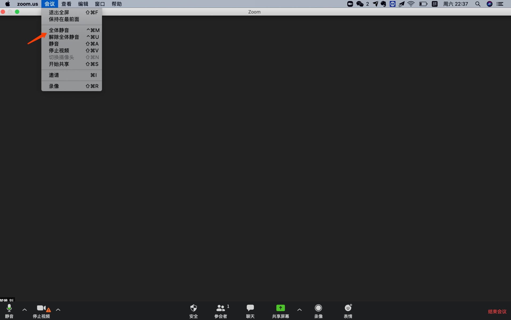

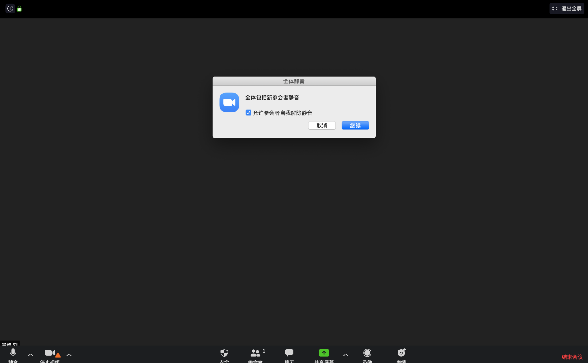

    1. 录像：先根据上面的准备调整好电脑和声音设置

        1. 退出微信、飞书等软件，或者关掉微信、飞书等无关的系统提示音

        2. 调整电脑声音设置，输入选择soundflower,输出选择多输出设备（如下图）

        3. 提前两个小时左右测试网络、录制效果，确保遇到问题可以有充足的时间解决

    2. zoom音频按照下图选择（⚠️转播成功时，我们是听不到外放的声音的）

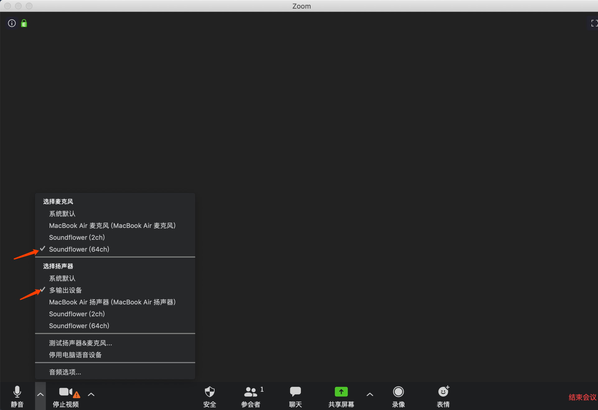

* 点击录像——即可开始录制——最后结束录制
