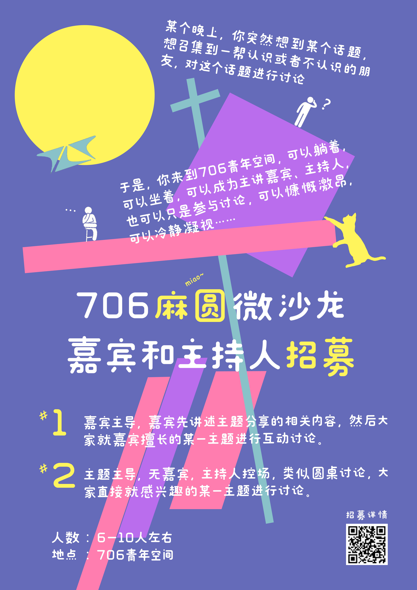
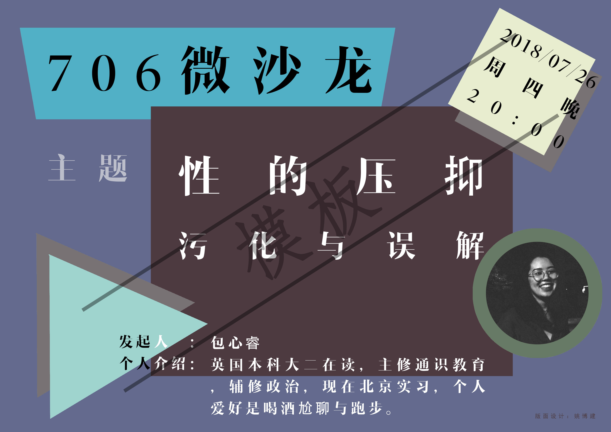

**活动简介：**

某个晚上，你突然想到某个话题，或是近期的热点事件，或是有趣的见闻和经历，或是严肃的学术问题，想召集到一帮认识或者不认识的朋友，对这个话题进行讨论。于是，你来到706青年空间，可以成为主讲内容分享嘉宾或是话题主持人，也可以只是参与讨论。讨论中，可以慷慨激昂，可以冷静凝视……

706青年空间希望发挥公共空间的原本优势，通过“706麻圆微沙龙”为青年群体创造更多表达、交流和讨论的机会。
<br>

**活动形式：**

形式一：嘉宾主导，嘉宾先讲述主题分享的相关内容，然后大家就嘉宾擅长的某一主题进行互动讨论。

形式二：主题主导，无嘉宾，主持人控场，类似圆桌讨论，大家直接就感兴趣的某一主题进行讨论。

时间：60\-120分钟，一般在周六及周日晚上八点开始。

人数：5\-10人左右

地点：706青年空间玻璃桌或者小房间
<br>

**微沙龙流程：**

1. 自我介绍（5-10 分钟）

每个人自我介绍（嘉宾最后介绍），说明自己的学校专业或公司职务，自己如何知道706青年空间的？为什么对这个主题的微沙龙感兴趣？

规则：所有参与的人，必须自我介绍。

2. 嘉宾陈述（15-30 分钟）

此环节为嘉宾的主场，嘉宾介绍主题相关的故事、经历、事实、经验或者理论。

规则：如无必要，观众不要在此环节打断嘉宾；如想打断嘉宾，需要得到嘉宾同意。

3. 观众提问互动（20—40 分钟）

此环节为开放环节，观众可以对嘉宾进行提问，观众之间也可相互提问。

规则：当一个问题正在被讨论，其他人不得私下交流，以免造成干扰。
<br><br>


**微沙龙往期活动汇总：**

[2018-09-29] [焦虑症正在伤害我，该怎么办？科技天花板与未来的世界；银河系自转 | 706麻圆微沙龙](https://mp.weixin.qq.com/s?__biz=MzU4NDU4NDEwMA==&mid=2247492006&idx=2&sn=c6b47fc0879865c7661fd15476c1b5ef&chksm=fd953f6dcae2b67b6d224f9d5f6fda096e11b1873c7273bc4db8accea84850bbc350a039d6a1&token=444111544&lang=zh_CN%23rd)

1. 科技天花板与未来的世界
2. 焦虑症正在伤害我，该怎么办？
3. 银河系自转与地球历史上的三次大灾变
<br>

[2018-09-18] [焦虑症正在伤害我，该怎么办？谈谈《乌合之众》 | 706麻圆微沙龙](https://mp.weixin.qq.com/s?__biz=MzU4NDU4NDEwMA==&mid=2247491815&idx=2&sn=c5d733d10ba596db0f3d8c14b04c0f68&chksm=fd953e2ccae2b73afd1353dd4ecab1aee0d13e3469600080dfb131c1c06adbeddf7761b9cb34&token=444111544&lang=zh_CN%23rd)

1. 焦虑症正在伤害我，该怎么办？
2. 剪不断，理还乱，一个城市与大国的故事
3. 谈谈《乌合之众》这本书
<br>

[2018-09-12] [为什么很多男性比较渣？两性择偶策略探讨！让我们温柔地谈谈抑郁症？谁是我？ | 706麻圆微沙龙](https://mp.weixin.qq.com/s?__biz=MzU4NDU4NDEwMA==&mid=2247491739&idx=3&sn=c6c0810e70d20b9c5434c00c61de9c92&chksm=fd953e50cae2b746dcc6e455693b717bc92184e53ff1fbbbd3d6bd1a383089f15d27af08c7e8&token=444111544&lang=zh_CN%23rd)

1. 让我们温柔地谈谈抑郁症
2. 两性择偶策略探讨————《欲望的演化》读书心得分享会
3. 谁是我
<br>

[2018-09-04] [706麻圆微沙龙：单身税是你想的那样吗？小鲜肉和男子汉，谁会是赢家？](https://mp.weixin.qq.com/s?__biz=MzU4NDU4NDEwMA==&mid=2247491602&idx=1&sn=ce3e4617b435be9d5da2f195da8f5583&chksm=fd953ed9cae2b7cf0953039bd1ccecf51357cb5debc22272fe3023f7ea5ea4651889987563c3&token=444111544&lang=zh_CN%23rd)

1. 单身税是你想的那样吗？收还是不收？
2. 小鲜肉和男子汉，谁会是赢家？
3. 那可不只是童话！
<br>

[2018-08-28] [706麻圆微沙龙：心理学情绪研究；尘肺病群体公益探讨；谁敢谈国学](https://mp.weixin.qq.com/s?__biz=MzU4NDU4NDEwMA==&mid=2247491500&idx=1&sn=c0c7b9669390e4ce79f0d6b4ee8dcb86&chksm=fd96c167cae148713a64d4ea1887e82cf86bb5b9a0ed590455f1c1581d942d772cd3abc8ee27&token=444111544&lang=zh_CN%23rd)

1. 谁敢谈国学谁谈国学
2. 尘肺病群体公益探讨
3. 心理学情绪研究：快乐使你微笑，还是微笑使你快乐？
<br>

[2018-08-21] [706麻圆微沙龙：我在哈佛学电影；公益新模式何处去？](https://mp.weixin.qq.com/s?__biz=MzU4NDU4NDEwMA==&mid=2247491412&idx=1&sn=1b69d7b37a588660979c4d19a2de65c7&chksm=fd96c19fcae14889bfcfddc51e2cfed8f5926d7aa84312d71d7bc6c001ffab062a19d71737f1&token=444111544&lang=zh_CN%23rd)

1. 我在哈佛学电影
2. 公益新模式何处去？
3. 音乐剧的误解和赏析指南
<br>

[2018-08-15] [706麻圆微沙龙：香格里拉的藏地见闻\.比特币的未来\.人物采写经验分享](https://mp.weixin.qq.com/s?__biz=MzU4NDU4NDEwMA==&mid=2247491352&idx=2&sn=325d9b0edb7d353dbc91467f160d9b07&chksm=fd96c1d3cae148c5dbecbefa2bb206b2182ec87bb3182e5e02078680b37218c9813d2217776b&token=444111544&lang=zh_CN%23rd)

1. 香格里拉的藏地见闻
2. 比特币的未来
3. 人物采写经验分享
<br>

[2018-08-08] [706麻圆微沙龙：法国留学见闻·北京城的历史格局与建筑·如何讲故事·校园欺凌](https://mp.weixin.qq.com/s?__biz=MzU4NDU4NDEwMA==&mid=2247491274&idx=3&sn=6233e8fbc6ac0f9dd405f8a172723f3b&chksm=fd96c001cae14917fe06787a2c997784bab532e84ffdfc9b4e369f9e0d503c153699f01890bb&token=444111544&lang=zh_CN%23rd)

1. 法国留学见闻
2. 北京城的格局和历史建筑
3. 一个故事的诞生
<br>

[2018-08-01] [706麻圆微沙龙：文学与电影·幻想乡·写作与职业规划](https://mp.weixin.qq.com/s?__biz=MzU4NDU4NDEwMA==&mid=2247491211&idx=4&sn=78566ae857a45273a4547b39ace3ac5e&chksm=fd96c040cae149565b50a282575e947e0c65b91621d791f87decb645896024f3ecc38ab717ca&token=444111544&lang=zh_CN%23rd)

1. 文学作品改编为电影的得失
2. 什么是东方 Project？
3. 履歷寫作及理想主義者的職涯規劃

<br>

[2017-09-30] [十一：706微沙龙，让我们自由聊聊学术和公共话题 | 706活动](https://mp.weixin.qq.com/s?__biz=MzU4NDU4NDEwMA==&mid=2247489378&idx=1&sn=6a4ad15bffcdd62afee0a4c5c23138a2&chksm=fd96c9a9cae140bf45b9732e8eaa7c5d8fe46206624c34027f6f38916697e8967336cdbcd9cd&token=444111544&lang=zh_CN%23rd)

1. 在现代性的冲击下，回族人如何保持他们自己的文化
2. 关于王笛和微观历史学的研究
3. 在今天我们怎么正确认识“少数民族”？
4. 作为一个学习实证学科的人是如何阅读理解马克思的？
5. 高校视角下的濒危语言抢救
6. 爱情的神经基础
7. 酷儿理论的尴尬
8. 我作为一个符号，该如何表达自己
<br>

[2018-07-22] [706麻圆微沙龙 | 上瘾\.保健品真相\.性的压抑污化\.独立思考\.心理咨询\.公益](https://mp.weixin.qq.com/s?__biz=MzU4NDU4NDEwMA==&mid=2247491134&idx=2&sn=223085e1a7605c423f283f82ee18324f&chksm=fd96c0f5cae149e34db18ed4075e118ed5059e940e928adc1918ef54e5d6686f1b901a29ba2f&token=444111544&lang=zh_CN%23rd)

1. 漫谈上瘾这件事儿
2. 你吃的营养保健品真的管用吗？
3. 性的压抑、污化与误解
<br>

[2017-07-21] [你真的了解医生吗？｜麻圆微沙龙 · 医学专场](https://mp.weixin.qq.com/s?__biz=MzU4NDU4NDEwMA==&mid=2247489455&idx=2&sn=03f36e0969650f3b0eee9135112c041c&chksm=fd96c964cae140724e369d1fbe8bbfe3543bc4a861005ae023ccd4d4b5570ed0f20284d78c52&token=444111544&lang=zh_CN%23rd)

1. 医学的科学力量与人文关怀————诊间故事带给我的思考
2. 生与死之间的距离为何？————医学伦理与社会道德
<br>

[2017-07-19] [freestyle · 抑郁症 · 麻圆微沙龙 · 苏格拉底 · 新媒体工作坊 ](http://www.shedejie.com/jiankang/36089.html)

1. 抑郁症，你不知道的事
2. 医学专场
3. “新媒体艺术为人民” 工作坊
<br>

[2017-07-13] [这个周末，把706交给艺术！ | 麻圆微沙龙·当代艺术专场](https://mp.weixin.qq.com/s?__biz=MzU4NDU4NDEwMA==&mid=2247489463&idx=1&sn=fbdb8d03af568ce95bf4eb627d999f03&chksm=fd96c97ccae1406a310e6808b6962a4eaf2cead5be3af2899da3541af89a76b4c87c52caec52&token=444111544&lang=zh_CN%23rd)

1. 艺术的故事————如何欣赏当代艺术
2. 《坠入虚空》讲起————关于当代艺术的漫谈和思考
<br>

[2017-07-06] [麻圆微沙龙 | 性少数在中国 · 女权主义 · 青年视角下的党史](https://mp.weixin.qq.com/s?__biz=MzU4NDU4NDEwMA==&mid=2247489469&idx=2&sn=6cccd11085e9a93dc62619e6721caa2b&chksm=fd96c976cae14060ccfb633a65daa15a289717f3e2e0562da9c654fca049864a67eb27c640e7&token=444111544&lang=zh_CN%23rd)

1. 看不见的世界————病毒学深度科普
2. 关于湾湾的二三事
3. 谈“**认知神经科学**”作为工科生的心理学
4. 性少数在中国
5. 女权主义会让你的生活更美好吗？————性别视角下的世界有什么不同
6. 以新青年视角聊聊党史
<br>

[2017-06-27] [麻圆微沙龙 | 寻找一种更加理想的交流场景和模式](https://mp.weixin.qq.com/s?__biz=MzU4NDU4NDEwMA==&mid=2247489479&idx=1&sn=9f63262c6a3896bdd8f7817d151fc7bf&chksm=fd96c90ccae1401a4320a02d260c50829dab3f5f328269af700b8091f2859d7a91b0eb3e39ec&token=444111544&lang=zh_CN%23rd)

1. 从科学理性主义视角观察道德进步————从生物的“**是**” 到道德的 “**应当**”我们可以走多远

2. 来到法国的第一年，我目睹了两场选举

3. 我们的教育只能是“**铁板一块**”————教育创业与创新分享

4. 阿罗不可能定理与社会选择理论

5. 从青铜器到康定斯基，艺术史究竟在研究什么？

6. 至恩至仇，至远至进，父亲母亲

7. 教书与育人————人生道路和自然成长
<br><br>


**706 青年空间 “麻圆微沙龙**”

**Q&A**

**Q**：“**706麻圆微沙龙**” 与 “**文化沙龙**”**、**“**学术讲座**”的区别是什么？

微沙龙主题多样，可以聊严肃的学术问题，可以就近期的热点事件进行讨论，可以分享有趣的见闻和经历，可以讲科普，可以聊故事。微沙龙形式简单，六七个人围坐在一起，就可展开分享与讨论。

**Q**：**“706麻圆微沙龙**”的形式是什么？

形式一：嘉宾主导，嘉宾先讲述主题分享的相关内容，然后大家就嘉宾擅长的某一主题进行互动讨论。

形式二：主题主导，无嘉宾，主持人控场，类似圆桌讨论，大家直接就感兴趣的某一主题进行讨论。

**Q**：大家都在“**706麻圆微沙龙**”聊什么？

现代性，酷儿广州摩登上海、中美高等教育、硅谷投资、咖啡馆、职业伦理、左派右派、中国小说、中国思想史 ，道德进步，科学理性主义，交互视角原理，连续性思维，暴力行为，心灵理论等概念进行分享，阿罗不可能定理与社会选择理论，马克思主义，神经学，符号的自我表达，间隔年，西藏旅行经历，原生家庭，大学迷茫，躺尸主义，爱情的生理学基础，区块链技术的基础，复杂性经济学的原理，新自由主义的迷失，酷儿理论，女权运动，留守儿童纪录片探讨，宇宙学，弦理论，共享居住，罗伯特议事规则，五月风暴，大卫哈维，列斐伏尔，空间正义理论，外企工作的经历，海外游学的体验，开民宿的体验。

**Q**：706青年空间为什么要“**706麻圆微沙龙**”？

1. 拓宽706青年空间的话题广度：很多人看到706青年空间的公众号，反馈说706的活动太过学术，门槛很高，导致他们不想进入706青年空间。通过各种主题的麻圆微沙龙活动，可以让更多人参与到706青年空间的活动中，与空间发生连接。

2. 挖掘造访706青年空间有一定的知识背景、技能和经验访客（如活动参与者，偶然造访者等，这些青年可能不如名人大咖的背景深厚，但在某些话题上也有自己的特长和个人特色），为他们提供平台成为706青年空间活动的分享嘉宾或者主持人，来发起微沙龙，既可以丰富微沙龙的话题，又可以增加他们与706的关系。

**Q**：参加“**706麻圆微沙龙**”的时间是？

如无其他大型活动排期，706青年空间每周六日都会发起微沙龙活动，每一个不同主题的微沙龙，会在不同的晚间开始，请留意公众号活动推送。

**Q**：来**706**青年空间，除了参加微沙龙，还可以做什么呢？

在图书馆看书、在咖啡馆喝一杯清凉的夏日饮品，还有撸麻圆，他是一只猫

**Q**：怎么报名麻圆微沙龙？

添加微沙龙负责人微信xiaohuoban706，注明报名微沙龙及场次。

**Q**：如何发起**706**的微沙龙，成为嘉宾或者主持人？

添加微沙龙负责人微信xiaohuoban706，注明您要发起的主题和内容，我们会在审核通过之后通知您。

**Q**：成为微沙龙嘉宾或主持人，需要准备什么？

微沙龙形式简单，氛围轻松，就像平时跟朋友聊天一样，不需要准备什么。如果嘉宾或者主持人需要PPT，请提前准备一份PPT即可。

另外，706青年空间会在公众号里推送微沙龙的活动文案，请提前准备一份如下的沙龙内容简介和发起人简介，还有一张个人照片。

```
沙龙内容：

想从自身经历出发，和大家聊聊国内的性文化。比如大家是如何看待性对一段关系的重要性、男女对性的幻想、性与权力的关系，以及对性可能有的误解。这场微沙龙的初衷是想把性去污化，增加对于性及两性关系的了解。毕竟生活中与朋友和家人还挺少聊这些内容，压抑和避而不谈，就可能产生误解。我希望能创造一个安全的空间，大家都能聊聊自己的经历、困惑和看法。希望706空间里的男女生都能踊跃参与，相信男女生之间会有相似的和不同的想法，也欢迎空间里的情侣们一起参加！

发起人：包心睿

英国本科大二在读，主修通识教育，辅修政治，现在北京实习，个人爱好是喝酒尬聊与跑步。706青年空间住客。
```



                                          编辑：杨树

                                          设计：凯晶
