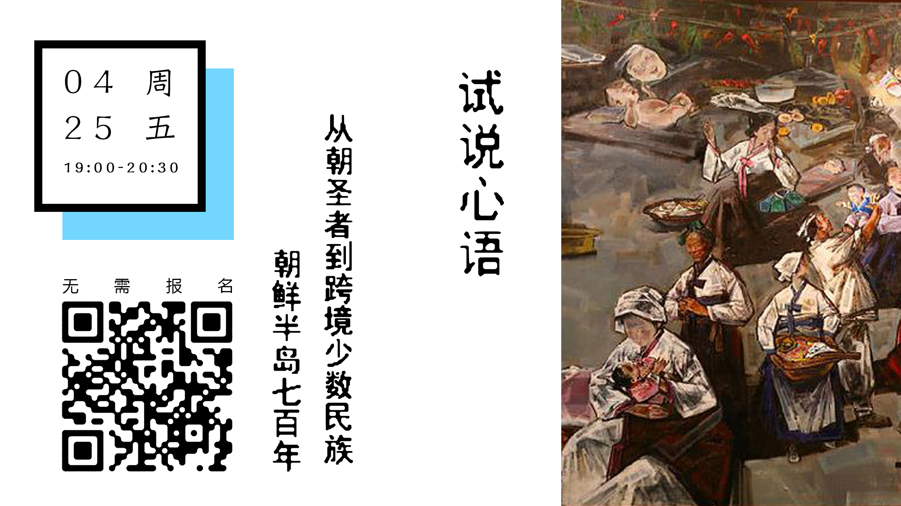

# 推送指南（设计部）

每周二下午2点前，社群小伙伴（现负责人：杨树/西西弗）在会在“常规活动群”发布信息模板：

hello，大家好，我们的常规活动需要在每周二下午的两点前 完成活动信息的采集，设计部的小伙伴才能展开工作，希望大家能理解、配合哈

- 信息采集表：[http://youthsapce706.mikecrm.com/v7UGINp](http://youthsapce706.mikecrm.com/v7UGINp)

- 活动流程 ：[https://shimo.im/docs/8XlHhkVxrK8nkzXo ](https://shimo.im/docs/8XlHhkVxrK8nkzXo)（对外）

- 706活动负责人须知：[706活动流程规范（对内）](http://706%25E6%25B4%25BB%25E5%258A%25A8%25E6%25B5%2581%25E7%25A8%258B%25E8%25A7%2584%25E8%258C%2583%25EF%25BC%2588%25E5%25AF%25B9%25E5%2586%2585%25EF%25BC%2589)

- 706新媒体内部分工：[周三活动推送流程及规则（完整版）](http://%25E5%2591%25A8%25E4%25B8%2589%25E6%25B4%25BB%25E5%258A%25A8%25E6%258E%25A8%25E9%2580%2581%25E6%25B5%2581%25E7%25A8%258B%25E5%258F%258A%25E8%25A7%2584%25E5%2588%2599)

 

1. 需要参照的文件：

- 主要信息对接口:[706](https://shimo.im/sheet/TVzW9rDSH8opaB95/qasFe)[活动场地排期表](https://shimo.im/sheet/TVzW9rDSH8opaB95/qasFe)

- 活动信息采集（周二前截止）:[麦客表单](https://cn.mikecrm.com/form.php%23/submit?id=200258920)

- 微信群（所有活动负责人）

- 706常规活动群（每周更新）:[https://shimo.im/sheet/TVzW9rDSH8opaB95/qasFe](https://shimo.im/sheet/TVzW9rDSH8opaB95/qasFe)
- acc: wufangrong@706er.com

- p/w: 706qnkj

- 微信群主：706社群小伙伴

 

如果发现“排期表”和“麦客表单”时间场地有冲突或者信息不对称，以排期表为主，也需要和活动负责人（杨树）确认

图片制作好后，将此石墨文档的标题日期更新 “一周活动推送（m.dd - m.dd）” 后转交（复制粘贴链接) 给负责排版的伙伴（现负责人：西西弗)

 

**新媒体 | 头条**

1. 头条封面图
   - 尺寸 ： 16:9 & 2.35:1 (请随时更新最新的公众号格式）

 

编辑：西西弗

设计：蟹一寒

2. 时间表

   完成时间表后，可以先截图放到 “常规活动群”，请所有活动负责人和706活动对接人检查确认信息正确

   

| 日期        | 时间         | 地点            | 主题                                                         |
| ----------- | ------------ | --------------- | ------------------------------------------------------------ |
| 5.09 礼拜四 | 19:30-21:30  | 706图书馆       | 破格电影沙龙特别企划 \| 【赛博朋克系列】第一部-攻壳机动队1995 |
| 5.10 礼拜五 | 19:00        | 706图书馆       | 从朝圣者到跨境少数民族——朝鲜半岛700年                        |
| 5.11 礼拜六 | 14:30        | 706咖啡馆玻璃桌 | 706空间研究小组                                              |
| 5.11 礼拜六 | 19:00 -22:00 | 706咖啡馆玻璃桌 | 小黑屋放映纪录片 \| 《川军老兵彭国臣》                       |
| 5.12 礼拜天 | 14:00-16:00  | 706咖啡馆玻璃桌 | 同道政治哲学读书会 \| 哈贝马斯《在事实与规范之间》           |
| 5.12 礼拜天 | 18:50-20:50  | 706图书馆       | 给我三分钟 \|  消费主义陷阱                                  |
| 5.14 礼拜二 | 19:30-21:30  | 706图书馆       | 语言角 language corner  \| TVshows电视节目                   |

 

3. 活动配图

 

 

 

**注意**：“麻圆微沙龙”由于是706旗下独立的品牌活动，由706活动负责人招募主讲人

所以它有自己的独立石墨文档：[https://shimo.im/docs/pUEGxbkcQI43ibnS](https://shimo.im/docs/pUEGxbkcQI43ibnS) 

（单挑推送条件: 3个或以上 的微沙龙活动，单挑推送的编辑文档如同）

和原有的设计模板：

 

4. 设计模板

[2019.4 cover 头图 .psd](https://uploader.shimo.im/f/nnM6nPs038oCKMiC.psd?fileGuid=hAscAepbJBgTTk6s)

[weekly event 汇总小图 .psd](https://uploader.shimo.im/f/GI0Dh8mCb2Ijr5aX.psd?fileGuid=hAscAepbJBgTTk6s)

[personal intro 麻圆微沙龙 个人模板.psd](https://uploader.shimo.im/f/PfVu9ZVKFtQIc9SW.psd?fileGuid=hAscAepbJBgTTk6s)

5. 次条 配图

 

6. 706 公众号素材

头图 动图（设计师：瑞芬）

 

底图 706介绍（设计师：凯晶）

 

7. 其他相关文件

[706设计部-公众号（2018存档）](https://shimo.im/docs/NayRHXAiVIoqrqR2)

[706新媒体栏目介绍](https://shimo.im/docs/LXHGm4cyNCooFsIQ) （2019暂定的新媒体栏目和固定配图）

[706青年空间常规活动矩阵](https://shimo.im/docs/i0IFdbYLhscpmhfp) （活动专栏图）