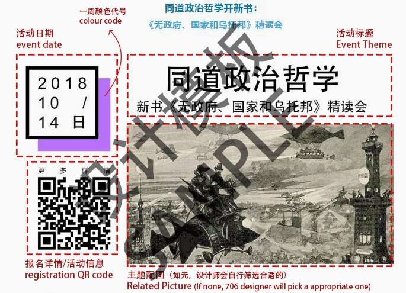
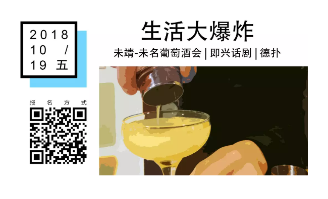
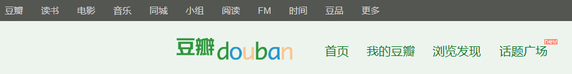
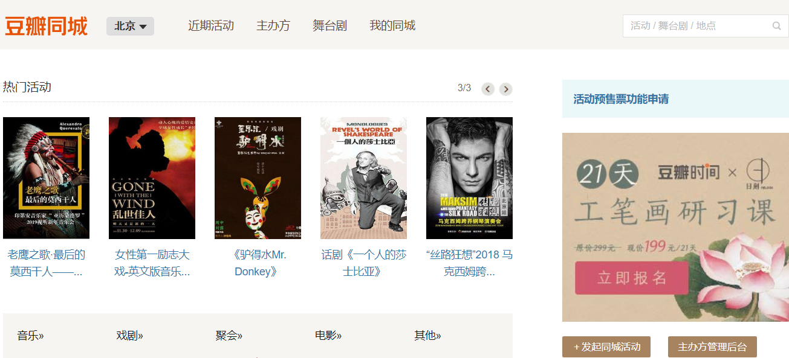
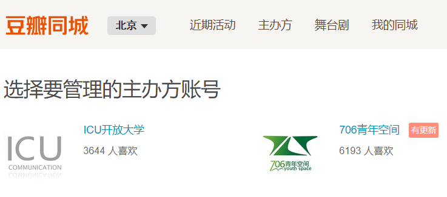
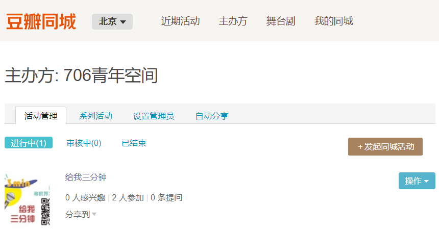
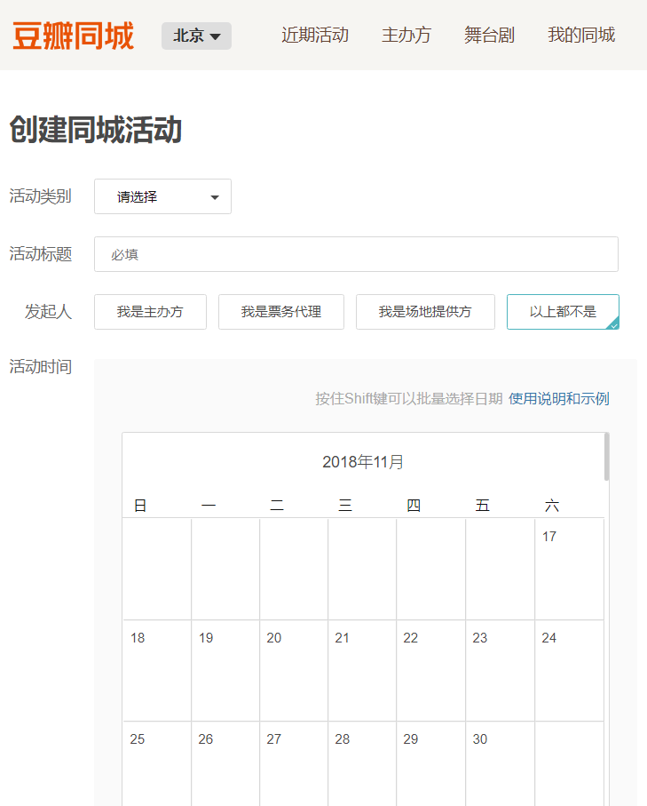
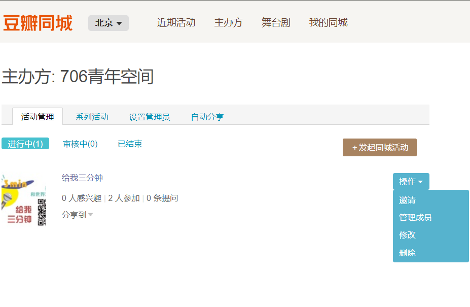
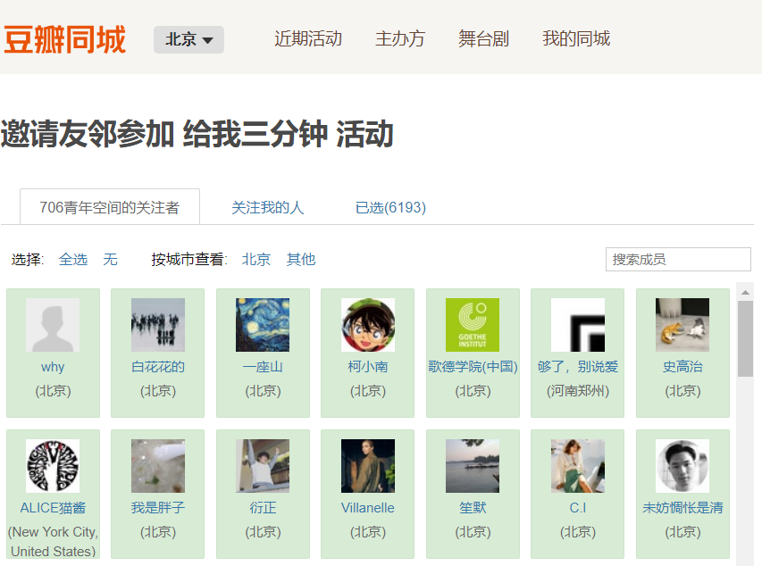
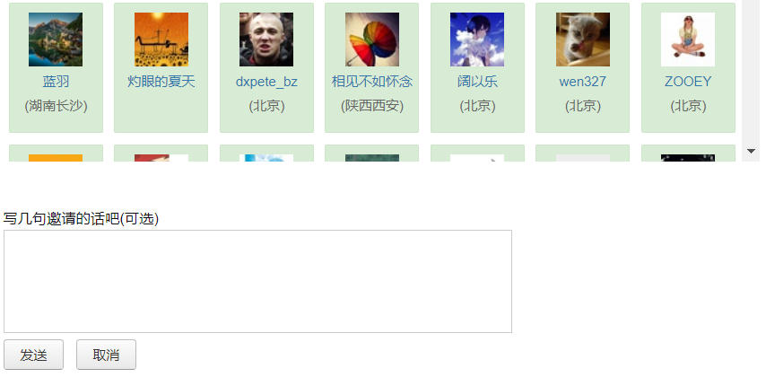

## 一、初步沟通

本环节负责：706活动运营中心  

 

1. 合作类型及相关负责人

小管家、小青年、706青年空间公邮或者工作人员遇到有意向合作的个人或机构，请按照如下标准将合作者的微信推送给相关负责人

 

706青年空间活动合作方类型及相关负责人：

- 高校社团合作：

- 公益组织合作：

- 读书会合作：

- 个人发起活动合作：

- 单纯的商业活动场地合作：

- 706品牌合作或长远合作：

- 公众号互推+活动线下合作：

- 单纯的公众号互推：公共号负责人

 

2. 活动合作的沟通内容

   个人或者机构如果有意与706青年空间进行活动或媒体合作，首先要与相关负责人进行初步沟通

   初步沟通通过后，方荣需要邀请活动负责人进入微信群：“706常规活动群（定期更新）”，通知活动负责人将自己的群名称备注为：组织或活动名称+个人姓名（苏格拉底对话+赵春晧），并通知后续的场务和706场务负责人对接

   初步沟通时，务必在电话里或者微信留下姓名、电话、机构名称、有意向合作做的活动主题、活动大概时间、拟邀请的嘉宾、活动大概规模。如果有相关的机构资料或活动相关PPT等资料可以发到项目邮箱 706project@706er.com ，706青年空间会评价是否进行合作

  

## 二、初步对接

本环节负责：706活动运营中心 

共同协助： 706活动运营中心  

 

1. 活动信息初步排表

每周一，706活动运营中心人员（目前是杨树）需要与主办方沟确认如下活动信息，放入706活动排期表

场地排期 ：[https://shimo.im/sheet/TVzW9rDSH8opaB95/Vl1Np](https://shimo.im/sheet/TVzW9rDSH8opaB95/Vl1Np) 

 

- 时间：推送的活动从 隔天周四 到 下周三 

- 地点：

- 名称：

- 活动负责人：

- 活动负责人电话 ：

- 706方对接人：

- 活动设备要求：是否需要投影、投影笔、音箱、麦克风、直播 （如果不说明的话，默认是不投影、不直播；）

- 1其他要求：收费类型及是否需要签到（详见收费类型）

 

如果不用发布文案 ，在石墨活动排期表里面用“灰色表示” ；如果需要单推，在石墨活动排期表里面用“”表示

 

2. 活动信息麦克表单审核

   每周二下午2点之前，706活动运营中心杨树需要确保活动信息采集表，信息收集结束

   活动信息采集表 ：[http://youthsapce706.mikecrm.com/PHrzh6c](http://youthsapce706.mikecrm.com/PHrzh6c) 

 

3. 活动信息海报制作，及 新媒体排版

   每周二下午，设计部 导出活动信息 进行活动信息海报 制作；整理活动表单 发送给新媒体

- 活动信息海报 （囊括：二维码，日期，时间，图片）  

- 大型独立活动海报 （配合706 活动对接人）

每周二晚上，新媒体 进行排版+编辑 ；今日结束前发送活动预览到 常规活动群，让每个活动负责人和706活动对接人进行再次确认

- 活动整体时间表  

- 活动汇总文案排版+编辑  

- 单条推送文案排版+编辑

 

每周三下午，新媒体 发送活动汇总+单条推送的活动（只限3条）

新媒体排期表 ： [https://shimo.im/sheet/WMpwxLg0oyo84KF7/v80q7](https://shimo.im/sheet/WMpwxLg0oyo84KF7/v80q7) 

 

4. 活动信息提醒

   周五下午，706场务负责人需要与活动负责人再次确认活动信息，方式是将下面的信息发送到微信群：“706每周活动群（定期更新）”

   706的伙伴们，大家好，我是706青年空间场务负责人

   明后天周末，我们的活动就要开始了。为了确保活动顺利进行，大家需要再次确认如下信息：

   - 如果需要投影、音箱、麦克风、投影笔等设备，但之前未与杨树进行沟通，请及时在群里@杨树，并告知需要的设备名称；

   - 如果活动需要电脑投影，请主办方自带电脑设备，并提前半小时到达活动现场，我们会安排工作人员进行投影调试；

   - 活动开始前十分钟，我们会安排工作人员对706青年空间进行简单介绍

   版本1：

   版本2：

    

   辛苦啦，祝大家周末愉快

  

## 三、活动场地及收费类型

本环节负责：706活动运营中心   杨树 

 

1. 活动场地介绍

   706目前有咖啡馆（包括咖啡馆玻璃桌）、咖啡馆小房间、图书馆3个场地适合做活动。咖啡馆、和图书馆容纳50人左右，咖啡馆小房间可容纳15人左右

2. 收费类型介绍

- 免费：适合扩大706青年空间影响力的活动（比如邀请行业大咖）或者高校品牌社团或者是和706调性特别搭的高校社团活动（比如大学团委不让做的活动？）

- 自愿消费饮品 ：适合固定长期合作的小型自带品牌的读书会 

- 每人消费饮品：适合与706进行非每周固定的活动合作，人数需要保证20+，如果人数太少，无法给一个完整场地，可以给咖啡馆玻璃桌。 饮料可以单点或者自助式

- 直接支付场地费：合作机构的活动，如果已经支付场地费，人数多少都可以。纯公益机构和高校学生非盈利团体可在商业租赁价格的基础上享受5折左右的优惠

 

**706活动场地：** 

- 周一至周四全天、周五白天/2-3h

- 周五晚、周六周日全天/2-3h

| 场地         | 周一至周四全天、周五白天/2-3h （价格） | 周五晚、周六周日全天/2-3h |
| ------------ | -------------------------------------- | ------------------------- |
| 图书馆包场   | 1000/2-3h                              | 1200/2-3h                 |
| 咖啡馆包场   | 600/2-3h                               | 1200/2-3h                 |
| 咖啡馆玻璃桌 | 300/2-3h                               | 500/2-3h                  |
|              |                                        |                           |

 

- 全价 包场

   上面包场的价格是面向各种机构类型的，只要不涉及到非法或者扰民现象（比如喝酒跳舞克拉OK等等），其他都是可以的

- 半价  

   公益机构的活动。或者出版社基金会等等的活动

- 全免  

   北大中外交流协会、中澳青年会、北影电影协会（尽量平时晚上）同道读书会（长期几年合作）或者请比较知名的大咖的合作机构的活动

 

3. 发票及场地规范

- 发票

   如果需要开发票，706青年空间只能提供办公文具或者宣传广告类的。 如果需要706提供发票，需要提供如下信息：公司名称、纳税人识别号、地址电话、开户行及账号。例如：

- 包场规范
   - 706青年空间位于居民楼里面，所以包场期间不允许K歌、跳舞、重金属音乐等活动，只允许民谣吉他、狼人杀、做饭、电影等娱乐活动
   - 场地使用结束后，需要主办方将场地恢复原状，不能留下垃圾

 

## 四、活动发布模式

个人或机构与706青年空间进行合作，706微信公众平台会协助发布活动信息。活动信息一般在周三下午或晚上发布，信息会放在“706一周活动总汇”里面，不会单条发布。如果活动需要单条发布或头条发布，需要706活动运营中心提前协商。主办方最好是在周二下午2点之前将活动文案填写到麦克表单”

涉及到商业或者公司合作的活动，在发布文案的时候，需要另外收费，收费需要协商

 

1. 706新媒体汇总推送

短文案活动摘要：嘉宾信息，活动内容等等，摘要的目的主要是为了让感兴趣的可以通过摘要来获取这个活动信息，摘要尽可能简短，大概200字以内

 

706新媒体汇总推送的二维码：

- 
   本活动负责人的个人微信号

- 本活动的麦克或灵犀的报名表链接 

- 本活动主办方自己公众号的详细文案

- 本活动主办方在石墨，或者麦克里面的活动的详细文案。[http://www.mikecrm.com/58hZJQ](http://www.mikecrm.com/58hZJQ)

（一般活动主办方没有公众号或者没有单发，而活动文案又是长文案的情况。）

706青年空间自己的报名表格

**备注:**

1) 如果活动主办方有自己的报名平台和审核方式，主办方需要将报名信息电子版备份一份给706留档

2) 如果活动无需报名，也无需添加活动负责人微信，那么，二维码可以统一为706方面联系人二维码，并且备注，活动直接来现场参加就可以

3. 如果706自己做品牌沙龙，或者大型活动（五月风暴类似的），或者觉得这个活动可以吸引到不错的报名人员，那么， 为了留下信息，706需要留个报名表格，参加活动需要报名

2. 706新媒体单条推送

706新媒体单条推送要求：

目前706青年空间新媒体已经规定每周单条推送的活动帖子不超过3条（包括3条），符合单条推送的要求（至少满足其中一项）

- 活动嘉宾是名人，或者明显可以吸引流量的活动（比如706文化沙龙，比如独立杂志展览，比如北戴河音乐节等等）

   [傅国涌 x 丁东 :《新学记：中国现代教育起源八讲》新书分享会](https://mp.weixin.qq.com/s/W_dvDuqlR2dy66fi4Ob6fg)

- 同一个品牌活动包括N个小活动，比如一个文案包括4,5个小活动的麻园微沙龙

   [十一706生活大爆炸，把整个706青年空间交给大家](https://mp.weixin.qq.com/s/Nm2ybPwURJZUI9miJ3QZiQ)

   [让我耕种你身上的殖民地——电影沙龙十月常规放映](https://mp.weixin.qq.com/s/So4pWcjg6hMqbXT1-7WofQ)

   [706麻圆微沙龙 | “流动儿童”返乡追踪；得了躁郁症，你怕了吗？河川生态复育](https://mp.weixin.qq.com/s/x1WzJC_X2YN5J5YOM-8xgQ)

 

[	706本周15个活动预告 | 民谣唱谈会，文化沙龙，OA读书会，生活大爆炸，电影放映等](https://mp.weixin.qq.com/s/9yNyde6vySewyL8hOHTvrQ)

 

​	[年前最后一波活动来袭](https://mp.weixin.qq.com/s/1mD0wcKvL2JBjojRs_rWsQ)

- 706重点扶持的初创活动，比如706目前在做定期的诗会活动，因为刚起步，需要706提供更多的扶持

   [为了寻找你，我搬进鸟的眼睛 | 706诗会第一期·启程](https://mp.weixin.qq.com/s/fD18LFXMKTfoScQc_vW4Cg)

- 活动的总结帖或者为了某个活动专门写的一个采访帖

   [《此间的少年》的那只令狐冲，他毕业四年了...](https://mp.weixin.qq.com/s/DrGWHbb9ivMxPUatCl0fgA)   这个是为了宣传一个分享会

   [48小时，来一场精神裸奔](https://mp.weixin.qq.com/s/75nakK4G0YNp6lmaOpnsPA)   这个第8次48小时的总结为了宣传第9次48小时生活实验室活动

 

备注：如果有活动不符合上述要求，而也想要单条推送的话，需要联系706目前的活动运营中心的邬方荣，他会在活动运营中心的微信群协商，决定权在706活动运营中心

 

3. 活动文案必填内容

706社群报名渠道

706青年空间汇总文案及单条文案的最后面，都要加一个706社群报名的模板。通过这个模板，大家可以跳转到706是社群报名表

麦客表单内容：姓名，电话，微信，学校/单位，专业/职务，自我介绍（100字左右，个人社团或社会经历，爱好和现在和未来想做的事情），其他问题（根据具体 活动具体设置）。 这样做的好处是，方便挖掘不错的人才，方便后续的沟通，特别社群类活动的报名表，需要按照这样的要求

在合作方的平台发布在706场地举办的活动文案，合作方在自己平台发布的文案自行决定形式，不过需要在文案最后请附上706青年空间的简介 和 706青年空间的地址图片（下面内容）

活动场地：706青年空间

北京市海淀区五道口华清嘉园15号楼2007室【从15号楼底商Spring Market 超市进入，迷路请联系】

706青年空间是中国第一家青年空间。举办了近两千场活动，涵盖多种活动类型。试图创造一种新型的实体空间形态，孵化具有潜力的合伙人项目，通过社群式的学习，倡导一种新的生活方式和教育理念，让青年人探索生活的更多可能性。  

 

4. 豆瓣等其他平台发布

登陆706豆瓣账号进入豆瓣首页，点击“同城”按钮进入豆瓣同城

 

点击“主办方管理后台”进入后台管理系统

 

选择“706青年空间”这一账号，点击进入

 

点击“发起同城活动”，创建同城活动

 

根据实际情况填写活动的各项信息

 

提交后活动进入审核阶段，约半日可审核完毕，遇有审核失败的情况应根据豆瓣的相关提醒予以更正，需要注意的是，文字介绍部分不可过分简短，应尽量保证图文丰富有吸引力

活动通过审核后，应当向所有粉丝发送活动推送邀请。点击“操作”按钮，选择“邀请”

 

选择全部关注者，并在网页低端填写邀请辞，点击发送即可

 

  

- 活动推广（有待讨论）
   - 官方微信：小青年、小伙伴、小朋友、小管家两个号、方荣个人号转发
   - 官方微信群：青年社群1群2群3群，各种兴趣群
   - 公众号合作渠道：北辰青年，同道读书会，土逗公社等

  

## 五、活动报名及签到

1. 现场场务流程

- 主办方人员需要在活动开始前30分钟来现场，调试麦克投影及电脑设备，现场有任何投影或麦克风等问题，请联系对应场务负责人。活动开始前或现场有任何需要（白板笔，胶带，5号电池，剪刀，投影笔，移动投影等需求），请直接去706咖啡馆吧台自取

- 主办方根据活动要求，提前30分钟来布置活动场地

- 活动完毕20分钟内，值班人员请拿走咖啡杯等相关咖啡馆用品

- 活动完毕30分钟内，值班人员确认活动会场一切归位，移动投影和投影笔归活动部，麦克需要归位原处

- 活动完毕30分钟内，主办方需要将桌椅归位。 

 

2. 现场投影设备介绍

> 你的活动在小剧场或咖啡馆B区都是使用固定投影

- 如果你是 windows 电脑：

   如果你有如下图所示的接口1，那就可以直接插上投影了

   如果没有接口1，那你需要找以下的转接线来连接投影接口与你电脑的接口2。接上就可以用了

- 如果你是mac：

   大部分情况你需要找以下转接线。左边连接投影接口，右边连接你的电脑

   如果你的mac有接口2，你也可以用这样的转接线

   移动投影（如果你的活动在小会议室或咖啡馆小角落都是使用移动投影）：

- 如果你是mac，706会提供这样的线，左边插投影仪，右边连你的mac

- 如果你是windows，706会提供这样的线，一边连投影，另一边连你的mac

  

## 六、活动现场签到及沟通 （根据现在的技术平台还需修改）

本环节负责： 706活动部

 

活动现场，主办方自行安排人员负责签到和沟通。如果参与人员找不到活动场地，可以在前台咨询小管家，由小管家进行引导

签到分流：

如果涉及到周末同一时间有好几场活动进行，一方面调整活动时间，使两个活动开始时间间隔30分钟，方便签到。另外一方面，也可以采取安排不同的签到处。除了在前台签到外，还可以在某个重要活动的门口直接签到（比如小剧场门口或图书馆门口），这样，起到活动分流的目的

## 七、活动现场宣传（宣传内容需要协商和修改）  

本环节负责：706活动部   

在706情况空间举办的所有活动，开场之前，706都会安排工作人员对706青年空间进行宣传，主要分为常规宣传模式和灵活宣传模式两种：

1. 常规宣传模式：

   活动开场宣传：如果是30+人数以上的沙龙，在活动开场之前，会有简单的4分钟以内的706的宣传视频。（介绍内容包括706的大概功能，706的会员和住宿，和706起源，和706的理念），并且现场会发一张706的单页

   活动结束宣传：活动结束后，706会安排工作人员，带领对706有兴趣的参与人员进行参观

   活动单页宣传：706签到处有706三折页，自取名片，留名片，活动主方方可让活动参与人员自取

 

2. 灵活宣传模式：

   机动志愿者可以在活动开始之前和活动参与人员多聊聊天，挖掘参与人员的信息。在活动进行中观察留意比较积极活跃的参与人员，在活动结束后主动与其沟通，加个人微信（让其扫描706小伙伴）。在活动结束后，也可以在活动现场积极聊天沟通，多认识一些活动参与人员

   

   活动现场直播

   需要根据具体活动决定，一般是每周有1到3场活动需要直播。这个需要根据周一邬方荣确定的活动需求（是否直播），提前沟通和主办方协商好。  

  

## 八、资料留存及制作

本环节负责：706活动部

 

 706青年聚，给我三分钟 ，失眠者之夜，48小时生活实验室产出

 读书会，一千零一夜 ，文化类沙龙，诗会等产出

活动结束后24小时内，如有相关资料（包括报名人员信息，活动照片及相关素材）请发送到706project@706er.com. （需要提前和活动主办方沟通好）

活动结束一周内，活动主办方如果有活动录音整理或相应的活动总结，请发送到706project@706er.com.  （需要提前和活动主办方沟通好）

活动现场会员咨询及访客接待  （对外宣称处于暂停状态）

本环节负责：706咖啡馆值班人员

会员咨询：当日值班志愿者在有人咨询706会员时，需要详细介绍，并且将咨询会员人员介绍给目前的706会员负责人（暂时没有）

访客接待： 在706签到处有咨询各种合作或相关事宜的访客，可以让填写个访客登记表。（扫描访客二维码即可）

志愿者咨询：在706签到处有咨询706志愿者的，可以让填写个706志愿者登记表。（扫描访客二维码即可）

  

## 九、主办方投诉及活动流程改进

本环节负责：活动706方面对接人 及 706活动统筹 邬方荣

 

为了更好的做好706的对外合作的服务及各项事宜，如果你有任何问题或者投诉建议，都可以联系邬方荣 13121958608 或微信rong706706706 邮箱wufangrong@706er.com

本环节也会试着将主办方各个分散的活动及机构，尝试互相连接起来，可以定期和706合作一些系列活动，或者大型品牌活动。或者将各个相互关联的主办方对接，可以互通有无，资源互换

我们也会试着在活动策划，活动互动和流程改进方面给你们提供一些建议和想法

 

其他相关信息：

- 活动赞助及媒体报道相关

   为了更好的做好706平台上面的活动的后续服务，包括媒体访谈，也包括有可能的赞助，我们也鼓励活动合作方可以积极和我们联系，看看你们在706平台上面举办的活动，是否可以除了活动本身以外，在媒体和公司赞助及合作方面，可以有所跟进

- 活动整合和校园推广（或开源复制）

   706会挖掘现有的在706青年空间举办活动的主办方，联合起来一起去高校做推广，同时有会对接高校社团或类似TEDX机构，给他们提供一些合适的嘉宾或青年嘉宾。将706青年空间，和高校社团 和来706做活动的各个合作机构，形成一个互动网络

除了高校社团以外，706青年空间也会联系全国几十个青年空间，合作起来做一些线下活动，这个方面也有可能和各个合作机构一起合作

或者，706青年空间也可以将模式成熟的活动，复制到全国其他几十家青年空间，或者全国高校社团或社会机构

 

## 十、活动报销制度

1. 活动部财务结算时间：每个月月底30号

2. 活动报销由活动部门根据每个活动做出具体的支出、收入和盈余表放在石墨文档里.  例如： [https://shimo.im/sheet/2IaUrWuZScAbexR3/RIDOC](https://shimo.im/sheet/2IaUrWuZScAbexR3/RIDOC)(凯晶万圣节财务汇总)  

3. 由财务部进行审核，确定无误后算审核通过

4. 审核通过后将盈余数额转给706小管家信号或旧号

  

## 十一、活动反馈