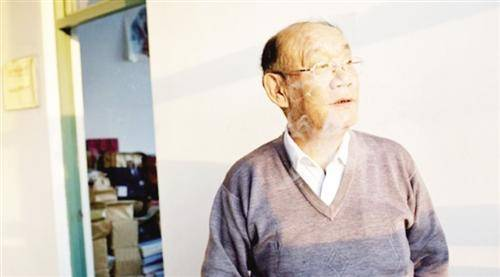
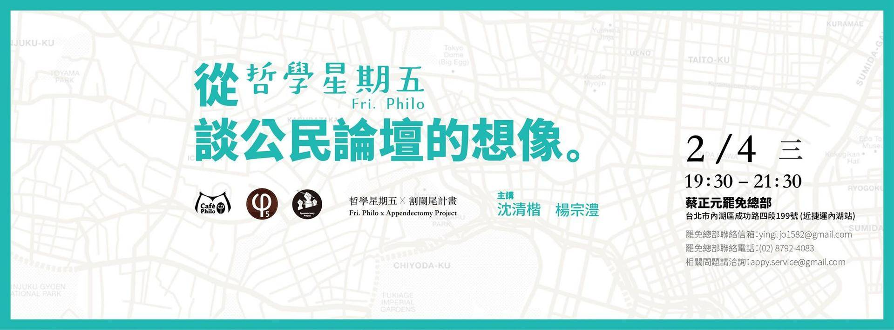
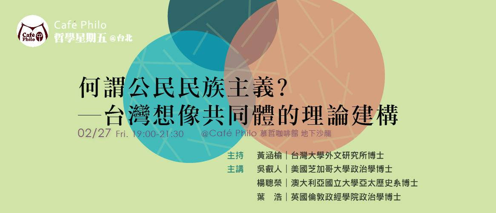

**沙龙——活动标准文案**

---

**1、活动标题。**

**2、活动简介。**活动简介即为文案的引言。在这个引言部分，可以通过描述某些社会现象和文化现象，引用适当的理论观点，来引发对主题的思考，主要以罗列疑问句的方式引出活动主题，调动读者的兴趣。      

**3、主讲人简介。**这一部分包括主讲人的图片、文字简介、引语评价等。

**4、活动信息。**

时间：2014年11月22日（星期六）14：00——17：00

地点：706青年空间

活动费用：非会员20元（706会员免费）

报名方式：无需报名，直接参加。

**5、活动推广。**

706深度°沙龙致力于“对当下社会热点问题的学术性解读”，透过我们每天正在经历的社会生活，去探索其中所反映的心理状态和价值观念，剖析现实背后支撑它的社会架构和文化模式。每一期的深度°沙龙，我们都会邀请到知名学者专家和文化名人作为嘉宾，来和706的青年朋友们共同分享他们的视野和洞见。如果你有好的话题资源和嘉宾资源，对我们的活动形式感兴趣，欢迎加入我们!信息收集方式：youthspace706@126.com

**例:**

---

**【11.22周六下午】706深度°沙龙 | 性学系列第一期 潘绥铭：性权利与性权力**

---

*2014-11-20* 706青年空间 

**706青年空间**

**活动简介**

社会中的每一个人，既享有内在的权利（right）保护，又受到外在的权力（power）控制，你是否曾经思考过权利（right）与权力（power）二者之间的关系？

你真正了解自己的性权利吗？女性和男性是否拥有平等的性权利？我们的性权利涉及到生理、心理和社会生活的诸多方面，性教育权、性表达权、性保护权、性健康权、性拒绝权、性隐私权……你的性权利是否受到过侵害？

福柯曾说：“性是一个没有任何现代权力体系能够忽视的资源。”毫无疑问，“性资本”的投入和产出同样是社会运转的一个重要部分。性作为一种资源是如何运作在权力体系之中的？性别角色何以演变为一种身份政治？性权力又是如何与社会中的经济权力和政治权力发生关联，从而渗透到我们生活的方方面面的？

本次706的深度沙龙，我们邀请到“中国性学第一人”——潘绥铭老师，从“性社会学”的角度来和我们分享、交流，共同探讨“性权利与性权力”。

**主讲人简介**

**潘绥铭**，中国人民大学性社会学研究所所长、社会学系教授、博士生导师，中国社会学会副秘书长。主要从事社会学研究方法、性社会学和性别人类学研究。被誉为“中国性学第一人”、“麻辣教授”。

专著

《存在与荒谬－－中国地下性产业考察》

《当代中国人的性行为与性关系》

《性，你真懂了吗？——21世纪性学读本》

《生存与体验－－对一个红灯区的追踪考察》

译著

《金塞性学报告》

《美国人的性生活》

**活动信息**

时间：2014年11月22日（星期六）14：00－17：00

地点：706青年空间一楼大厅

活动费用：非会员20元 （706会员免费）

报名方式：无需报名，直接参加。

**活动推广**

706深度°沙龙致力于“对当下社会热点问题的学术性解读”，透过我们每天正在经历的社会生活，去探索其中所反映的心理状态和价值观念，剖析现实背后支撑它的社会架构和文化模式。每一期的深度°沙龙，我们都会邀请到知名学者专家和文化名人作为嘉宾，来和706的青年朋友们共同分享他们的视野和洞见。如果你有好的话题资源和嘉宾资源，对我们的活动形式感兴趣，欢迎加入我们!信息收集方式：youthspace706@126.com

**另：也可以设计类似的海报图片放在文案里**

