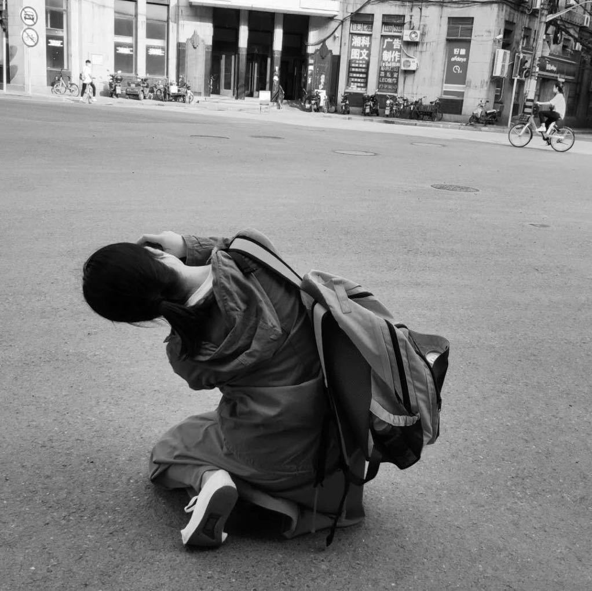

当你将 35 个在中国古典文学到生物物理学等学科领域具有深厚专业知识的陌生人配对，给他们 90 分钟的时间来创作一些奇怪、大胆和新颖的东西，并要求他们展示结果时会发生什么？

你所在领域的哪些问题最近一直困扰着你？

你真正擅长什么？当结合你的技能时，你会立即想到什么？

你最喜欢的论文或艺术品是什么？为什么？

你脑子里一直盘旋着的“十个问题清单”（à la Hamming）是什么，你真的希望你能解决？

你伙伴所在的领域真正让你害怕或惊讶的是什么？

在你的领域中，你可以使用或尝试的一思维方式是什么？

哪些见解构成了你学科认知的核心？

“怎么样让熟悉的变得陌生，让陌生的变得熟悉”。

尝试保持三个平行且不同的想法或模式。尝试在它们之间切换，看看最后如何组合它们。

这个活动的最初模型来自于Katherine Ye（现Carnegie Mellon University计算机科学博士生）于2017年在San Francisco组织了这个活动，邀请了35个业界专家，让他们与跟自己领域不同的人形成小组，创造出新的项目理念，挑战自己的学科的边境。

这个活动的灵感麻省理工学院媒体实验室的反学科宣言：

来自当我想到我们创造的“空间”时，我喜欢想到一张代表“所有科学”的大纸。学科是这张纸上的小黑点。点之间的大量空白代表反学科空间。很多人都想在这个空白领域发挥作用

这个活动最后的展示小组是：

由Anna Seigal（一名数学研究生）和 Sara LaHue（一名神经病学住院医师）组成，他们提议使用信息论原理构建一种装置，与患有闭锁综合征或昏迷的人进行交流.

Scott Farrar（数学老师和研究员）和他的搭档（游戏设计师和程序员）展示了一个游戏模型，以帮助学习者探索数学规则。例如，学习者可能在学习组合学时探索多米诺骨牌的不同排列

由生物工程博士生和民族音乐学家组成的小组提议创建一个应用程序，该应用程序将使用机器学习来帮助人们学习演奏音乐。后者将音乐学习视为一个复杂的寻路问题：路径是非线性的，有无数种方法可以从你的状态达到你想要的专业水平。

接下来的三人小组由一名生物物理学博士生、一名具有机器学习专业知识的软件工程师和一名数学博士生组成，他们提议设计一种与外星人交流的方法。他们同意从同步脉冲开始（希望不会被误认为是脉冲星），然后希望通过发送更多“不自然”的东西来跟进，听众不会误认为是自然现象。

M Eifler（一位艺术家和 VR 研究人员）和他们的搭档（一名律师转为程序员）展示了他们制作的一本名为“如何赢得每一场争论”的杂志。例如，你可以通过学习了解他们的观点并向他们提出澄清问题来完全控制反对派。他们杂志的每一页都描述和说明了不同的修辞锤。

2018年的春天，笔者在校园认识了Katherine。

在2019年，笔者组建了一个小学生团队、把这个活动改编成了一个新版本，新版本的活动流程跟原型类似，但是受众人群不是学术专家，而是大学高年级本科学生和硕博生；

宗旨不是挑战学科边境，而是给处于学术生涯早期的同学们一个体验不同专业领域的机会。当时，笔者就是个学习计算机和戏剧的本科生，经过几年的跨学科学习，认识了很多不同领域的人，不仅收获知识也交到了很多学术背景各异的朋友。在这个过程中了笔者也体会到了很多难处。比如说，探索未知本身就可能是一件令人畏惧的事情，不同的领域有不同的语言系统，跨学科就好像学习一门新的语言、探索一个新的世界。于是，笔者组织了Not-a-Hackathon这个活动，想通过它创造一个舒适好玩自由的空间，让大家学习“新的语言”。

2021年，笔者想把这个活动带到706在纽约和上海的活动空间。我们的成员将不仅仅是在校学生，而是各种想去自己领域之外冒险的年轻人。不论是对学生还是已经工作的人，跨学科探索都有很大的价值，也有一定难度。这个活动的目标是能够降低其难度，并实现其价值，让大家收获知识，也认识新朋友。
 

**活动简介：**

反学科工作坊是一个两小时的黑客松式活动。我们邀请二十名左右来自各行各业、背景各异、对自己领域之外的世界充满着好奇心的青年，大家分成4到5人的小组，在一个共同空间里展开讨论，用两个小时的时间里想出一个结合组员专长的项目理念。

这个理念可以是一个产品，一部小说，一首诗，一个建筑模型，一个公园，一个装置艺术，或是一个公益组织。我们不限制这个理念的领域、架构大小、成果是否精美，我们在乎的是大家工作创作和学习的过程。
 

**活动宗旨：**

- 跳跃学科和领域的界限，让看似截然不同的知识和技能有机结合，创造出新事物
- 颠覆传统“黑客松”对编程和软件的偏重，创造一个模式类似但主题更加广泛的工作坊模式
- 给充满好奇心和创造欲的小伙伴们营造一个舒适好玩、可以自由突破的空间
 

**活动介绍：**

706准备在8月份在纽约上海（也有可能旧金山北京）开启中外双城联动的706跨学科工作坊，我们试图聚集20+从古典文学到生物物理学等学科领域具有深厚专业知识的伙伴，给他们 90 分钟的时间来创作一些奇怪、大胆和新颖的东西，并要求他们展示结果，这个会发生什么？谁也不知道。

前期参与人员：

照片（可以个人照或宠物照等）+姓名+个人专业或相关背景介绍（50-100字）+对本工作坊的期待 （50字左右）

 

王心怡  Joyce

现坐标纽约，是个天天与policymakers共处的产品经理，在默默观察白宫通过政策杠杆撬动科技革新的各种骚操作，本职工作是研发用于非洲市场的数据分析软件。Joyce本科在卡耐基梅隆大学读计算机和戏剧，当过码农，也做过AI和人机交互方面的学术狗，一直流浪于多个【学科】之间。

2019年Joyce在大学校园结识了Antidisciplinarathon的创始者Katherine，受ta启发组织了一系列【跨反】学科讨论和工作坊。这次很兴奋能把这个活动带到706的客厅（们），继续在学科之间、学科之外、学科之上探索发现！
 

梁智鹏  Liang

现坐标波士顿，MIT Medialab 即将毕业。之前在德国学习机械电子，后转学媒体艺术，后转学纯艺，后转MIT。激进的反学科反身份创作者。热爱哲学、艺术、科技、美食、夏天的风... 还有好多东西。餐馆刷过盘子，寿司店卷过米，给剧组做过饭，优衣库卖过汗衫，做过摄影个展，做过机电工程师，表演过电子音乐，设计过室内展览，Berghain做过VJ，给艺术大佬打过工，卖过作品给ZKM，Ars Electronica Center 做过展，等等等等。

目前致力于开发未来人机界面。在柏林7年居住在一个艺术家聚居区，天天和不同人玩了命的交流。期待能在706再现这个美好的气氛。
 

Mao

MIT Sloan PhD 在读，此前一直学习和从事计算机专业。对跨学科研究感兴趣，希望能在706认识各行各业的朋友，一起探索如何更清晰地认识这个世界，如何运用所学更有效地参与公益。
 

张一林

现坐标上海，毕业于俄勒冈大学历史系，现在智库打工，之前在乡村笔记公司打工。平常在豆瓣上连载关于中东的小说：《游走的局外人》。在校杂志社码字四年，在中国青年报社等刊物发过文章，秋季会去SOAS读中东研究。平常喜欢射击、下围棋、跑马拉松。

之前是706跨学科生活实验室的共创人和706上海客厅十日谈的分享人，期待这次的跨学科工作坊的智识交流与创新！
 

蛙蛙

目前在学数学物理，具体来说在试图弄清楚物理学家在场论里讲的那些故事；对706的共居概念感兴趣，在北京
 

Sati

现坐标上海，偶尔出没于北京五环外或山东省文登市抱龙河边右数第三排路灯底下。在美国读历史，过去一年在北大蹭课，接下来去英国交换，在德国学过德语。喜欢昆虫和书店，关注性别、媒介学和游戏研究。最近在706上海客厅搬砖，做播客，给小朋友讲讲历史启蒙，以及在长沙做「记忆」主题讨论课。期待在706跨学科工作坊发现更多可能。
 

阿诗

现坐标上海，八月启程加入706纽约生活实验室，同时在NYU读心理咨询的硕士项目。本科学的是PPE（政经哲）——跨学科本跨。受COVID影响意外滞留国内的这一年半，尝试参与了一些社区营造和公共艺术相关的项目，在这过程中深感人与人之间相互关切，不放弃理解，并始终保持连接的可贵。

一直陪伴着我的是写作（多数时候是心迹，偶尔也是手艺），舞蹈（从古典芭蕾到Hiphop到后现代接触即兴），读诗（独立运营着一个小小的诗社），即兴戏剧（一直自诩”生活现场的喜剧演员）。目前感兴趣的方向是身心学和艺术疗愈。因为自己从感性角度和身体打交道比较多所以会很期待这次如果有机会的话可以和神经科学方面的学者交流一下。
 

朱子虾Jessica

现坐标DC的纯种北京人，本科毕业于布朗大学认知神经科学专业。曾在一个达赖喇嘛访问过的实验室研究正念冥想的临床应用，在波士顿儿童医院做过战略咨询实习，也在运营着一个专注于青春期女孩健康教育的项目——热爱探究健康、幸福、医疗、治愈以及其延伸出去的各种话题。这辈子到目前为止最极致的许多瞬间都是因为突然看到了不同领域和学科之间的联系，所以期待遇到和创造更多这样的瞬间。
 

刘星男Chris

现坐标旧金山，本科毕业于CMU行为学和人机交互专业。身在FB打工，平日却对视觉设计指导及环境设计感兴趣。 永远对自己所处领域的局限性有些不满，想跳脱切换于不同的创意领域之间。

 

**活动时间及地点：**

北京时间：2021年8月中旬某周六15:00-18:00（时间待定）    706上海北京城市客厅

美东时间：2021年8月中旬某周六15:00-18:00 （时间待定）   706纽约流动客厅

报名要求：

我们鼓励那些在现有的学科背景下有所束缚或限制的同学来参加，或者你对自己专业以外的领域好奇，希望有所新的探索和发现，也都是可以报名的

报名方式：

咨询二维码：706小管家 xiaoguanjia706

策划人：王心怡

共同编辑：Katherine Ye &王心怡
