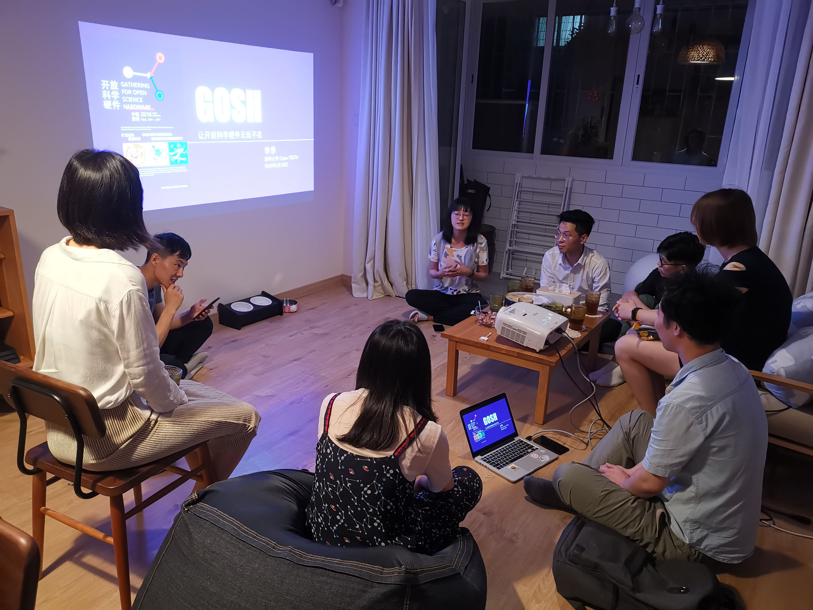
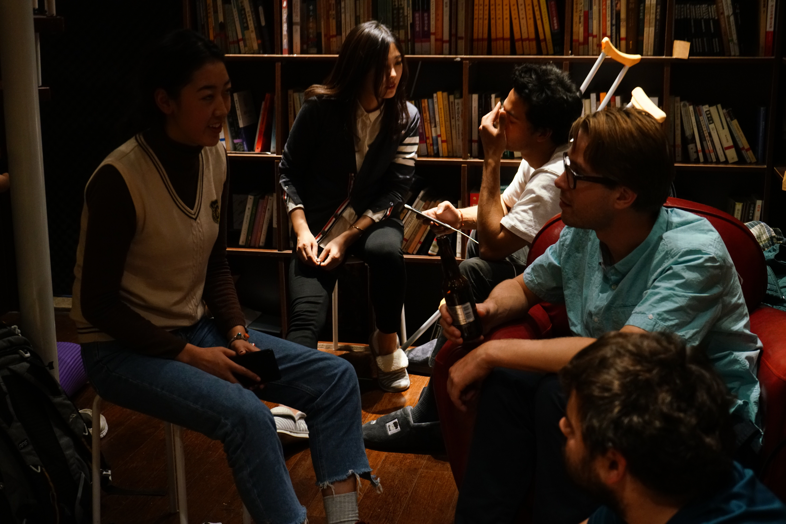
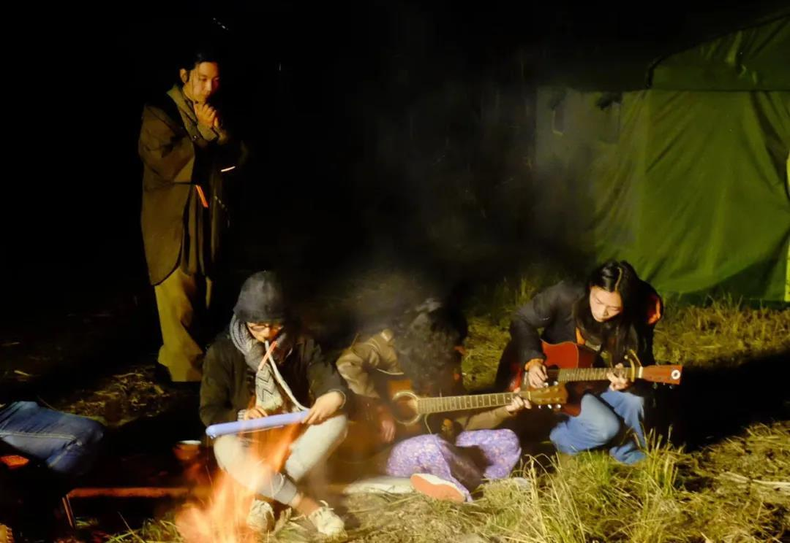
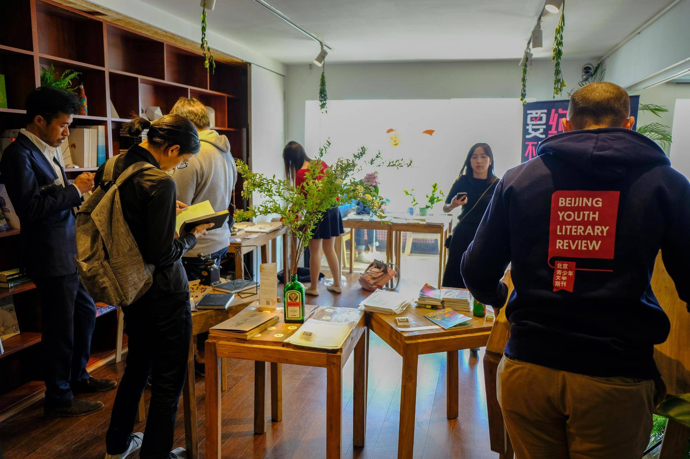
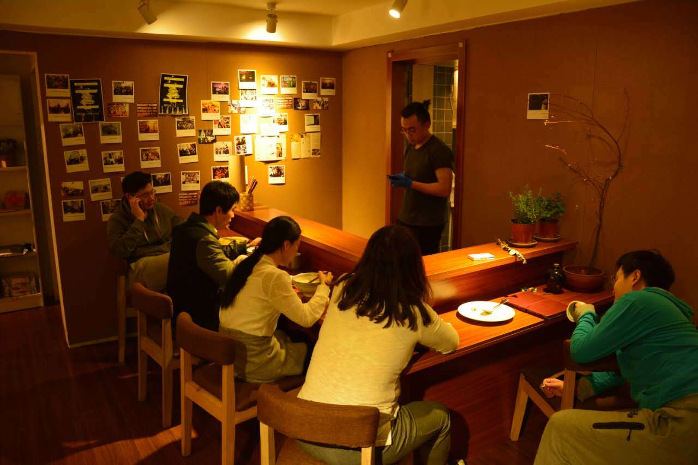

# 706 青年空间-活动介绍
 

## 一、48小时生活实验室

48小时生活实验室是推出的生活方式探索项目

每期我们邀请一群年轻人，在一个实体空间共同生活48个小时

期间，我们将共同完成一次关于生活的实验或创作

让年轻人，打破原有生活环境的局限，突破互联网虚拟社交的屏障

聚集在一起共同探索生活的各种可能性
  

## 二、706文化沙龙

706文化沙龙希望能够秉承法国沙龙文化的原始精神

在706青年空间这个实体的公共空间中

试图通过活动本身去还原一种公共领域的气场和氛围

不同职业、专业、价值观的人在自由、开放、分享的氛围里讨论同一个公共议题，探索更多的可能性。
  

## 三、706社会青年派对

706青年派对是将青年聚、话题广场和论坛剧场等活动形式相结合的青年发声和社交活动

鼓励青年人对日常生活的观点进行表达、交流、讨论和反思

在观点的探讨和碰撞中，了解其他青年人的想法，结交志同道合的伙伴
  

## 四、706麻圆微沙龙

706麻园微沙龙是在706这个空间里面，让任何人在任何时刻，都可以发起话题

你可以是分享嘉宾或是话题主持人，也可以只是参与讨论

706通过“706麻圆微沙龙”为青年群体创造更多表达、交流和讨论的机会
  

## 五、706破格电影沙龙

破·格电影沙龙 是每周末在706的固定节目，我们通过各种文艺片，通过小众的片子

不断探寻的理想和现实的观照，这里充满了松与温暖。

在这里，遇到志同道合又与众不同的伙伴、展开迫不及待或审慎而思的交流

破·格电影沙龙，希望成为你循环往复生活的一部分。
  

## 六、706小黑屋放映

“小黑屋”是706一个房间的代号，在这个“小黑屋”里

我们放映青年导演的电影习作，鼓励导演在创作中有个性的影像语言表达

我们放映具有创新精神，但还未被广泛传播的独立电影作品

我们的放映是为了建立导演与观众、学者面对面的直接沟通、交流与学习
  

## 七、706生活大爆炸

生活大爆炸是706隔周末的社交活动，它轻松、娱乐、休闲，没有很高的门槛

大伙放下学业和工作，一起来706青年空间休闲放松

有人在吧台喝酒闲聊，有人咖啡馆下棋；有人在厨房准备甜点，有人在桌前品尝葡萄酒；

有人在图书馆弹吉他，表演即兴话剧，有人只是来发呆坐坐，遇到几个陌生人，就跟他聊聊天……
  

## 八、706给我三分钟

我们每个周末的晚上会在706进行“给我三分钟”

顾名思义，就是让每一个人都可以上台演讲属于你的“三分钟”

在这里，你将拥有一个属于你的讲台，我们就是你忠实的听众

这三分钟，我们全权交给你，你说，我们听。于思维碰撞中，找到适合自己的表达方式。
  

## 九、苏格拉底式对话

苏格拉底式对话致力于在日常生活中发现和提出意义问题

然后通过一种协作、对话的方式来获得意义问题的解答

这是一场思辨者的盛会，这也是你锻炼自己思维的最好的时刻

一起来思辨吧！爱智慧的人都在这~
  

## 十、同道学园 I 政治哲学读书会

一群来自五道口周围高校的喜欢哲学的同学凑在706一起精读哲学经典著作

从古希腊哲学到卢梭、密尔，康德、罗尔斯，我们沿着人类思想史的脉络

大家在分享和讨论中共同提高智识、在友爱中求真
  

## 十一、706客厅对话

706客厅对话是一种解决分歧的简单方法，这是对话专家开发的一种对话模型

目的是对于撕裂的社会，来自民间的回应

希望让有不同观点，不同教育背景的人，可以有所交流，可以跨越分歧

至少促进理解，获得更多的共识
  

## 十二、706共学小组

706共学行动小组是对特定的材料进行学习、并从彼此的生命经历、学科背景中学习的实践

我们会在行动小组当中开展对“共学”可复制模式的探索
  

## 十三、706写作工作坊

706 写作工作坊是一个线上青年写作者社区

写作者们每周周末会参与 3 小时线上讨论，交流彼此的作品并相互提出修改建议

工作坊目前根据不同的写作文体，已建立 ：影像组、影评组、现代主义小说组、现实主义小说组、类型小说组、科幻组、新诗组、非虚构组。
  

## 十四、706漫游计划

706漫游计划，是“漫游青年”组织的一个系列野外活动

在自然中，在田野中，在山谷中，在海岛上，在乡村和小镇上来寻找

这是我们的探寻之旅，也是我们塑造共同体的旅程

我们会以“自治”和“共创”的模式来完成这些为期10天左右或更长的“漫游计划”
  

## 十五、706独立出版展

706独立出版展，每年会征集到杂志、书籍、作品集、报纸、海报、磁带、CD等等进行展览

706独立出版展，本质上不光是一次独立出版的展览

它更像是一种城市生活方式的探索，一种新的空间和人际关系的寻找

已经对未来更加美好城市生活的追寻
  

## 十六、706新空间主义

“新空间主义”是706提出的公共空间理念

我们批判异化的日常生活，重构可以栖居生存空间。

我们结构性地反思社会议题，梳理706及其他青年空间的实践经验

探索共同居住模式与空间设计，解放个体的创造力与空间的异质性，创造共享、共治的社群
  

## 十七、深夜食堂

706深夜食堂是706的一个周末和食物相关的一个夜聊会

就着简单的食物、淡淡的清酒、失眠后的清汤面以及彻夜加班后的炒饭

只是听着、品着大家各自异乡人的故事，或许你也可以在其中或多或少看到自己的影子。
