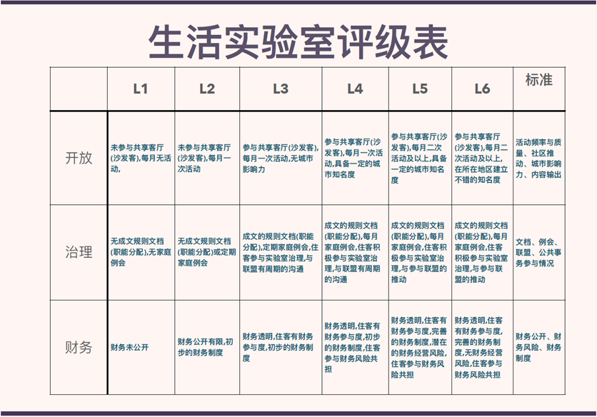
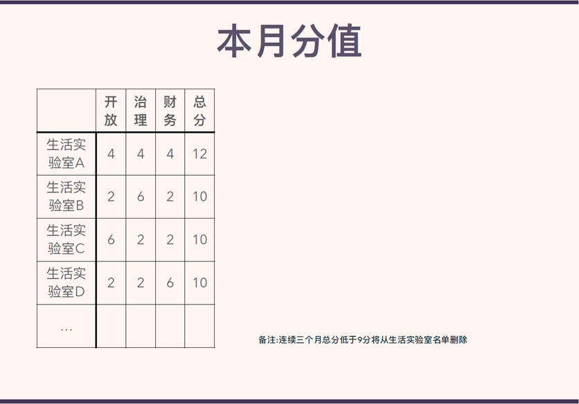

# 生活实验室评级表

# 日常打分举例：

# 加入生活实验室的流程：

第一个月：

1. 合同签署，拍照/扫描上传

2. 更新实验室具体信息至[《706生活实验室信息汇总（实时更新）》](https://shimo.im/sheets/VDRqdW6vqGqCjHhd/o0pV9/ )

3. 成文的规则文档，根据工具包自行修改

4. 第一次住客例会

5. 室友实际的分工情况

    1. 第一个月分工可简化，必需的职位有：卫生、安全、行为和用电监督（卫生是最基础的。安全、行为和用电规则是否建立由实验室根据内部意愿和情况来觉得）/ 财务 / 事务协调， 具体分工可参考 [https://shimo.im/docs/pJxQdQVJWQkHCxKR/](https://shimo.im/docs/pJxQdQVJWQkHCxKR/) 

四件事情都做以后成为考核期实验室

第二个月：

1. 举办/承接一次客厅活动/沙发客

2. 提交财务报表

公众号公开时标注为考核期实验室

第三个月：

1. 满足L3条件

可成为正式实验室，获得投票权

# 706社群可以提供的：

1. 住宿/活动/沙发客曝光

    1. 住宿招租信息可更新在[《706生活实验室信息汇总（实时更新）》](https://shimo.im/sheets/VDRqdW6vqGqCjHhd/o0pV9/ )

    2. 活动信息可更新在 706space.com （需要麦克表单后台权限）

2. 联盟/平台有一个协助人 最开始帮助大家建立实验室
