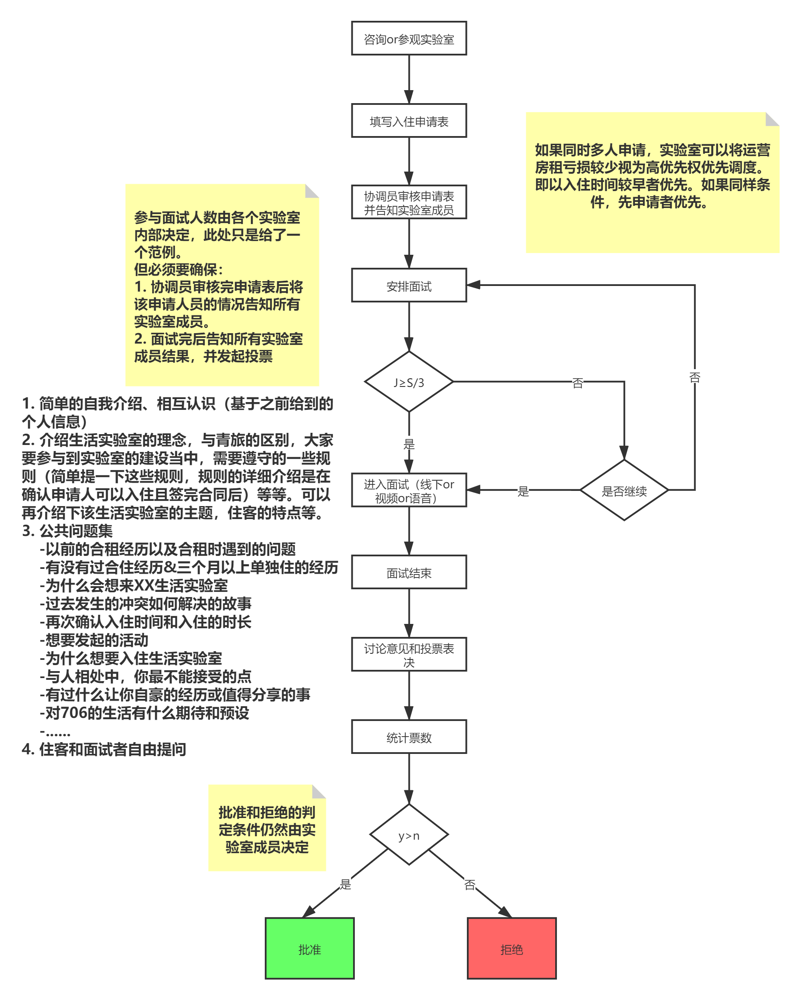

## 一、申请、面试和投票流程

## 二、通知投票结果

协调员在组织实验室全体成员完成对申请人的投票之后，尽快通知申请人。

1. 拒绝入住

2. 批准入住

申请人需要在获得通知后需要将押金交给财务助手，锁定床位。

继续进入下述流程。

## 三、签订合同

合同签约完成后，申请人正式成为实验室的新住客。

## 四、排期和账目更新

在706XX生活实验室**排期表**中更新床位信息。在706XX生活实验室**账目**中更新房费信息。

在706生活实验室对外展示网站上更新住客个人信息。

## 五、告知实验室规则

## 六、拉入微信群

1. 将新住客拉入706现住客微信群

    1. 协调员请新住客做简单自我介绍，并告知什么时候会搬进实验室

2. 将新住客拉入“706城市社群总群”

