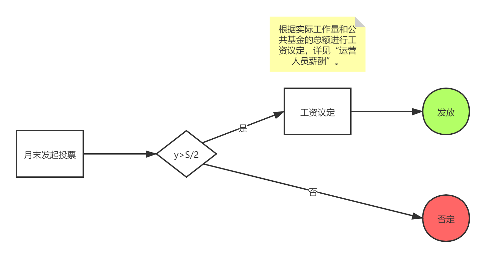
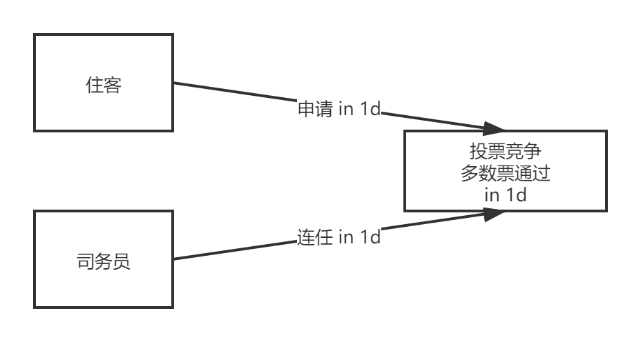

各个生活实验室可以根据自己所在实验室的具体条件，在这基础上修订和增加。

## 职能分配说明：

1. 下面的这些职务具有可复制性，是每个生活实验室都可能需要的职务。

2. 一个人可以兼任多个职务，一个职务也可以多个人一起担任。

3. 各个不同的职务，都是属于兼职内部工作，会根据相应的工作量来支付相应的报酬。报酬的份额和发放由实验室内部决定。该费用属于每个月的固定开支，从总的生活实验室的收入里面扣除。

4. 关于报酬：参见[公共基金收入与支出规则](https://shimo.im/docs/2gZ4A43ao8UXiiSi/ )中的运营人员薪酬

## 住客职位：

1. 卫生、安全、行为和用电监督

每位住客都有责任维护空间卫生，检查空间安全情况，注意自己的行为举止是否影响到他人和养成节约用电的意识。但仍然需要设立职务专门负责监督。

其职能主要是：

    1. 确保空间的整洁干净

    2. 安排每日卫生轮值和安全检查，及时更新值日人并提前通知值日人(具体人)

    3. 如有必要，安排大扫除时间和每个人的工作

    4. 监督是否符合卫生、安全、行为和用电公约

2. 财务助手

    1. 收缴住客房租和排期

    2. 对接房东

    3. 缴纳水电气网费用

    4. 公共基金的入账和花销的记录

    5. 参与706财务会议

    6. 定期向所有生活实验室成员汇报财务状况：房费、每个月公共基金的收入和开支

    7. 司务员的工资发放

    8. 监督是否购买了相应的物资

3. 事务协调

    1. 住客招募、组织新住客的面试和投票

    2. 对接和登记沙发/短租床位住宿人员

    3. 召集住客例会

    4. 对接706协调人员

4. 调研助手

    1. 调研新住客信息

    2. 调研大家的需求

    3. 制定相应规则的公示方法

5. 活动策划

    1. 活动客厅主人

    2. 更新公共空间使用日程表

    3. 收集策划案+对接嘉宾

    4. 收取押金及活动费用

    5. 主持+介绍

    6. 有义务帮助活动发起人对所有活动进行通告、通知、预热，包括并不限于在群内的宣传，参与人的报名统计，以及辅助发起人使用音响、投影仪等设备

    7. 监督活动后空间恢复原样

6. 场务物料

    1. 定期协调成员共同购买生活实验室公共物品及公共消耗品

    2. 负责采购日常和活动所需物资

    3. 场务布置，增进实验室的美观

（日常物资等购买的申请不局限于场务场料负责人，任何人都可以申请，通过报销单或者申请单）

7. 内容输出

    1. 定时记录实验室发生趣事，纷争

    2. 深度挖掘室友

    3. 日常生活和活动的影像记录

    4. 公众号文章的撰写和排版

    5. 海报设计

8. 观察员

    1. 

## 工资分配

1. 每月月末启动

## **司务员**岗位竞争体系

1. 每月月末提前三天启动

