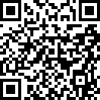

沙发客规则：

1. 申请入住

    1. 在入住一周前联系生活实验室协调员，提出申请。一周以内的申请需要介绍人，并且需要全体住客同意。

    2. 填写沙发客申请表，协调员收到申请表后，住客XX（人数）同意则可以入住，在48小时内回复是否可以提供沙发。

2. 入住收费

    1. XX元/晚，押金XX元。

    2. 706固定工作人员可以免费入住，免费天数最高X天。（再议）

    3. 根据入住天数计算费用，一次性交给生活实验室协调员。

3. 入住天数

    1. 单次入住不超过7天，超过7天要再次申请（连续申请也需要提前一周）。

    2. 最多可同时容纳X位沙发客。

4. 入住卫生、安全、行为和用电等细则

**参实验室内部规则**

5. 空间使用权

    1. 在没有住客的同意情况下，不随意进入住客的房间。

    2. 可以使用厨房和冰箱。请在使用生活实验室的锅碗前询问一下住客。

    3. 如果要带朋友来实验室，请提前告知协调员。不能带朋友在实验室的过夜。

    4. ......

6. 入住期间活动

    1. 沙发客可以免费参加入住期间在实验室客厅举办的活动。

    2. 沙发客可以在入住前或者入住期间策划一场自己的分享、工作坊等活动。举办活动需要向住客提出申请。

沙发客申请表：

[https://shimo.im/forms/vHpWPKQggCdpWvpc/fill](https://shimo.im/forms/vHpWPKQggCdpWvpc/fill) 

备注：此处给出了上海生活实验室沙发客申请表，各个实验室可以将其作为模板，制定自己的沙发客申请表。

