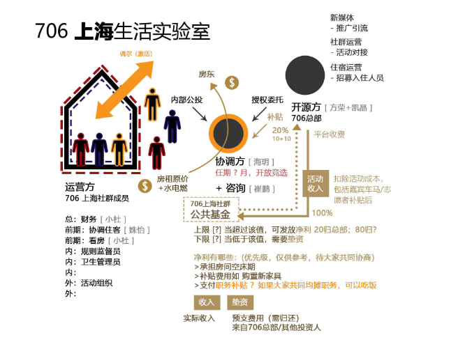

## 定义：

租房消费合作社

## 核心特征：

### 第一步：基础的共享

大家共享物品，技能，或者想法，大家住在一起，经常聚餐，一起看电影，分享彼此的想法，解决大城市年轻人的孤独问题，解决了大家的社交需求；

### 第二步 核心的自治

1）共同讨论和决策机制

每个新进入空间的人，需要知道的是，应该有一个很合适的讨论环境，让大家可以共同决策，先要有一个形成共识的机制，可以共同决定生活实验室的内部事宜，形成共识和规则。无论是以公共基金的模式，还是做活动的模式，还是社交的方式来做。 从而可以获得更好的住宿体验和公共客厅，学会自我管理和共同维护运营一个生活共同体和城市社群。

运作的中心是固定的家庭会议，在这里会讨论从是否要购买空气净化器到我们的公共客厅如何开放的问题。

2）职责分配

活动，宣传，制度监督等职责（根据情况而定），各个生活实验室成员根据自己喜好选择，并通过内部选举从而承担某项职责，获得相应的权益。这些任务都给每个人的自我成长带来了更多的机会。

3）沟通机制

具有一套运行沟通机制（生活实验室冲突解决机制，开会规则手册等等），来使得这个生活实验室项目，符合706的自治共享的核心精神，并且在保证可持续的前提下来解决青年的居住问题。

4）财务制度

706生活实验室，从接纳新成员面试审核，到财务监督预算，都是由706生活实验室的现有成员自行决定的，慢慢形成一整套完整的财务规则（比如和706，生活实验室基金共同分配权益承担损失），平衡入住质量和财务收益问题。

（因为我们在乎的重点不是居住空间，而是里面的人，以及和这些人能一起做的事情。所以，有某种现有住客对新住客的审核或约束机制是很重要的，不论是面试，还是资料预筛选，或者，虽然没有决定什么样的人可以入住的权利，但是有权力投票把人踢出去。

所以，这里不是笼统的自治，首先要分不同生活实验室，对应不同程度的自治。自治的成本如何？这个需要综合协商。）

### 第三步 ：未来的共创

如果有条件的，可以有一些生产性，表现为形成一定的社群文化和文化产品，面向外人获得一些收益，超出劳动投入 （比如共同经营咖啡吧或小书店什么的） 共创属于“自治”之后的一个自发的过程。 共同创造也是需要去推动的，比如706在背后提供各种支持，比如我们应该鼓励别人协作，这个也是需要训练出来了。 （这个不是非得需要，有的可能就停在第二步就够了）

## 如何定义一个好的生活实验室？

1）经济可持续，至少不长期亏损

2）人数比较稳定，同时也是开放的租房模式，不能退化成彻底的合租 

3）未来会形成共同的文化，共同的伦理生活，而不是纯经济合作

## 流程规划：

### 第一步：召集共同居住的小伙伴

706通过706青年空间等公众号平台，以及豆瓣等其他宣传渠道，来推广706生活实验室的理念，并且通过706在各个城市的线下团队的共同协作下，召集到同一个城市的相似地理位置区域的一批认可706生活实验室理念的706小伙伴，并且，706城市负责人，或706已经创建过生活实验室的负责人， 会给所有报名人员挨个电话沟通，确认各种细节，最后双向匹配出最终的合适的入住人员。

### 第二步：共同租房子

这一批入选入住的人员，会所有人支付定金，确认大家会一起居住，然后，大家会共同参与到后续的新的706生活实验室的建设里面来，比如，我们首先会有1,2个人组建成一个找房子小分队，这个找房子小分队，会在706城市运营小组的协助下，找到合适的房子。 

然后，在大家都看过房子满意后，706城市小组的负责人会要求一起合租新706生活实验室的伙伴，大家集体缴纳房租，来支付给房东。这样，就完成了共同租房子这个流程。

备注： 1）706实验室户型最优型：

706生活实验室不是一个普通的住宿项目，需要同时满足住宿的功能，社交的功能，私人和公共空间互不干扰的需求，所以，目前最合适的房型是： Loft复式二层， 二层有多个房间和一个住客使用的客厅，用于这个房子的住宿人员， 一层是一个稍大的客厅，可能带一个房间，一层客厅除了住客使用，也会对整个706本地城市社群成员开放，一层房间，可能可以作为706本地社群运营小组的办公室，同时还可以作为客房接待一些沙发客，促进706跨城市的社群交流。 

（如果不是很强调和城市社群融合的706生活实验室，就不用这么苛刻的选择户型，上面这个空间格局是面向各个城市核心的生活实验室而言的。） 

2）签约注意事项签约时候，因为会根据房东的不同要求来定签约主体，会有可能是706城市负责人，会有可能是新入住706生活实验室的入住人员代表，也有可能以706公司为主体来签约。

### 第三步： 空间硬件布置

这个前期布置，基本都是706生活实验室的本地城市的召集人来负责的，这个方面，需要706生活实验室以后形成一个常备的清单，将一个生活实验室需要的各种家具，沙发，桌椅，并且按照一定的放置要求有条理的归置。

这个布置里面最核心的就是706生活实验室的客厅的布置，因为考虑到未来各个706生活实验室的客厅，都会加入到706共享客厅项目，所以需要根据706共享客厅的要求来布置：比如：投影，录音，摄像，麦克风，特制灯具，背景音乐设备等等。

### 第四步：空间软件布置

任何一个全新的706生活实验室在人员入住，都需要经过一个前期预热和培训过程；

#### 4.1   706提供一整套标准化的基本框架和规则（包括各种工具包）

4.1.1. 工具包类型

706提供的工具包，主要是所有706生活实验室未来都会遇到，并且需要明确有一定的规则来解决的，比如，日常规则，投诉机制，冲突解决机制等等。 当然各个生活实验室可以根据自己特殊情况来调整，不过可以在这些标准制度的基础上。

最核心的是706各个生活实验室，可以在基础规则下，有一个慢慢自发形成的机制，很多冲突矛盾可以通过内部协商的一整套机制来解决，比如如果目前的这个规则有问题，我们可以根据我们制定的协商流程，来改规则，只要大家形成共识就可以。

4.1.2.  706活动运营工具包

这个主要包括706共享客厅，706客厅对话工具包，也包括各个706生活实验室如果自己组织其他类型的活动工具包，里面包括，如何和706城市社群对接， 如何做活动，活动流程，活动模板，活动宣传，706可以给到的各种活动相关的资源是什么？

#### 4.2   706生活实验室集体协商修订工具包和规则

在这个新的706生活实验室根据这些规则和工具包后， 就可以根据自身的特殊情况，结合706提供的基本框架，结合自身生活实验室的特点，来修订具体条款了，这个类似宪法和部门法的区别；

（706官方规则：确保706核心利益的规则，包括风险说明，合作社理念等等）

（706城市社群方面，比较偏社群运营了，即使有规则，也是涉及到提供社群活动的基地：706生活实验室客厅的使用注意规则。）

#### 4.3   706生活实验室最终的规则效果

4.3.1  706某个具体生活实验室的小管家的职务

任何一个生活实验室，只要有一个住客可以代表这个706生活实验室，来负责和706对接就可以，这个706通过授权，或者通过706生活实验室内部竞选的方式，最终出来一个706生活实验室成员，来作为706生活实验室的小管家。

同时必须明确这个706生活实验室小管家的权利和义务是什么，责任和权利的明确描述。目前设想的706生活实验室的代理人，包括两方面的任务，一个方面是负责解决内部冲突，同时，担任706生活实验室财务管理和事务协调员，另一方面是作为和706的对接联络人，参加由706生活实验室协调委员会召开的所有生活实验室的集体会议，及其他沟通事宜。

备注：

1）其实轮值应该比有一个长期的组织者要要很好很多，因为大家要认识到，没有一个长期的最终责任人，才能真正地进行一些实验性的事。

2）如果某个生活实验室规模超过7人，可以1个人担任这些职务。

4.3.2   706生活实验室基金池

只要有一个资金池的这个结构，大家会自动的去选择我怎么往里添钱，怎么往里赚钱，我们用什么方式去往里增加我们盈利点，然后自动去选择由谁来管账，或者说我们我们怎么去支出，这会随着时间的推移慢慢变成这样， 所以实验性就在于怎么去处理这个公共资金池。然后处理的方法就完全是有实验性的，每个人自己决定

这个也是706生活实验室，共同参与经济方面的公共事务，包括比如我想买个投影仪，比如我想把沙发出租出去，比如说日常采购的决策。通过公共基金怎么达成共识。

以资金池为支持为纽带，形成一个共识和决策机制，这个有可能是个启动引擎，足以推动这个轮子转起来了。

4.3.3   最好有定期的聚餐+例会制度

另外，还有就是大家对彼此的尊重，讨论的时候有个投票决策机制，具体是投票决策，还是共识决策，还是1/2或2/3通过，这些的前提都是需要有这个流程机制，用合理的方式探讨出一个流程。

## 706生活实验室类型

706提供信用机制和第三方担保，让一起租房的706社区成员自组织的合租，这样，前期的找房，装修，房东沟通工作，都不用706本部出面协调；

这样做的好处是：

低投入，低风险：把房租的巨大资金投入和住客不够导致亏损的风险分散到每一位住客身上。鼓励住客积极在平台上寻找室友，增加用户粘性。

易于扩张成本低：利于建立在各个城市建立起生活实验室社交网络。

前期低收益，后期收取平台费：

## 706生活实验室生态

### 人数规模及范围：

同一个生活实验室生态，总人数不应该超过100人，单独一个生活实验室人数不应该少于7人，10人及以上是最理想的，未来可以多一些单人间和双人间。同时，客厅开放沙发客功能。

同一个区域生态的生活实验室之间，最好走路不要超过10分钟。否则就会失去联系。很难形成一个生活实验室的社群。

（这是一个很理想的生态模式，不是非得需要）

### 自治的状态

706生活实验室还是一个完整的系统，里面有创造力的群体，也有偏享受生活的群体，大家相处融洽就行，706可以尝试引导几个有创造力潜质的生活实验室，让实验室能够慢慢达到L5或L6的级别。

不一定有创造力的人非得住在一起，只要他们共同属于这个706城市社群就可以了。

同时，706其他的生活实验室，顺其自然发展，关键看里面住的人要什么，只要保证达到最低评分9分即可，有可能慢慢发展出来主题，也有可能没有主题，这个都无所谓。

就好像这些不同的生活实验室也是一个生态，有生产内容的，有消费内容的。也有既生产内容又消费的。

### 灵活的双向选择

其实，如果一旦一个区域的生活实验室的生态做起来后，比如一个区域有8个生活实验室，各个生活实验室可以各有特点，这些信息都是可以公开在我们网站上面的，这样，想入住的新人也可以自己筛选生活实验室，可以选择去其中1家或者几家生活实验室去面试。然后选择最合适的。这个未来慢慢趋于是个双向选择。  同时，各个生活实验室的特征也会越来越明显， 比如，有的可能是偏学术思想性的生活实验室，有的可能是偏 生活好玩的生活实验室，有的可能有很多国际学术，很有国际特色。有的可能偏极客范。有的可能偏创客区块链领域的。等等，这个也是可以慢慢演化的。

未来所有的基础服务（缴费，保修等等）可以电子化的都是在网络上完成的，各个城市一般不会配备服务小管家。

### 生活实验室的社群运营功能

主要任务促进包括706这个城市的生活实验室成员在内的，大概有500人左右的一个社群的建设，比如内部串门计划，外部的文化沙龙，定期的48小时生活实验室。

社群小组的成员本身应当对活动举办有着强烈的热情，并且同时能够拉动一些人参与。这个“社群运营小组”成员包括住客里面的活动召集人，也包括706某个城市社群的运营代表。应该形成一个整体的社群运营小组，不会可以区分是住客还是非住客，都隶属于这个706城市社群。

（如果有706共享基金的话，它是隶属于706社群运营小组，每个月 有一定的额度，主要是用来促进活动发起，购买一些活动相关物品等等）

### 财务关系

1. 706生活实验室住客集体承担房租，房租是公开透明的，房东租多少钱，生活实验室的成员根据房间大小，朝向等问题以加权的方式平摊

2. 706青年社群举行的内部聚会（或串门计划）如果不用报名，直接参加的情况下，706青年社群会根据每次活动是否收费，及收费多少情况，来和706生活实验室协调员协调场地，如果收费，费用直接给706上海社群公共基金；

### 沟通关系

706生活实验室内部事务自治，如果706生活实验室协调员处理不了， 可以求助706生活实验室协调委员会；

706生活实验室品牌中心 未来理想状态是单向对接，直接对接706生活实验室协调委员会。

## 706生活实验室筹备风险把控

### 签订租房合同：

和房东签订租房协议的时候，需要结合具体情况，房东愿意和多人签订协议，还是只是接受和一个人签订协议；

如果房东只是和一个人签订协议的时候，706可能需要承担一定的风险 ，同时这个人也需要和其他租客签订协议，一起来分摊风险；

### 押金退不回来的风险

这里的风险主要指，行政命令，火灾，不可抗力，以及房东的资产发生主要折损时产生的押金退还损失

初始入住的参与者在退宿时可以拿回押金，同时在新人入住缴纳押金后方可拿回押金，同时需要告知新人押金无法退回的风险，将自己合伙的共同所有权，决策权，收益权，转移给新人

具体的合租合同，一般是在你决定退租之前1个月，就开始通知房东或通知租客，在这个1个月你正式不租的话，那还是没找到租客，如果极端情况，到了1个月还是找到租客， 那么空房期从他押金里面扣，所以，他有2个月的缓冲期。 这样就已经将风险降到非常非常低了。

具体参考：[706生活实验室合同协议书](https://shimo.im/docs/jtjd6DthKt38hVyy)

