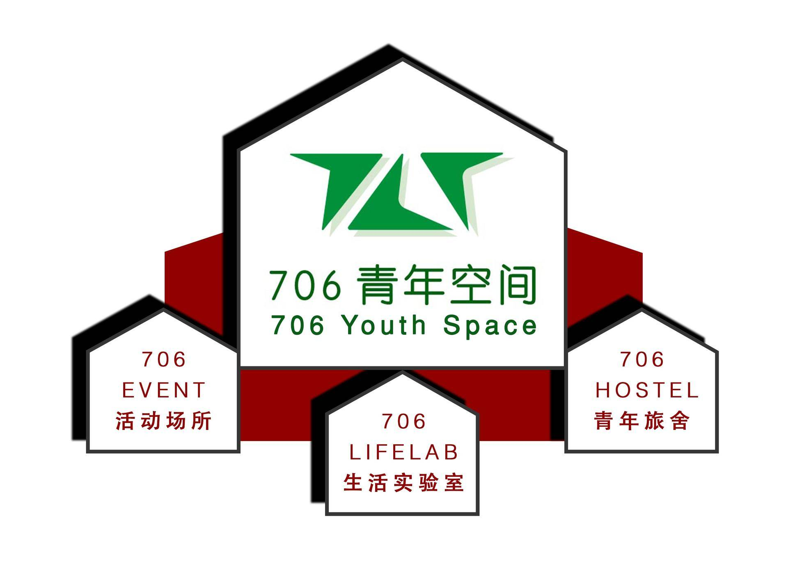
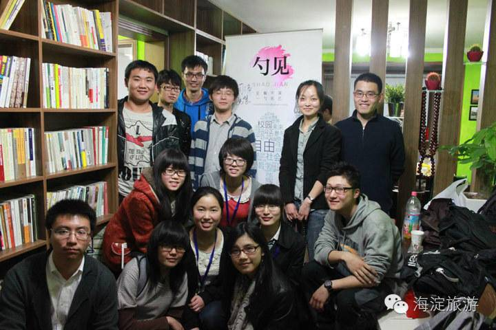
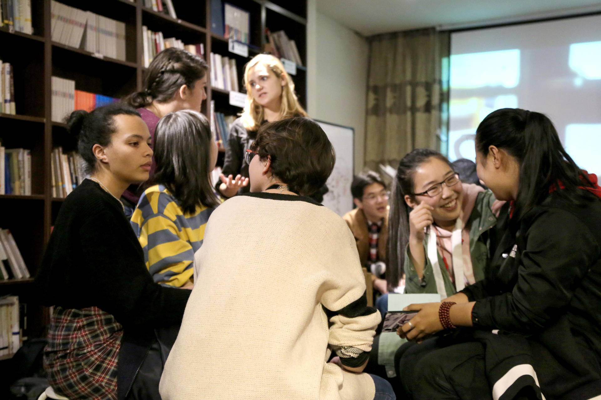
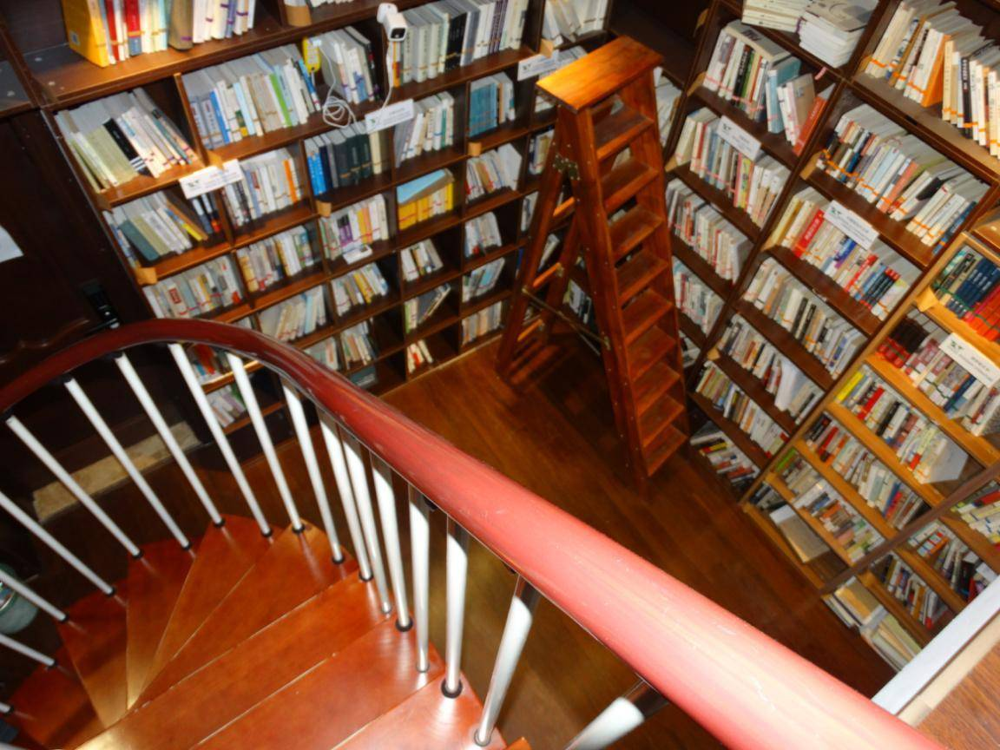
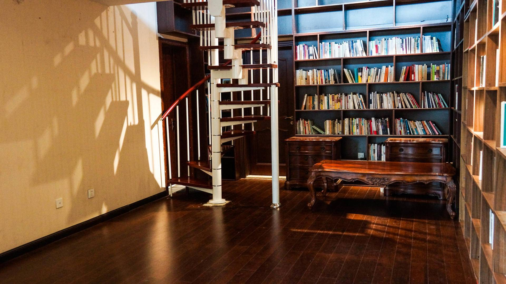
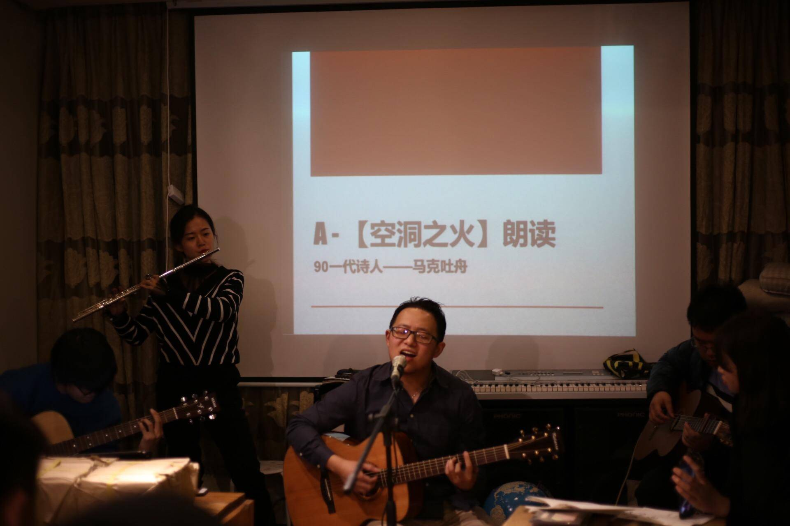
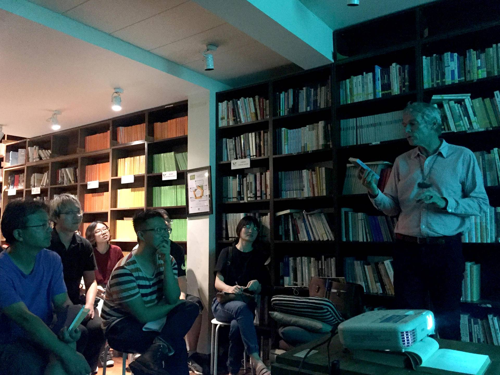

706青年空间位于宇宙中心五道口，是中国第一家青年空间。706已经举办了很多活动，发起了数十个创新项目，各地有趣好玩的青年人在此汇流。我们试图创造一种新型的实体空间形态，倡导一种新的生活方式和教育理念，让青年人探索生活的更多可能性

706青年空间历史发展

2012年，12个年轻人一起筹款在北京五道口华清嘉园（紧邻清华大学）做了一个共治共享的独立的青年空间——706青年空间，这里有更多的藏书和CD，让无数怀抱理想和梦想的全国各地的年轻人，聚到一起，随意看书、聊天，自由举办沙龙、读书会和戏剧表演等活动，让青年人通过彼此，看到一个不一样的世界，发掘更多的价值观，创造更多的生活的可能性——原来生活如此多姿多彩，原来，每个人，都是可以改变自我和一丢丢世界的.

In 2012, 12 young people who shared the same vision gathered and fundraised for setting “706 youth space”, which is also the first independent youth space in China. Located at the "center of the universe"— Beijing's Wudaokou, immersed in the vibes of international culture, we have many various books and CDs, to feed the soul of countless young people from across the globe, where they can pursue their visions and dreams. But first, you might need a platform that allows a bit more complexity.  

706青年空间框架图 706 youth space organisation map

***勺见沙龙在706青年空间举办“冷浪漫”的社会学讲座 "The Anthropology of Emotions" Salon***

***AFEP French Corner 法语角***

***这是一个和图书馆结合起来的青年公共空间。***

***This a common space that combined with the fucntion of library space.***

# **Our past events**

随后，在短短4个月内706青年空间给全国各地的青年组织搭建了一个平台，举办了40多场沙龙.

In only 4 months, There are more than 40 talks held in 706 youth space, which set up a fantastic platform for youth organizations all over the country.

沙龙嘉宾有做打工歌手的孙恒，有做农业社区发展的石嫣博士，有零点、黑苹果等公益机构，有《财经》的谭翊飞和安替老师，中央研究院的林泉忠老师，北大的张健，清华的郭宇宽、杨恒均老师，人大的张鸣老师，有野夫的朋友毛喻原，有社科院的马原老师，儒家学者杨汝清……

Guests include part-time singers, a researcher of agricultural community development,  public welfare organizations, journalists of Finance and Economics, professor of the Central Academy of Economics, teachers and students of Peking University, Tsinghua University, Renmin University and the Academy of Social Sciences, Confucianism philosopher and etc.

Poetry Festival 空洞之火马克土舟诗歌朗读会

Jan Siesling <Art is More> lecture 艺术评论讲座

修行者、法师、记者、老师、作家，先后来到这里，分享各自的人生阅历、学识和真相，回归最传统的书院式的师生关系.

Practitioners, monks, journalists, teachers and writers came here one after another to share their life experiences, knowledge and truth, and they return to the most traditional academy-style teacher-student relationship.

706青年空间也为独立社团和机构提供面试场地，为来北京游学旅行的学子提供沙发：云南“见与行”项目200多人在706面试，日本人学术会、北大韩国留学生社团活动也在这里举办.

706 Youth Space also provides interview venues for independent societies and institutions, and sofas for students traveling to Beijing: more than 200 people interviewed in 706 for the "See and Travel" project in Yunnan, and the activities of Japanese Academy and Korean Student Association of Peking University were also held here.

