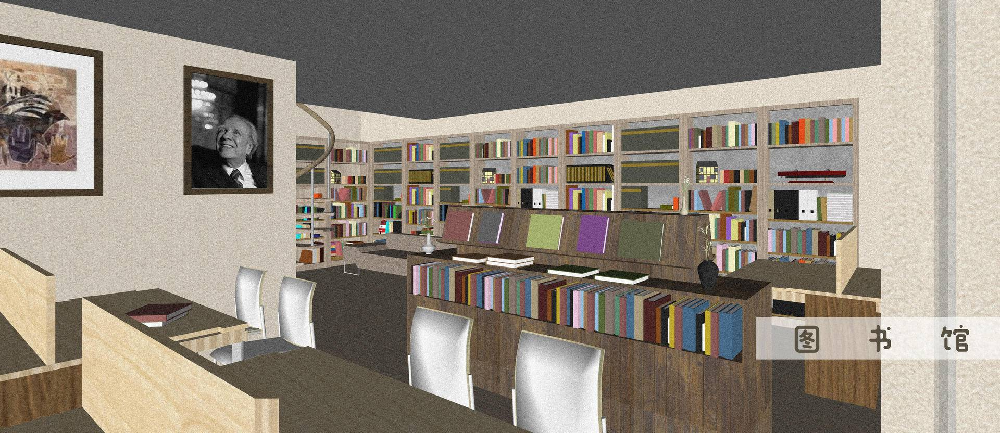
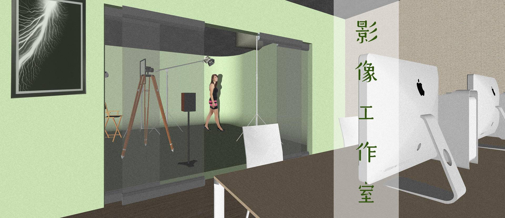
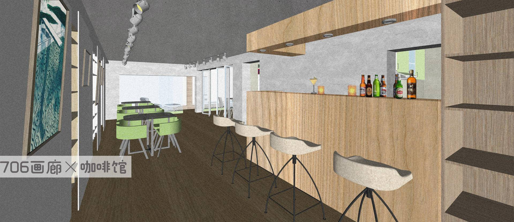
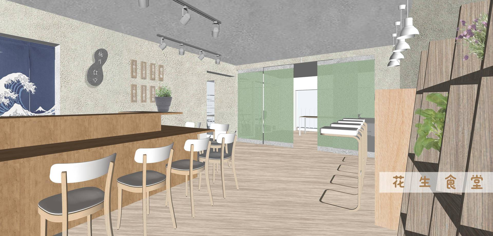
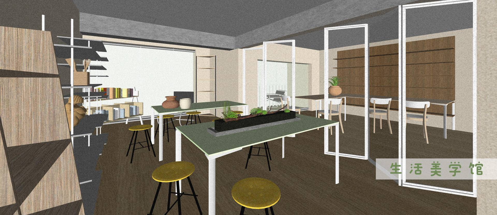
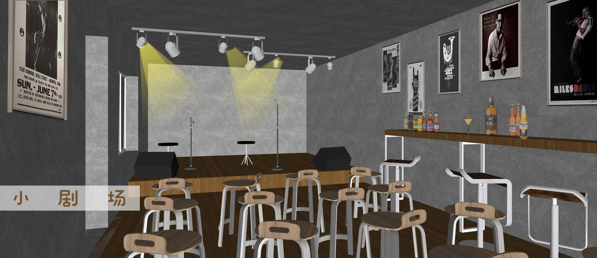
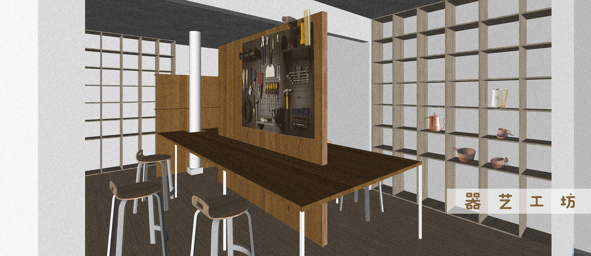
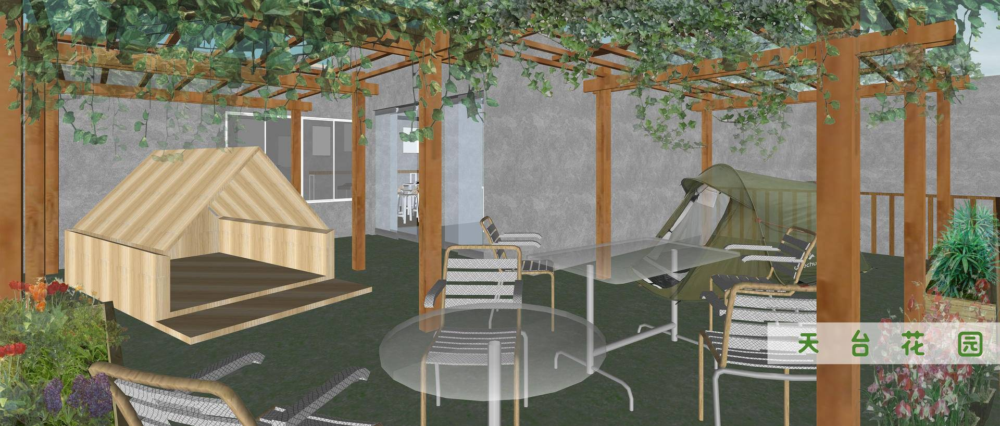
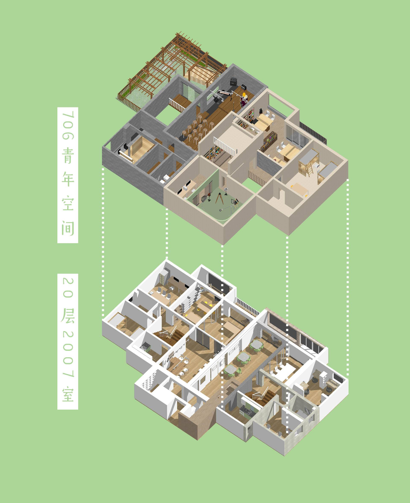

### 全球背景介绍

目前是一个各种空间或生活模式层出不穷的年代，也是各种空间形态和商业形态越来越融合的时代，这些不同的空间也承载了不同的理念和价值观，以及不同的生活模式。

激进一些的既有日本东京一个试图摆脱高度消费主义、创造自主社区的街区高圆寺，号称“一个笨蛋聚集的场所”；

也有乌托邦式的空间社区，印度黎明之城，丹麦的克里斯提安娜自由之城，美国的各种嬉皮士公社，以色列的基布兹；

也有强调教育的空间，比如发源于德国候鸟运动的国际青年旅舍，作为年轻人的自我教育共同体，美国伯克利激进左翼传统大学下的各种COOP学生自治公社；

也有生活方式类的空间，既有台湾的诚品书店，也有日本的茑屋书店；

当然，还有美国60年代反越战运动后形成的的各种共识社区，最近流行的Coliving和联合办公空间，也符合最新的社会潮流，年轻人不愿意受限于公司，更愿意独立自主的工作，这个趋势也起源于60年代的反精英和互联网技术的高度发展。

### 

### 国内背景介绍

相比较于国外各种更多的探索新生活模式的空间相比，国内的青年空间或类青年空间之所以能在全国范围内发展起来，根本原因是在于中国的改革一直没到位，经济起来了灵魂没跟上。

公共空间引领现代都市青年的归属感建设，一方面，中国快速的城镇化发展导致了大量人口快速向城市转移，人口的快速流动导致熟人社会的瓦解。另外一个方面，教育产业化导致了大学无论是从招生规模还是高校数量都是高歌猛进，无数的年轻人借此渠道来到他们不熟悉的大城市，上学时期，高校保守传统的教育模式和管理方式，并没有给青年大学生营造一个归属感特别强的空间；

 等他们毕业留下来做“北漂”，“广漂”，或者各种大城市漂，在城市里高楼林立水泥砖头把大家隔开了，会更高容易感到孤独，面对一个陌生的环境莫明的恐惧油然而生。我们要重塑社会的归属感就从提供公共空间做起。

### 国内空间的发展情况

在2012年的时候，在高校林立的北京五道口区域，出现了全国第一家青年空间：706青年空间，并在国内首创“青年空间"这一概念，一时间，青年空间好像雨后春笋般在全国各个大城市毗邻高校的区域冒出来了，上海，广州，南京，重庆，杭州，青岛------

经过13年，14年的发展，在14年万众创业导致的无数联合办公空间的冲击下，青年空间逐渐示弱。

紧接着，在16年左右，很多自媒体大号还有互联网公司终于意识到，线下空间才是看得见摸得着的，才可以更好的沉淀资源，呈现生活方式，并且才可以贩卖各种概念产品，甚至形成一个个基于线上形成的线下空间里面的社群，从而形成一个双相闭环。

比如，正午故事开始做正午酒馆，乐童音乐开始做乐空间，伍德吃托克开始在北京大悦城做实体空间，蘑菇空间从一个音乐主题空间已经开了6家分店了，当当网，亚马孙开始做书店，更不用说，各种连锁书店品牌，西西弗书店开到了无数城市，诚品书店也来到了苏州，共享际也开始布点，YOU+青年公寓还有众多青年公寓品牌也开始在各个城市深耕。

每个人都想开一家基于airbnb的民宿，开个书店，甚至开个青年公寓，共享社区最近也开始火起来了，大量的资本和资源涌入这些空间行业。

### 青年空间核心特征

青年空间本身是生态多样性的模式，类比一个微型城市共同体，作为载体，空间会有无数的涌现和偶遇（前沿思潮的涌现，思想交流者的偶遇，志同道合朋友的聚集）。

里面的人，事，信息流，呈现出无数的交流场景，多样性和多元性，不仅仅体现在空间更加复杂的功能上面，而且还体现在容器承载的多样的思想和人群，更加体现在未来可能遍布各个城市的核心区域。 这样，才有可能孵化出各种创新创意，才有可能人和人更好的相遇相知，学习成长，以及共同协作和创造。

它的核心特征简单来说，必须满足：

实体空间-----首先必须有个线下的实体空间来支持青年活动和交流

公共对话------不是私人属性的空间，强调公共领域的对话，必须强调开放性

多元活动------不是单一属性的主题咖啡馆或者文艺范的独立书店，不是有放映会或者支持个读书会就可以的，需要有多元的、有创意的、激发青年人的活动

混合形态------可以不拘一格、空间用途混合和多样化、可以有咖啡饮料服务、可以有图书馆、也可以买书、也可以包括国际青旅住宿服务、也可以包括学术和媒体实验室、也可以有文艺小剧场。恰恰是混合多用途的空间，才是青年空间的特征

“青年空间”是独特的，区别于所有商业空间的原因是：

#### 1）具备主体性，可以独立形成行业

“青年空间”的简单来说，是一群年轻人共同构建的一个公共空间，是青年人彼此聚集和交流的公共空间，一群青年人，在共同的成长过程中，对规范，道德和交流方式相互达成一致时，才会形成一个新的文化和社会规范，才会想象出我们在现有条件下的另外一种可能性。

这样定位的“青年空间”，显然不同于被观看被销售商品或者到此一游的空间，也不同于作为商业地产的补充和导流的所谓的文化书店，当然，也不是文艺小清新网红店，也不是脱离主流社会，希望消费和生产循环的自给自足的社区，当然更不是现在流行的咖啡馆和联合办公空间了。虽然，“青年空间”有可能包括上面的这些业务或空间形态功能，不过这些都不是它的核心。

#### 2） 空间的叙事性

青年空间是有故事的，它融合了所有来往空间的人的故事，它关注日常生活的观念和叙事，它融合了不同的观念，文化表达

空间会让每个到来的个体，有可能通过艺术，戏剧，哲学，心理学，先锋文学等等来探索自我的内心，让人彻底打开自我，这里是每个人的异托邦；

空间也是个天生产生故事和内容的地方，它让压抑和无聊的现代年轻人，通过这里的人和故事，看到外面更大的世界

#### 3） 超越性

它不不仅仅是个文化空间，更多是个生活方式的空间，是有归属感的地方，是未来青年人生活的第一据点。空间的核心价值是体现它的“Be Utopic”特性。年轻人们在 706 做的事情是反思现实的、批判现实的、高于现实的、实验新的现实的，甚至超现实的，这就是乌托邦的价值观，是 21 世纪的东西。

它的影响力不在于 空间到底有多大，背后有多少资本，它是青年新文化的发源地，这里必然会创造和碰撞出各种新思潮，新内容，和新的想象力

#### 4） 功能和内容的丰富性

青年空间的形态是多变的，在北京可以是个偏向学术和思想交流的复合空间，在大理 可以是个偏文化旅行的青旅短住和长住驻留模式结合的空间，不同的形态的空间形成一个多样化的空间集合，满足青年人的对于各种生活方式的想象。

青年空间的内容也是非常丰富的，比如可以开展“驻地作家”计划，也邀请国内外的相关艺术或文学等领域的艺术家，作家来到706书店，短期或长期驻留，比如可以在这个空间里面开展反思生活的课程，开展各类通识课程，比如组织音乐会，独立出版日，甚至邀请学者来做公共空间的学术研究，当然这里平日里更多是生活气息，日常聊天，酒吧夜谈，吉他弹唱。

青年空间是没有边界的复合文化生成空间，这里会让艺术，学术，生活方式等等各种各样的东西在这里生根和发展；

 

#### 5）平台性质

“青年空间”的概念开始更加朝向交互性、开放性和多元性。作为开放的“青年空间”不应该只有一个固定的声音，也不应该只有一套固定的价值观。只有做到没有价值观，才能真正做到包容与开放。如果一定要有某种价值被倡导，那么这时它就成为了一个有着特定目的的社会组织而不是一个多元的平台，这样反而会破坏“空间”的性质。

#### 6） 深度和广度的平衡

关于“深度”与“广度”的定位：

一种完全开放式的多元价值空间包容了更多的声音，但也同时也会带来许多问题。如果没有任何的评价标准和界限，就很容易走向价值的涣散和组织的娱乐化、肤浅化。这就迫切需要提升“青年空间”的深度和高度。

去营造一个有品质、有品位的高端青年空间固然是我们需要去努力追求的，然而这样的尝试又很可能阻碍到青年空间的普及和拓展。当我们把一个东西做得过于高要求时，它的受众很可能就会缩小，而当我们侧重于强调它的普及性时，又需要我们自己先去放低姿态。这也就意味着，如果“青年空间”既想秉承一种原汁原味的高品质理念，又要发出具体的行动来达至广泛而深远的社会影响，那么它就需要在“高端性”和“普及性”之间做一个谨慎的权衡，在二者之间通过“度”调节和把握来找到属于自己的合适定位。

#### 7） 年轻人的社区

起源于德国的传统的青旅模式已经式微，国内大城市的各种网红和连锁书店又被资本和消费主义裹挟，充当为商场引流的入口，总体而言，传统青旅和书店都需要模式完全更新，需要重新发现年轻人，跟上时代发展的步伐；

青年空间空间功能上，看起来类似青旅和书店的复合体，不过在物理基础的表层，他会强调年轻人，它是主要服务于年龄在18到35岁之间的，思维活跃的青年群体，强调社会实践，鼓励学习交流和成长，社区共创 ，朴素、开放、平等主义生活态度，总体上，让在成长中，青年固有的理想主义和踏入社会性的硬着陆空隙间寻找出路，并兼顾理想与现实～

#### 8） 城市特性和社会关系的建构

如大卫·哈维所言：空间具有社会内涵；是特定社会关系的载体，而不仅仅是活动的容器；空间直接参与了特定社会关系的建构美国公社COOP是年轻人反抗资本主义生活方式的入侵，而众多青年空间又何尝不是在生活领域进行的探索呢？

一个城市的青年空间，会影响到这个城市里面充满好奇心和探索生活的青年人，他们在这里尝试社会实验，探索人际关系，生活的本义，还有社群，学习，文化的意义。

### 青年空间和人的关系

#### 满足物资和精神需求

“青年空间”首先需要满足年轻人从低到高的需求。从最基本的提供住宿服务到开放的交流平台，再到一种精神上的向往和归属，去营造一种“全方位”的开放体系，尽可能涵盖更多的功能，给予年轻人更多认识自己、改变自己、提升自己的机会。

#### 拓展年轻人的视野

“青年空间”的最大价值在于“交换空间”。

它所提供的这个平台之所以有意义，是因为它给了每个参与的年轻人一个新的机会来突破他们原来所处的环境和氛围。无论我们来自哪里，我们原本所属的团体和组织都会在某种程度上给我们一定的限制和压抑，而在“青年空间”里，我们接触来自不同圈子的人，通过尽情的交流，分享不同的观点，开启不同的视野，从而交换彼此的价值。这种意义的产生正是“空间”精神的本质所在。让理想的人在这里触碰现实，让现实的人在这里瞻仰理想，来成就他们各自心中的“乌托邦”。

#### 有归属感的地方

“青年空间”作为一个有机的社群，其组织的形式不应该流于形式和程序化。真正支撑它走下去的力量是组织形式背后的精神理念和文化积淀。一个好的青年空间所给予人的并不仅仅是功用上的满足，更应该是情感上的寄托，也就是归属感——产生一种“家”的感觉。只有建立起这种牢固的情感纽带，才能源源不断地吸引更多的人。这些文化和情感的沉淀对于“青年空间”来说是最基础的，也是最长远的。

#### 共创一个社群

这些共同组成了一个遍布五道口的社群式学习网络，

青年空间为大城市青年人的公共生活，也为多样化的自我表达和社群协作提供了空间。我们在传统的社会框架以外需要寻找另外一种生活方式的可能性，那种灵活的，协作式的，基于某些共同的理念和信仰的，跨越了生活和工作界限的新生活方式。

在这里，年轻人共同组成了一个社群式学习网络，各种互补的知识和技能成为社群间合作交流的基础，跨界和分布式学习网络的形成 ，才可以从里面涌现出无数创新和创意。

### 青年空间可能的空间功能

#### 图书馆

在706图书馆一起读书和探讨，可以写作和思考，也可以将706的日常交往和生活，赋予哲学思考的可能性，这也意味着将哲学构想成一种决定，一种生活方式的选择。

#### 影像工作室

在706影像工作室里面，你可以尝试胶卷摄影，可以

#### 咖啡馆

你站在他们中间，一种亲切感，一种归属感，一种自豪感。明明萍水相逢素不相识，但好像就是看到了自己的同伴一样呢。你会想象这里是国际青年人的天堂。在这里，各种肤色、各种国籍的年轻人，跨越了文化和语言障碍，一起学习和讨论。 走在706图书馆里面就是一场邂逅，你不会知道你被哪一本书吸引，一如出现在我们生命中的那些人，没有预兆。我觉得，这是人和书，人和人的缘分。

#### 花生食堂

还记得在学校边上小吃一条街上熙熙攘攘的人群吗，或许是你的同学开了个奶茶店，或许是你的师兄业余兼职摆了一个小凉皮店，或许开小面馆的阿姨在你大一到毕业一直在那招呼着来来往往的人，这种有人情味的社区式的模式，已经一去不复返，小吃店都变成了大商场。

我们试图在706花生食堂创造一个摆脱纯粹的消费主义的模式，重创人和人通过食物产生的温情关系，创造自由交流的社区。

首先，这个食堂是合作社模式的，几个人或更多人可以轮流来做大厨或厨师助理，一起来运营这个食堂；同时，顾客也是属于706青年空间这个社区的成员，大家来吃饭的同时，同时也是打开话匣子，认识更多的朋友的机会，同时，这些食物，食物背后的厨师，这些来吃饭的706成员，共同组成了这个706花生食堂的社群。

#### 生活美学馆

位于花生食堂旁侧的生活美学馆，展示，销售社群成员的创意周边，一起制作生活物品，一起创造生活中美好的东西。

#### 小剧场

706小剧场，强调实验性话剧，并且探索话剧形式的新的可能，未来的小剧场的表达形式和空间形式都在变化，诗歌音乐文学和话剧天然是亲近的，706小剧场需要多多参考一些民间剧场和草根剧社，生命力就蕴含在这些里面，而不是去寻求类似孟京辉这种已经和商业结合太过于紧密的戏剧表达，流行的一般来说都已经过时了，我们需要去寻找不是浮在表面的，而是湖底汹涌的暗流。

实验性小剧场可以很好的捕捉现代城市年轻人的焦虑和不知所措的现代性问题，呈现背后更深刻的社会议题和全球化带来的新的问题和可能。

#### 器艺工坊 

每一个年代的青年人，都在为上一个年代没有完成的事情而努力。我们的不自由，将永远停留在过去的一代，而真正空前的自由世界，将由我们一代来完成。那么，我们的愿望就是集合大家的力量，一起来创造一所没有围墙，没有课堂点名，致力于信息平等化的创客空间

你问这个事情的边界时什么，我真的无法给你一个边界。

#### 天台 花园

## 

### 理想的青年空间形态

理想的青年空间是由书店（阅读自习区），咖啡馆（酒吧），食堂（餐厅），小剧场（沙龙空间），青旅（短租空间）4个部分构成的。

书店（阅读自习区）是相对安静阅读的区域，拥有几万册各个领域的图书，针对群体主要是爱好阅读和思考的青年人，也服务于周边不少学习的年轻人；

咖啡馆（酒吧）既是休闲区域，也是创意孵化的区域，不少独艺术工作者或自由职业者会来这里办公，沟通学习和聊天。

食堂（餐厅）用食物去给年轻人营造一个脱离于现实的空间，在这个空间里，他们是轻松的，会有那么一刻，生活中的各种情绪被眼前的食物暂时推离身体，身体的感官都在试图了解眼前的食物，在这一刻，人是单纯的去喜悦。

小剧场（沙龙空间），通过即兴话剧，艺术沙龙，读书会，工作坊，科技类活动等来提供年轻人的社群生活，与陌生人在公共空间的社会互动，创造良好的公共对话和空间。

青旅是偏向服务于外来城市的年轻人，很有可能这里是他们进入这个城市的第一站，在短短几天或几周内，他们除了认识天南海北的同样入住青旅的小伙伴， 还可以在书店/咖啡馆/食堂/小剧场等区域和本城市的年轻人达成一片。

让渴望认识自我和得到认同的年轻人，打破自己现有生活环境的局限，打造新的社交关系，重建人与人的信任，聚合在一起共同探索生活的不同可能。

### 青年空间是新商业，是替代性空间

在移动互联网时代，随着话语权从几个固定的网站转移到无数分散的APP和小众亚文化平台，随着虚拟社交已经变成无数个小圈子的分层模式，对应的城市实体空间，也必然受到挑战。年轻人再也不喜欢去大商场了，那种光鲜亮丽的时尚服装，富丽堂皇的购物中心，琳琅满目的商品，那些庞然大物，这些和年轻人有什么关系恩？

在一个碎片化和个性化，强调差异化的时代，年轻人需要的是秘密聚集地，需要的是对大宗消费品，对大众文化疏离感的空间，需要某种体现个性和独立的感觉，美国的The lab还有The Camp在废墟上建立起来的，喷泉都是用油罐筒改造的，这种在城市边缘地带的商场大受欢迎，或许它迎合了城市年轻人，在无可奈何接受城市的消费文化，和城市的管理模式后，  又渴望集体逃离的某种无意识，前一阵，逃离北上广的火爆北京圈子，便是这样一种潜意识的具体爆发。

既然，无论如何无法逃离城市，那么，还是需要寻找合适的替代空间。

从某种程度来看，也是因为对宏达叙事和某种官方美学的集体背叛，因为对大城市自以为是的，井井有条的不过又无聊单板的某种生活美学的无意识反抗，这种文化也衍生到了商业上面，也在北京催生了无数类似五道营这样的区域，还有正午酒馆，熊猫精酿的走红，也正好印证了，在这个大城市里面，有那么一类群体，会被传达同样理念和价值观取向和生活方式的空间所吸引，成为这些群体的秘密聚集地。

对于商家来说，这是一场关于“The place to meet”的竞争。越来越多的消费者爱一个品牌，不是只爱它的产品，更爱这个品牌的给他的feel；可以预见的未来，消费者在哪里下单不重要，重要的是他愿不愿意来这里，呆在这里。

在这样一个碎片化的时代，如何将自己作为‘一个’与剩下的‘无数’区分开来无疑是一个首要任务。而可以预见，在这样一个人人都有话语权，人人都可以用钱投票的时代，与之对应的城市必然也会变得更为丰富多彩。因为，‘不同’才能生存。

### 具体规划

我们预计筹款200万左右，寻找合适的创业团队，在上海(或大理）租一个500平+的空间，做一个基于706孵化的一个新品牌的符合文化空间，定位是一个青年空间模式的旗舰店；

#### 第一步：选择合适的地址

我们准备在上海，年轻人最集中的区域， 比如商业区域和高校交汇的地方，比如设计师，建筑师及自由职业者扎堆的地方，找到一个不临街，隐蔽一些的独栋，同时交通方便易到达。

这样屏蔽了大街上的散客，创造一种类似鉴于家和公共空间之间的形态，客户群体主要针对向往这种生活方式（游牧生活方式）的大城市的青年人（或者短期旅行或者长期驻留的方式）。

#### 第二步：团队招募

青年空间需要一个空间设计和创意部门，聚集有关领域的设计师，建筑师，空间产品经理，空间体验师以及公共艺术，生活方式的各路创意达人，或者和设计建筑园林创意事务所合作，从理论层面，用户体验层面，媒体传播层面，传达空间的活动层，围绕青年空间及旗下的空间产品，重新塑造一个新的空间品牌

#### 第三步：众筹资金

（未完待续）

### **备注：**

1）这个是青年空间旗舰店的筹备理念，定位，愿景以及简单的规划部分，其他的，比如，具体的BP等等还有待撰写，如果你有兴趣参与上海（或大理） 青年空间旗舰店的创业，可以私聊微信fangrong706

2）这个是一个相对理想化的青年空间的一个策划方案，实际情况下的青年空间估计很难全部达到这些核心特征，也很难拥有所有这些空间功能，所以这个目前还是个理想化的旗舰店模型；

3） 如果未来的青年空间旗舰店以“短租青旅”为主要的商业模型的话， 还需要 有个专门青旅升级版的青年空间旗舰店的策划和方案；

### 其他补充文件：

1. 青年空间-出资协议草稿

2. 青年空间-BP

参考：

[706空间创意部：用想象力重塑706空间，一场有关空间的革命](https://shimo.im/docs/St0rS3L2fEEgoFa1)

