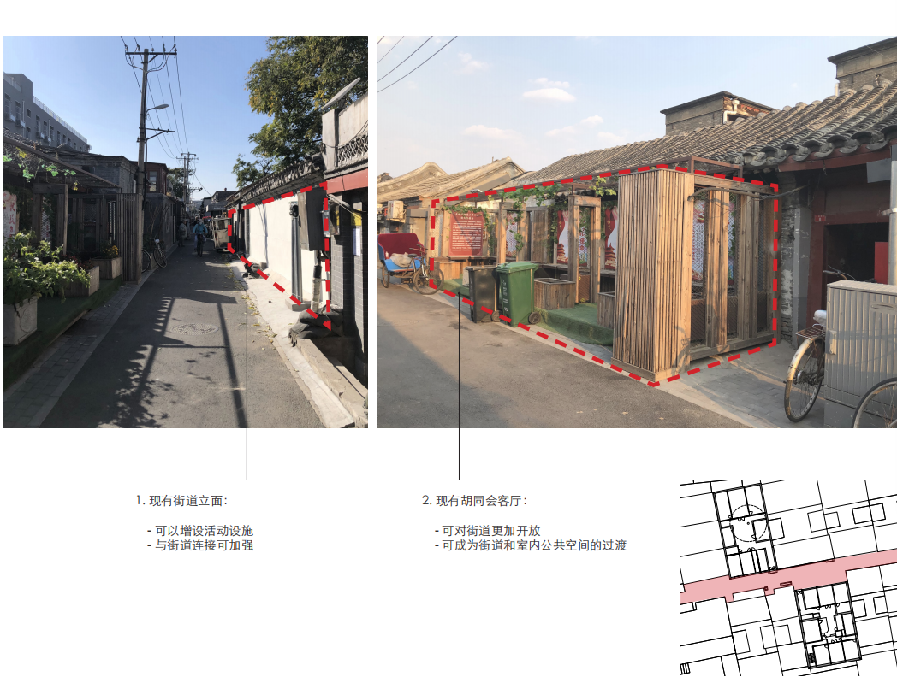

**项目介绍：**

品牌名称：未定

「不卖书的书店·706」 阅读为本，连接每一个个体。

「不卖书的书店」是706青年空间推出的空间项目，其位置位于： 某胡同街道，其空间的主体结构是独立空间+复式小楼，优势在于：

① 周边客流量庞大：	笤帚胡同位于北京市，周边客流量大

② 社区环境综合性强：，书店选址隔壁便是一家建筑设计公司；项目方团队具备多年的社区运营经验。

③ 底层书店+空中艺术空间：其底层书店+复式艺术驻留空间的结构使其具备了独特的品牌宣传特质，并且有利于形成紧密“书店社群”开发与社区相关的人文服务。

④ 社会支持：「不卖书的社区书店」已经获3000本左右的优质图书捐赠用于运营（不包括706图书馆现有图书）；706青年空间与国内多家出版社达成过初步合作共识，例如图书渠道、读者见面会、新书发布、名人沙龙等等，积累了相关的渠道以及资源，相关合作：

广西师范大学出版社，北京大学出版社，人民大学出版社，三联出版社，新星出版社，三辉图书等20多家出版机构。

理想国，看理想，新知，凤凰文化，中青报，东方历史评论，未读等50多家文化组织。

⑤ 复合空间功能复合与文化体验，通过周边配套的业态实现物业租金溢价，带动子项目的营收。（主题民宿、餐饮等）

平面图

其他数据：

底层空间+复式小房子，加起来总计80平米左右

**项目方介绍：**

「不卖书的书店」由706青年空间（北京）孵化团队主导的商业项目，并引入书店相关的运营成员。

706青年空间是中国第一家青年空间。举办了近两千场活动，涵盖多种活动类型。生产优质的媒体内容和孵化具有潜力的项目合伙人，通过社群式的学习，倡导一种新的生活方式和教育理念，让青年人探索生活的更多可能性。

目前书店团队：

空间设计师

图书选荐师

运营负责人

**为什么组织：**

大家好，做一家非传统意义上的书店，是706由来已久的想法。

在今年，我们也去往全国多家独立书店，进行实地考察以及调研，比如杭州的钟书阁，广州的1200bookshop，方所，大理的书呆子，长沙的止间书店，卡佛书店，HOME书房，西西弗书店，北京的单向街空间，万圣书园，豆瓣书店等等。

关于唱衰独立书店的声音屡听不绝，关于独立书店崛起的案例一直都有。

但是我们决定做一家跟他们都不大一样的书店。

目前，我们解决了选址、部分启动资金以及团队的基本构架，现在想邀请你加入这家书店的共建之中，你可以通过不止以下的方式加入：1.提出相关点子

2.出资众筹 3.参与落成

筹资款项将用于书店前期落地以及运营。

**项目方案：**

预计总计小额投资3万元

1.收益权认购

3000.00元/份

· 每年参与年营收利润分红，根据年营业额的阶梯分红（参考补充文件）

· 可一次性获得出资金额的10%作为免费消费权益

· 免费获取高级会员

2.股份权认购

10000元／份

出资人可获得投资机构同等权益

· 股份份额详情面议

· 如果年营业额达到目标营业额，额外增加分红（第四季度补足）。

· 配套设施以及免费会员服务：待补充

**退 出 机 制**

1、认购收益权后，自收益起始日，项目每届满1年、第2年之日前的15天为申请回购窗口期； 

2、项目方或大股东应自收益起始日起届满3年之日起15日以内以初始投资额的100％价格回购投资人股份权 3、其他：寻求股权收益权份额转让

**风险提示：**

1.实体项目开发、建设和运营的风险

2.市场风险

3.经营位置的风险

4.业务收入波动性风险

5.项目估值模型的风险

6.信息披露真实性风险

7．天使筹资的基本风险

冷静期规则说明

●为保护众筹人权益，认购期结束后72小时为投资冷静期。期间您可以申请退还认购款。

●冷静期过后，将不再支持退款申请

其他补充文件：

1. 书店-出资协议草稿

2. 书店-BP

3. 出资细则答疑

筹资模式参考来自于专业众筹机构：开始吧、多彩投

