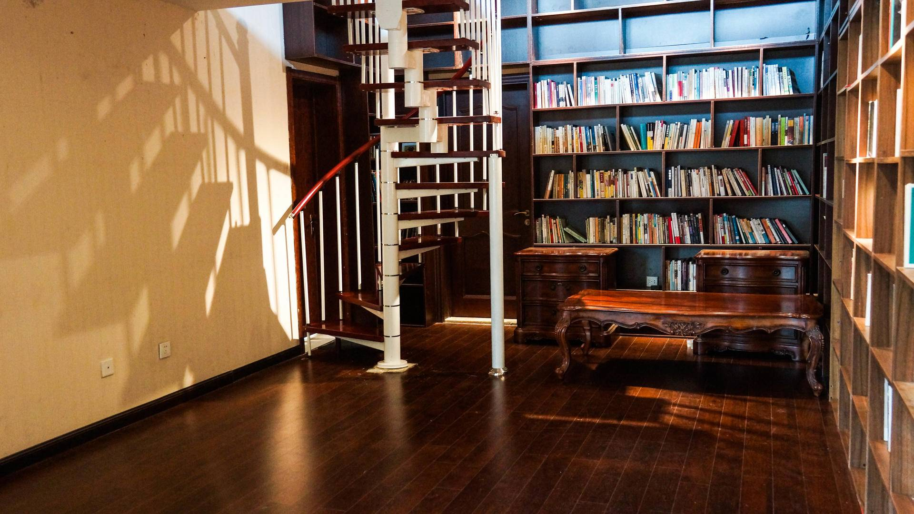

### 

## 项目介绍

来706图书馆看书的人，他们总会询问最近有没有值得推荐的书籍，所以，我们设想，706青年空间的图书馆是不是可以邀请朋友或老师来推荐书单，来自在不同领域的人，推荐令人有所启发的书籍。如果可以召集到七百零六个人，那么这份书单的背后是有力量的知识体系，这个项目就可以叫七百零六个人的图书馆。 

706青年空间图书馆，根据邀请的七百零六个人的书单，来引入一批书籍，作为推荐人的共建书柜。同时也会根据实际情况，来组织一些推荐人之间的聚会，或者推荐人的书籍交流活动，鼓励五道口周边高校青年甚至是全北京地区的有志青年来阅读及后续互动。

## 书籍推荐人部分名录：

舌尖上的中国导演：陈晓卿

编剧:史航

诗人：叶匡政

专栏作家：王路

台湾作家：伊格言

奴隶社会负责：华章

三联新知前主编：王新

法律学者：陈少文

研究员：黄凯平

新公民计划：魏羽佳

人物记者：杨潇

上海观察主编：小尤

书店漫游作者：雅倩

读易洞书店创始人：邱小石

中南屋：黄泓翔

清华老师：付志勇

IT专家：詹膑

作家：吴强

口述史专家：李远江

新经济学读书会：石永彬

自由撰稿人：西闪

豆瓣网红：塔其克马

Vista看天下副主编：田毅

21世纪教育研究院理事：张守礼

知日杂志主编：苏静

杂志编辑：马特

东方历史评论：戴潍娜

音乐人：钟立风

读库副主编：芳州 

纪录片导演：荣光荣

编剧、策划人：史航

漫画家：王烁 anusman

北京师范大学教师：林猛

中国人民大学教师：周濂

联邦走马：恶鸟

纪录片导演：荣光荣

独立艺术家：坚果兄弟

美国政治科学与国际关系学教授：孙太一

路客中国：子文东

看天下副主编：田毅

 知乎达人：佘炤灼

自由撰稿人：王路

同道读书会：灰袍（高勇）

美国博士：董一格

自由撰稿人：西闪

C计划联合创始人：蓝方

中国IT界资深传播和媒体专家：王俊秀

读易洞书店创办人：邱小石

21世纪教育研究院理事：张守礼

北京师范大学政府管理学院老师：林猛

美国哥伦比亚大学政治学博士：林垚 

真实故事计划联合创始人：雷军

 漫画家、漫画评论者：王烁anusman

 新京报书评周刊编辑：罗东

政治哲学博士，大学老师：向东

自然大学校长：冯永锋

上海大学教授:严泉

诗人，散文诗作家：黑马

## 部分推荐人的推荐书籍介绍：

需要找到各个推荐书籍的图片，然后用展示的形式在微信展示出来

### **1 恶鸟**

联邦走马创始人；恶棍机车主理人

1、恶意之⼭山

[以] 阿摩司·奥兹

1947，耶路路撒冷还在英管辖下，天竺葵怒放，爱情信仰、地下⾰命、少年⻘春搅和在一起，OZ⽤轻盈笔触写下这⼀一切。

2、知觉之⻔ : 天堂与地狱

[英] 阿道斯·赫胥黎

嬉⽪⼠运动的感官幻觉“圣经”，对赫胥黎的美丽新世界之外，多了一个献上膝盖的作品。结合禅与摩托⻋维修艺术，可以得到更多启发。

3、最接近⽣活的事物

[英] 詹姆斯·伍德

伍德有关⼩说的信仰、细节、观察、描述、批评和隐喻做了了独到的⻅解，独到还不够，应该加上迷人。

4、本托的素描簿

[英] 约翰·伯格

令我惊奇是约翰·伯格居然也是重机爱好者，Hond0 CBR1100，江湖称黑⻦，他对骑摩托车和素描的某种类似感深深着迷，每次点燃油⻔的⽣命之⽕火，感觉坐在⼀⾸赞美诗上，它追随你的⽬光，而并非你的想法。  这本书混合了素描，机⻋，斯宾诺莎的伦理学，约翰·伯格的⽇常经验⾮非常迷人。

5、碧岩录

雪窦重显 / 圆悟克勤

⽇本称之为禅宗“圣经”，⾥面全是活泼的禅宗祖师禅机演练，接机、应机的⽅法和手段。参禅第⼀书。

6、棕⾊的世界

[英] 格林·狄⻰

狄⻰已经摆脱了什么是故事，图像，或者说做到了忘记当下是在叙事这个事情，就和里⾯和洗⾐衣机圆筒很相像的符号，⼀个快要闭合的圈，内含的⽐喻、象征意义及修行，都是⾮常丰富的，他开放给世界的冥想， 做成⼀个漩涡式⿊洞。

7、禅与摩托⻋维修艺术

(美)罗伯特·M.波西格

佛陀或是耶稣坐在变速器的⻮轮旁边修⾏会像坐在⼭顶和莲花座上⼀样⾃在。如果情形不是如此，那⽆无于亵渎了佛陀——也就是亵渎了你⾃己。

8、只是孩⼦

[美] 帕蒂·史密斯

纽约六七⼗年代的文化盛宴，那些光怪陆离和声名狼藉，那些先锋艺术还是摇滚与恶棍们，还是那神奇的切尔⻄旅馆，每⼀个住客都是艺术家都是⼀个宇宙，⽽帕蒂已经可以那么平静叙述出来，再波涛汹涌的感情都能在两只手上轻轻传递。

9、思考建筑

⽪特·卒姆托

卒姆托对建筑美的思考从⽅式、内核、光、场景体验多⽅⾯展开，似乎印证了卡尔维诺讲座⾥⼩说的轻逸、精确、鲜明、多样化。⽂笔在柯布⻄耶、安藤忠雄之上，和库哈斯《癫狂的纽约》有一拼。

10、发现的乐趣 : 费曼演讲、访谈集

[美] 理查德·费曼

⾼手都是相通的，有点像物理学界王⼩波，只是一个在知识⻘年下乡时，⼀个是战时参加了曼哈顿原子弹计划，但都能有趣的发现一些东西，⽆论科学，信仰，还是哲学。这本书和王⼩波的精神家园在⼀个推荐⽔平上。

### **4 坚果兄弟**

可能是深圳最喜欢烧野火的人

推荐书籍01

蒙面骑士：墨西哥副司令马科斯文集

推荐语

如果切·格瓦拉是萨特称为“世界上最完美的人”，而马科斯这个世界上最神秘的人，则以他的天才般的想象力重新发明“革命”、“文学”、“面具”，我非常向往

推荐书籍02

记忆残留

推荐语

最近看的一本书，在极为科幻和虚假的当下，这本探讨“真实”的书特别有意思，读起来像参观一件艺术作品

推荐书籍03

小运动：当代艺术中的自我实践

推荐语

看看在一切都景观化、媒体化、消费化之外，另一种有价值的实践可能

推荐书籍04

Raqs媒体小组：动力沉思

推荐语

这个艺术小组非常有吸引力

推荐书籍05

媒体艺术网络

推荐语

了解各种多媒体艺术的入门书

推荐书籍06

回归土地：新西兰的另类社区运动

推荐语

继续寻找乌托邦

推荐书籍07

此h时此地

推荐语

大部分搞艺术的，是既没有立场、常识，又没有想象力，因此这本书显得特立独行、意味深长

推荐书籍08

离线·黑客

推荐语

这系列，好像不看不行

推荐书籍09

离线·科幻

推荐语

这系列，好像不看不行

推荐书籍10

离线·开始游戏

推荐语

这系列，好像不看不行

### **7 孙太一**

美国政治科学与国际关系学教授，社会创新的行动研究者

1. 《贤能政治》 作者：贝淡宁

扎扎实实地理解西方民主的问题以及中国尚贤制的优势

2. 《安源》 作者：裴宜理

文化置位对党革命成功所起的关键作用

3. 《中国政治改革的逻辑与局限》 作者：傅士卓

中国为什么仍没有形成西方意义上的公民社会

4. 《邓小平时代》 作者：傅高义

邓小平的一生也是中国逐渐走出百年耻辱，步入新时代的铺垫

5. 《Accountability without Democracy》 作者：Lily Tsai

为什么没有完善民主制度的基层政府依然十分有效地可以提供公共服务？

6. 《穿越平行宇宙》作者：麦克斯泰格马克

天文学宇宙学其实也是数学，更是哲学，它让我们了解生命的短暂与渺小，让我们能更为清楚生命的意义

7. 《一本正经又怪诞的行为心理学》 作者：理查德怀斯曼

社会科学之所以不是传统意义上的“文科”，而是“科学”，在于其越来越系统而有意思的方法论，尤其是通过各种“实验”去进行研究

8. 《民主主义与教育》 作者：约翰杜威

我们一生在不断地学习，而时刻可以温习一下接受教育的目的是十分有必要的

9. 《北京法源寺》 作者：李敖

人的一生由各种或微不足道或生死攸关的选择而组成，将这些选择至于宏大的历史背景之中却将每一个人物勾勒得有血有肉，带来思考，耐人寻味。

10. 《人在纽约》(Humans of New York) 作者：Brandon Stanton

伟大的作品可以由平凡的人们共同创作而成，真实有时最触动人心

### **17 西闪**

作家，著名评论家，青年学者，独立书评人，画家

1、许宏《何以中国》

2、约翰·巴里《大流感》

3、罗伊·波特《极简医学史》

4、凯博文《疾痛的故事》

5、涂丰恩《救命》

6、安德烈·洛克《夜间思维》

7、佩雷兹·拉维《睡眠之谜》

8、罗杰·戈斯登《欺骗时间》

9、哈尔特穆特·罗萨著《加速》

10、奥维·洛夫格伦、乔纳森·弗雷克曼著《美好生活》

11、弗雷德里克·巴特等著《人类学的四大传统》

12、沃尔夫冈·J.蒙森著《马克斯·韦伯与德国政治》

### **23 王俊秀**

中国信息经济学会信息社会研究所所长；长期关注互联网，信息社会与中国转型

数字化生存

人类简史

未来简史

万物简史

信息简史

人工智能简史

离心力

技术的本质

图灵的大教堂

复杂

### 

### **43 周濂**

中国人民大学哲学教授

1、茨维格：一个古老的梦——伊拉斯谟传

2、汉密尔顿：希腊精神

3、彼得·盖伊：启蒙时代

4、瑞·蒙克：天才之为责任——维特根斯坦传

5、科斯、王宁：变革中国

6、麦克里兰：西方政治思想史

7、金里卡：当代政治哲学

8、德鲁克：旁观者

9、乔纳森·海特：正义之心

10、赵越胜：燃灯者

### **44 史航**

编剧、作家

1 刘震云：《故乡天下黄花》

2 海明威：《太阳照常升起》

3 东野圭吾：《嫌疑人X的现身》

4 张立宪：《闪开，让我歌唱八十年代》

5 毛姆：《刀锋》

6 欧里庇得斯：《美狄亚》

7 王安忆：《黄河故道人》

8 野上照代：《等云到》

9 契诃夫：《契诃夫手记》

10 加西亚·马尔克斯：《霍乱时期的爱情》

11 冯骥才：《一百个人的十年》

12 伊坂幸太郎：《金色梦乡》

13 石川啄木：《事物的味道》

14 迪伦子特：《老妇还乡》

15 爱伦堡：《人岁月生活》

16 止庵：《插花地册子》

### **72 钟立风**

个人简介：写作歌手、音乐人，已出版《像艳遇一样忧伤》、《欲爱歌》、《书旅人》、短歌集、《疯狂的过果实》等音乐、文学作品若干。

推荐书单：

1、 吴藕汀：《药窗诗画》

吴藕汀先生的文字使人静心静气，缓缓入睡。

2、 《庄子》

与其是是而非非，善善而恶恶，不如两忘而化其道。

3、 张岱：《夜航船》

天地宇宙，包罗万象；真真假假，不必理会——读起来总会兀自偷乐，妙哉，快意！例如：妇人月信断三五日交接者是男，二四日交接者是女。又比如：猫洗面过耳，必有客至……如是随时搭上“夜航船”总会有奇遇。

4、 废名：《我认得人类的寂寞》

海是夜的镜子，思想是一个美人。

5、 林语堂：《苏东坡转》

多年前读过，还想再读，再读。既然又爱苏东坡也喜林语堂。

6、 宋琳：《口信》

当代最低调、最有质感、乐律的诗人。我见过两三位穿手织毛衣很酷的诗人、艺术家，宋琳是其中一位。

7、 雷马克：《黑色方尖碑》

妻子看后，说很好！

8、 查尔斯·布考斯基：《低俗》、《样样干》、《脏老头手记》

“联邦走马”出品的这三本布考斯基，是目前国内文坛最具音乐性的作品——任何艺术都渴望获得音乐的属性。法国作家费迪南·塞利纳说得更狠：对我来说，不会唱歌的一切都是粪便！

9、 胡安·鲁尔福：《燃烧的原野》

当想要走进永恒的人性深处，她说不由自主地就打开了这本书。

10、E.M.齐朗兰《眼泪和圣徒》

这个比叔本华还悲观的人曾说：就像其他人去上班一样，我每天都去“怀疑”那里报道。他还说，我恨过自己的国家，所有人，整个世界，到最后，唯一可恨的，就只有我自己。

### 

### **98 付志勇**

清华大学美术学院教师，艺术与科技创新的推动者

推荐书单：

1、[法]丹纳《艺术哲学》（傅雷翻译），生活·读书·新知三联书店

丹纳从“种族、环境、时代”三大因素来阐释文明样貌和艺术流派，不仅给予读者解析艺术的工具，也将引导读者在脑海中建立起形象化的体验场景，让艺术鲜活地呈现。

2、黄仁宇，《万历十五年》，生活·读书·新知三联书店

不同于我们熟悉的断代史，黄仁宇先生从人物和事件为中心，以讲故事的方法将读者带入到历史场景，因果关系厘清脉络和引发洞见，启迪读者建立自己的“大历史观”。 

3、林语堂，《吾国与吾民》，湖南文艺出版社

林语堂的这本书，较为温和地剖析了国人的性格、心灵、理想、生活、政治、社会和艺术等方面的特质，有助于更深刻地理解当下的种种世事。

4、林语堂，《生活的艺术》，湖南文艺出版社

关于中国人情怀的书，给追求完美生活方式的读者一个理想范本。

5、[美] 约翰·杜威 《艺术即经验》，商务印书馆

本书也可以翻译为：作为体验的艺术。第一次读到书中“An Experience”的理念，是在美国卡耐基梅隆大学设计学院的一门交互设计研讨课上，所以本书也非常适合用户体验和体验经济领域的读者。

6、[美] 欧文·戈夫曼《日常生活中的自我呈现》，北京大学出版社

本书的“前台”和“后台”观点，会帮助读者更深度理解当下互联网及朋友圈上的各种“表演”行为。作为拟剧理论代表作，本书也给出了全面剖析“如戏人生”的各种理论。

7、[美]唐纳德· A · 诺曼， 《设计心理学》系列，中信出版社

当同学们从本能层、行为层和反思层来谈设计的时候，他/她应该读过诺曼的《情感化设计》，当然这个系列包含《日常的设计》、《与复杂共处》和《未来设计》。

8、[美] 简·雅各布斯 ，《美国大城市的死与生》，译林出版社

当我们在拆出一个又一个大都市的时候，本书则以美国城市的历史案例，告诉我们城市的活力来自哪里，为什么需要人本的城市。

9、〔美〕克里斯·安德森，《创客——新工业革命》，中信出版社 

创客的概念因中国创新创业的大潮而家喻户晓，但希望读者通过这本书，来了解创客真正的含义和价值。

10、[美] 汤姆·凯利，戴维·凯利，《创新自信力》，中信出版社

如果对IDEO、斯坦福大学设计学院、设计思维有所耳闻，本书可以让大部分读者增强创新自信力。

### **20 蓝方**

批判性思维教育机构C计划联合创始人；原《财经》杂志、财新传媒公共政策资深记者

推荐书籍01

· 你以为你以为的就是你以为的吗？－朱利安巴吉尼－北京联合出版公司

推荐语

· 一本很简单的哲学入门小书——甚至并不是一本书，只是12道检验你思维、逻辑与道德体系是否存在漏洞的测试题。从发现自己的认知体系、价值体系的漏洞开始，反思自己认为理所当然的一些观念，是实现独立思考、培养批判性思维的第一步。

推荐书籍02

· 思考，快与慢－丹尼尔卡尼曼－中信出版社

推荐语

· 一本认知心理学的经典著作。大量的实验、案例，解释心理学上的各种“效应”，让你意识到我们的“直觉”在帮助你快速解决问题的同时，又会怎样误导你的决策。”认知错觉比感知错觉更难以识别，理性的声音也许比错误的直觉响亮又清晰的声音更微弱”——这也就说明了，为什么我们要质疑直觉，训练我们的批判性思维。

推荐书籍03

· 身份与暴力－阿马蒂亚森－中国人民大学出版社

推荐语

· “滋生暴力的艺术依靠某些本能，同时利用这些本能去基调思考的自由和冷静推理的可能性。”在分裂极化的世界，我们面对偏见、仇恨和暴力最有效的武器，就是我们的理性。

推荐书籍04

· 艾希曼在耶路撒冷－汉娜阿伦特－译林出版社

推荐语

· 一个“忠诚”“敬业”却缺乏独立思考能力的“小人物”，如何成长成屠杀机器上不可或缺的螺丝钉。关于平庸的恶，最完整的报告。

推荐书籍05

· 正义之心－乔纳森海特－浙江人民出版社

推荐语

· 为什么人们总是坚持“我对你错”？面对同样的进化和本能，现代人却建立起了六种不同的道德基础。道德世界，可能比你我想象的更多元，试图用某一种道德伦理去说服他人，大多数时候只是一厢情愿的想法，制造着群体间的敌意和分化。意识到那些信封不同道德准则的人，和我们一样都是真挚且真诚的，跨越道德阵营的沟通与合作，也才有可能。

推荐书籍06

· 洞穴奇案－萨伯－三联书店

推荐语

· 五个困在洞穴中的探险者，以执骰子的方式选出牺牲者，让另外四人杀死并吃掉他以活下去。他们有罪吗？十四份虚拟的法律意见书，代表着不同的法哲学。一个经典的道德困境，折射出伦理道德判断的极端复杂性。我们到底如何才能决定谁是有罪的？

推荐书籍07

· 非暴力沟通－马歇尔卢森堡－华夏出版社

推荐语

· 一本实用的小册子。在这个极化撕裂的世界，如何实现理性、平和的沟通交流，避免争端和冲突。

推荐书籍08

· 好好讲道理－爱德华戴默－浙江大学出版社

推荐语

· 想在辩论中一针见血的指出对方的论证漏洞？这本书，便能让你系统学习各式各样的思维谬误。了解谬误，是破解谬误的第一步。它能让我们在说话时更加警觉，提升自身的思辨能力，少犯错，成为更会讲理的人；另一方面，它也帮助我们在听话时，避免被愚弄、操纵、洗脑，得以明辨是非。

推荐书籍09

· 明亮的对话－徐贲－中信出版社

推荐语

· “说理是摊开的手掌，不是攥起的拳头。”为什么要学习批判性思维？其中一个原因，批判性思维是构筑公共理性的根基。公共说理是什么？到底有多重要？我们应该怎么进行公共说理，要规避哪些陷阱，警惕什么宣传？徐贲老师这本书，就在探究这一系列问题的答案。

推荐书籍10

· 批判性思维原理和方法－董毓－高等教育出版社

推荐语

· 一本优秀的批判性思维教材。对批判性思维的核心工具，论证，进行了系统的梳理和讲解。不同于诸多翻译引进的批判性思维读物，这本书语言平实，贴合中国社会语境，学术上严谨规范，是一本很适合的入门读物。

##  706图书馆历史：

706图书馆是属于706青年空间整体空间功能的一部分。在2013年期间，由12个706图书馆的合伙人合伙出资做起来的。这些合伙人的信息如下：

（增加一个可以左右滑动的12个人图片信息，图片在相应的文件夹里面）

第一期的图书馆专柜计划中，我们介绍了706图书馆的出版社专柜，邀请各出版机构在我们的图书馆建立专柜，并且，希望出版机构能利用706青年空间的线下优势，举办读书会、文化沙龙等相关线下活动，进一步让书籍发挥更大的价值。详见[图书馆的更多可能性 | 706图书馆专柜计划](http://mp.weixin.qq.com/s?__biz=MjM5MjU2NjYyMA==&mid=2654578541&idx=1&sn=090f0edc1896b28873cc0f411b4f2352&chksm=bd695b5e8a1ed2481e407f70e6ae9b9f095573f6475a0157e1ffe4837e55bb2a6d4cc5e3a8f4&scene=21#wechat_redirect)

例如：

三联、新民说、三辉图书、微思客、新知杂志、新星出版社……

706图书馆具有什么功能呢？

第一：文化聚集功能，我们同时兼具集合各类读书会的平台的功能，不管是爱思想读书会的生活探讨，还是同道读书会的伦理和社会探讨，或者是新知沙龙，凤凰大学问，还是KY的心理学工作坊，或者是大象公会合作的沙龙，还是新星出版社探讨的文学，还是理想国来聊聊“大路朝天”的纪录片。都是社会各种文化机构，各种思想观点，各种领域的碰撞和交流。可以让青年学生学到更多知识，得到更多启发，扩展自己的视野。

并且706自己也会组织706文化沙龙，定期邀请各路老师，来706和青年群体交流探讨。

第二：706青年空间k同时会鼓励周边的高校学生或年轻人发起微沙龙，一小群人围坐在一起，聊天讨论和交流，进行定期的小规模的讨论，形成一个小型的学习互助共同体，我们认为，这个才是最好的学习模式。同时，他们就会借用706图书馆的不少书籍来做参考。

## 如果你可以给706图书馆推荐书籍?

如果你也希望像上面的100位老师或706的朋友一样，来给706图书馆推荐书籍，我们也欢迎你填写麦克表单，直接在里面填写就可以。有问题也可以联系rong706706706 微信，备注：图书推荐“。

麦克地址：http://cn.mikecrm.com/hOavbtv

## 706图书馆长期招募小团队

706图书馆也会长期招募志愿者团队，同时也考虑招募一名全职工作人员，来负责图书馆的内外沟通事宜，出版社沟通及读书活动策划等等事宜。如果有兴趣，可以添加 rong706706706 微信咨询，备注“图书馆应聘”

