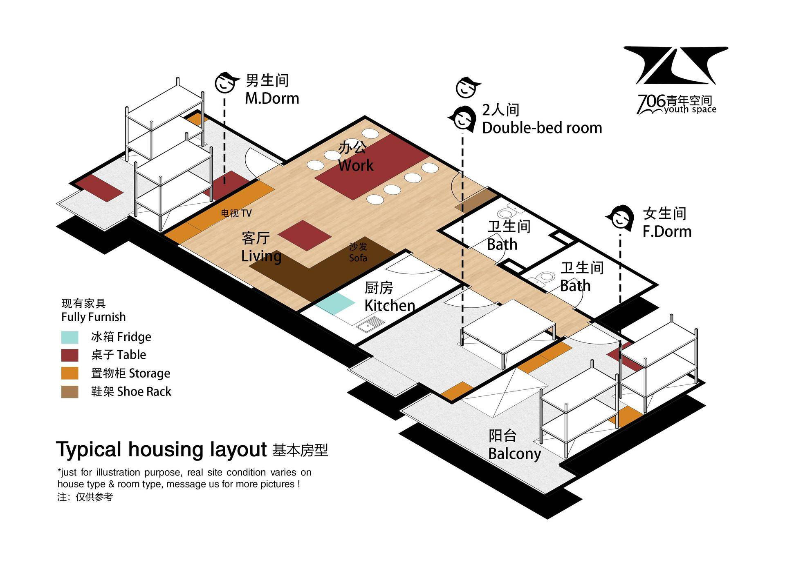
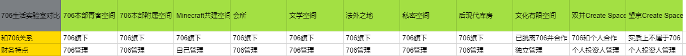
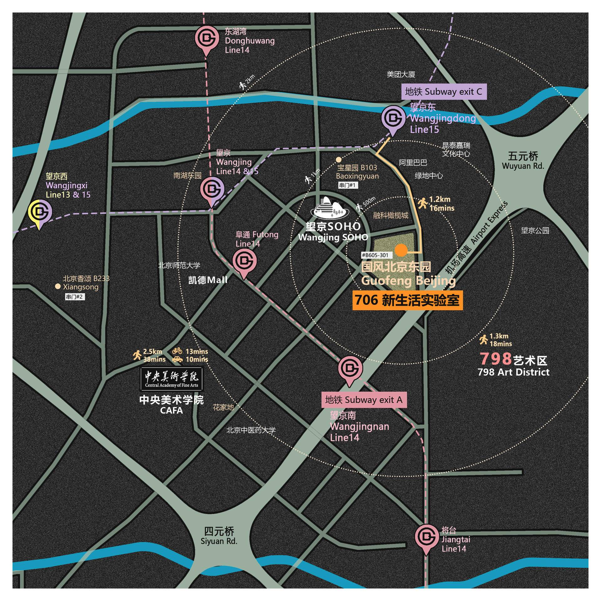

# 空间运营部常用信息模板

* [空间运营部常用信息模板](#空间运营部常用信息模板)

    * [第一章 答疑模板](#第一章-答疑模板)

        * [一、入住申请](#一入住申请)

        * [二、房型咨询](#二房型咨询)

        * [三、房租咨询](#三房租咨询)

        * [四、位置咨询](#四位置咨询)

        * [五、看房申请](#五看房申请)

        * [六、报修申请](#六报修申请)

    * [第](#第二章-通知模板)[二](http://#第二章-通知模板)[章 通知模板](#第二章-通知模板)

        * [一、午餐订购信息](#一午餐订购信息)

        * [二、入住手续信息](#二入住手续信息)

        * [三、退住手续信息](#三退住手续信息)

        * [四、住宿规则](#四住宿规则信息)[信息](http://#四住宿规则信息)

        * [五、工具文件信息](#五工具文件信息)

## 第一章 答疑模板

### **一、入住申请**

使用说明：**住客也可能根本不问，但是这一条一定要发！** 管家可直接复制“答”部分，予以介绍。  

**问**：  

如何申请入住呢？  

**答**：  

您好，欢迎选择706青年空间。706设有短住和长住床位，短住最多可提前2周预订，长住最多可提前2个月预订。是否有床位需依据您的入住日期及时长确定。  

入住方式：  

1. 填写申请表单：http://cn.mikecrm.com/px4dgmh 

2. 等待审核结果：我们会在24小时内完成审核，并通知大家~

3. 确认入住时间、地址、费用等具体信息。

4. 缴纳订金，预订成功。

5. 住客成功入住！

表单稍长，也是为大家负责哈，谢谢配合！蟹蟹~  

### 二**、 为何706住宿还需要填写表单申请呢？**

因为706青年空间不是一个单纯以住宿为目的的青旅，它是一个青年空间，所以希望入住的人员可以和这个空间，还有和这个里面的人有更多的互动，所以我们会对这里入住的人，包括年龄和一些基本条件，有一些要求。会做一些简单的审核，所以入住706青年空间是必须填写表单的。

### **三、房型咨询**

使用说明：住客或会要求单间、二人间、独立卫浴等房型，可结合**下文和当时的空缺床位**灵活解答。  

你好~我们房型大部分是四人间，也有少部分两人间、三人间和六人间。目前有空缺的床位是……，以下是上述床位的价目表，请参考。  

（附上价目表）  

各类房型差别并不是很大哈，房间比较大的床位自然多，其实都是很舒适的！棒棒哒~  

/ 也可发图片说明 基本房型图

### **四、房租咨询**

使用说明：咨询者询问价格时使用，可以从完整的价目表中截取符合对方要求的部分床位的价目表发给对方。  

问：  

你们这边的房子大概多少钱啊？  

答：  

你好，我们这边以床位为基本单位出租，床位每个月的价格大概是2500元左右，最多可以提前2个月预定，定金是500元。房租支持月付、季付、半年付和整年付，一次性支付的房费越多，价格越低哈~  

我们也支持短住哦~短住的价格为120元/天，短租预定也需要缴纳订金，短租如果和706长租发生冲突，都会优先长租，所以我们只能保证短租有地方住宿，床位或沙发或地铺。预订成功后，不支持临时取消，临时取消定金不退。请见谅。  

（附上价目表）  

我们的价格包括了基本的住宿价格和水费、电费、燃气费、网费以及物业费等……这样一看，是不是很划算^_^ 而且很方便！  

### **五、位置咨询**

问：  

你好，请问你们在什么地方啊？  

答：  

我们的本部位于北京市海淀区五道口的华清嘉园15号楼2007室，请注意区分15号楼和甲15号楼，千万别走错了哦~ 

同时发送前台电脑桌面**“管家必备”**文件夹中706地址及路线图照片；用手机操作微信发送地理位置搜“706”即可显示706青年空间详细地址。

### **六、看房申请**

使用说明：应结合我们的实际人手情况，灵活处理。  （补充：尽量发送照片-前台电脑完整图片，减少看房工作量，而且要注意每个空间对于管家看房的要求不同-事先通知/无需通知）

问：  

我可以去看房吗？  

答：  

可以的，我们的工作时间是每天的11:00-22:00，一般来说，这段时间可以看房哈，不过我们的人手不多，如果要来看房请提前越好时间哈。五道口这边看房706小管家带你过去，六道口那边看房，706小管家会帮你约里面现有成员接待你看房。

……  

也许足够你了解我们，哈哈哈 ^_- ~ ~ ~

### **六、报修申请**

你好~报修申请请在石墨文档中指定表格中填写相关信息，我们会每日查询，回复率百分之百哦，相关申请被记录后不会被遗忘，有利于工程部开展工作，谢谢大家的合作！蟹蟹~  

工程部报修表格地址：https://shimo.im/sheet/Eniyhg8RULEESPu1/2IYYT/ 《实验室|购物维修建议清单 List of item（住客版）》

### 问题紧急可以联系工程部工作微信号：gongchengbu706706,也可以打电话联系我们的工程部：13031003736。  

**七、外国人常见**

（第一次认识706的人）lifelab 推广文案：[https://shimo.im/docs/UtNaJMP9PxUPJtHP](https://shimo.im/docs/UtNaJMP9PxUPJtHP)

（询问住宿空间）：[https://shimo.im/docs/UtNaJMP9PxUPJtHP](https://shimo.im/docs/UtNaJMP9PxUPJtHP) （双语）

### **八、其他生活实验室咨询（非706管理）**

**i) 赵鹏-跨学科生活实验室：**

问：具体位置？

答：目前在水清木华，蓝旗营小区，和华清嘉园之间选择一套合适的，确保离北大清华的步行距离不超过2km. 

问：房间价格？

答：户型是大四居，仅提供单人间和2人间的选项，价格会按照实际面积做调整：

单间：大概在5500-6000；双人间：3000-3500 (*以上价格不含水电燃气，也会根据合约形式给予优惠)；同时也接受按天短租，1人间258/天，2人间200/天。

问：什么时候可以入住？

大概在6月24号可以开始入住，实际时间还等待业主确认，但是即便到时您早来，我们也会安排您在本部或其他合适的空间暂时过渡。

操作流程：

1) 填入生活实验室交接表 (是为了让706内部知道多少人感兴趣入住，赵鹏本人不使用石墨协作）

2) 把对方微信推给赵鹏（尽量不推赵鹏微信给对方）

**ii) 双井 creator space 生活实验室：**

文案参考：[双井/望京/五道口/六道口706生活实验室招募啦](https://mp.weixin.qq.com/s/DlPdIkHW9FD6H4g1U-O1OQ)

问：具体位置？

答：在富力城附近，邻近地铁双井站出站口A，步行距离大约15分钟

问：房间价格？

答：户型是个复式，顶层带一个大露台，总共7个房间，仅提供单人间和2人间的选项，只接受长住（3个月或以上）	

- 套间（独卫）：6800-7800； 双人间：2300-2500； 单人间：4000-4600，按实际房间情况（*以上价格不含水电燃气，也会根据合约形式给予优惠。）

其他问题（看房，空房，价格，照片 etc）：

我们会把你推给双井实验室的协调员，ta会与您协商和安排后续事宜。

操作流程：

1) 填入生活实验室交接表 

2) 把对方微信推给方荣/或推方荣微信给对方，方荣会检查交接表，并与雨彬内部协调沟通。

**iii) 望京生活实验室：**

**文案参考：**[https://mp.weixin.qq.com/s/p4tJ00Ln5W165Xarn9_mZQ](https://mp.weixin.qq.com/s/p4tJ00Ln5W165Xarn9_mZQ)

问：具体位置？

答：在国风北京，靠近望京soho，地铁站8分钟步行望京东

问：房间价格？

答：户型是个复式，6居2卫，仅提供单人间和2人间的选项，只接受长住（3个月或以上）	

单间价格：4200 ¥ ； 双人间价格：2400~2800 ¥；标间单间：3200 ¥；每个房间面积平均 15-25m2 （*以上价格不含水电燃气，也会根据合约形式给予优惠。）

问：什么时候可以入住？

6月25号开始 就可以起租了！

问：关于 宝星园 creator space 和 香颂 fun space 

答：这两套房子不属于706品牌旗下，但是也是706的朋友，后期大家可以互相串门哦

其他问题（看房，空房，价格，照片 etc）：

我们会把你推给望京实验室的协调员，ta会与您协商和安排后续事宜。

操作流程：

1) 填入生活实验室交接表 

2) 把对方微信推给凯晶/或推凯晶微信给对方。

**流程中提及：**

把相关咨询人员信息写进 [生活实验室交接表](https://shimo.im/spreadsheet/blcRyHIr2DsXDDCA/9P4Xb) ，（请粘贴复制对方完整个人信息）， 并在生活实验室运营群 / 私聊 @负责人 履行通知。

**总协调员：凯晶**

个别生活实验室协调员：

i) 跨学科 - 赵鹏 ；

ii) 双井 - 方荣（协调新住客-双井内部协调员：房况/价格）；雨彬（协调双金内部：是否同意新成员入住）

iii) 望京 - 凯晶

## 第二章 通知模板

### **一、午餐订购通知**

x月x日（周x）的午饭，开始报名啦！阿姨会据报名人数11:00开始准备食材，故11:00之后报名或取消无效，至多15人，于12:30在15号楼1805客厅开饭。

报名：微信【转账（非红包）】15元给 706住宿小管家 后，在下方报名。午饭见~

01、

02、

03、

04、

05、

06、

07、

08、

09、

10、

11、

12、

13、

14、

15、

### **二、入住手续通知**

定金已收到，床位预订成功了哦~ 706青年空间住宿工作的负责部门的工作时间为**11:00-22:00**，床位预订成功后，请务必在此时间段内来 **本部前台(华清嘉园15号楼2007室)** 办理入住。如果您在11:00之前到达，可以在空间的咖啡馆等处所休息等待，如果需要在22:00之后办理入住，请提前说明，工作人员会在沟通后提出解决方案哈！  

  

### **三、退住手续通知**

  每天晚上确认明天到期的住客是否续住，明天新入住的伙伴是否知道地址，确认到达时间。

你好！明天需要办理退住了哈，可携带门禁卡和押金条来 **本部前台(华清嘉园15号楼2007室)** 办理退住，如不方便来本部也可将门禁卡和押金条交由其他伙伴捎到本部，同时将自己床位的**三件套（床单、被罩、枕套）**放入洗衣机清洗（告知小管家或其他现住伙伴晾晒），本部可将三件套放至一楼洗手间洗衣篓中。我们收到前述物品后会为您办理退住手续~ 谢谢合作哈！  

  

### **四、住宿规则通知**

  

使用说明：本条信息需要在住客交纳定金之前或者完成定金的支付而我方尚未收取之前发送，尽可能确保住客的主要决定是在了解了本处信息后做出。  

您好~确认入住者默认为认同706有关住宿规则，请仔细阅读相关规定。严重违反相关的关键规则的，706有权解除与其签订的合同并要求其离开706生活实验室。我们欢迎认同706理念的小伙伴一起探索生活更多可能！

### **五、工具文件通知**

  

使用说明：本消息应以公告的形式置于微信群中，也可以间隔一段时间在群内发布以提醒大家尤其是新人使用该表单。    

大家好！有什么建议、购物申请、报修申请，都可以在这里填写，百分之百回复！https://shimo.im/sheet/Eniyhg8RULEESPu1/RIDOC/ 《实验室|购物维修建议清单 List of item（住客版）》

## 第三章 价目表 

[直接参考 706空间运营部细则4.0 - 1.3长住](https://shimo.im/docs/wbKrN0aSVV8bzQ7j)

