# 1 住宿问题

## **1.1**住宿审核

为营造一个供青年人生活、学习、交流和成长的社群空间，706青年空间会对所有申请长住的住客进行审核，审核分为网络表单审核、入住审核期审核和长期审核三部分。

**入住前的网络表单审核**

入住前由706青年空间审核

自2018年5月1日起，所有申请长期入住706青年空间的住客必须填写麦客表单，在表单中填写自己的个人经历、在做的事情和想做的事情、自己的见闻和经历、自己想分享的技能等基本信息。706青年空间会对申请人进行审核，符合706青年空间调性的住客才可以入住706青年空间。

**入住后的审核**

入住后由各个生活实验室内部审核

706生活实验室新成员在住宿1个月期内（还是更长时间？），如果有2名及以上706生活实验室成员（签订季/半年协议）质疑某住客因为非严重原因（比如不合群，不符合此生活实验室调性等等）不合适继续入住此706生活实验室，706管理人员会根据情况是否属实以及商量解决方案，或者让其换其他生活实验室或者离开706青年空间。

备注：此条规则根据[ 18.11.30 会议记录 706&各生活实验室](https://shimo.im/docs/mZH83NJLnYAeEWHV)  会议投票 3.5  决定

备注：

1）706青年空间会给被劝离的住客1周的缓冲期，并且退还此706生活实验室成员所有剩余房租和押金。

2）如果某生活实验室成员发生打架斗殴等违法行为，或在公开场所发生性骚扰等严重干扰公共空间的行为，706方面也有权利要求其离开。

备注：此条规则根据[ 18.11.23 会议记录 706&各生活实验室](https://shimo.im/docs/wQVUVP3op80XLTwN)  1.7 会议投票决定，采取了a与c的综合

## 1.2 短住：（少于1个月的算短住）

### 1.2.1 短住定金：

短住（一个月以下）：预定时缴纳500元订金（预订天数≥5天）或预付房费（预订天数＜5天），外部平台入住时需要缴纳120押金。

### 1.2.2 定金问题

预订成功后，不可更改入住日期（比如您订的7月15日入住，但是您实际是7月17日才入住，房费从7月15日开始算起）；一旦预订如果临时取消，订金不退。

### 1.2.3 接受短住的空间：

1）原则上，目前短住优先在706青年空间本部，尽量不安排到任何706生活实验室。

2）如果短住超过10天，比如20天左右，706本部没有床位/沙发的情况下，那么，706小管家可以协商1805或其他空间，需要咨询某个空间的某个房间目前现有成员，确认他们可以同意短住成员，这个情况下，才可以安排短住成员到706某个生活实验室。

### 1.2.4 短住费用：

短住：短住选择类型有床位，沙发，地铺这个3种，短住必须先给钱再住宿，尽量不要按天给

**短住安排规则**：如果有空床位，必须先住床位， 床位满了以后，才接受沙发或地铺。（除非对方在床位满的时间段 提前预定了沙发地铺。）

价格分别如下：

短住床位：120元/天，短住地点一般优先在706青年空间本部（ 706生活实验室不再提供短租）。

图书馆安排8个住宿（2个沙发，6个地铺）。沙发是沙发80元/晚，地铺60元/晚。

地铺/沙发可使用时间： 周一  - 周四  | 晚11点 - 早11点 (隔天 )，周五  - 周日 | 晚12点 - 早11点 (隔天)

### 1.2.5 ： 短住续租退宿

1. 短住续租

短住住客入住之后，如果床位到期，您想继续居住，706小管家会根据情况，有床就睡床，没有的话，就提供沙发或地铺。

2. 短住退宿

短住住客入住之后，如果取消原来的订单，需要扣1周7天房费。（比如，短住住客提前离开，还剩下4天房费，那么都扣掉， 也不用让他补房费。如果剩下7天，刚好扣完，如果剩下9天，那么我们706需要给他2天的房费。地铺沙发也同理。）

### 1.2.6 短住注意点

本部的床位原则上不管**“短住”**什么时候预定，一旦“短住申请”和“长住申请”发生床位冲突，都是优先“长住申请”。

**注意点1**：比如有人当天或明后天申请入住短住3,5天，当天706本部有空床，那么，是可以直接安排短住床位的，如果是要申请1个月以后的短住，那么，706小管家必须说明白是无法保证有短住床位，到时候，就只能有床睡床，没有床睡沙发或者地铺；

**注意点2**：如果短住的人一定不想睡地铺，那么，可以选择咖啡馆小房间住宿包间，160元/晚。提前很多天预定也是可以的，使用时间也是和地铺/沙发使用时间一样，白天用于活动。

### 1.2.7 ：地铺/沙发问题

（下面文章中的“地铺”代指地铺/沙发）

原则上有空床位的情况不安排地铺/沙发（免费住宿的志愿者除外），在床位排满或者有特殊需求的情况下，如果想在706打地铺（最多7天），需要经过管家允许。 地铺安排，优先志愿者（如果说是志愿者，让相应的负责人和管家打招呼说明：必须提交完整信息-名字+微信+手机）

1. 地铺安排，图书馆安排8个位置（2个沙发，6个地铺）。费用是沙发80元/晚，地铺60元/晚。

2. 沙发或地铺住客入住时候，706小管家先带住客去指定沙发或地铺的地方，~~然后706小管家自己进入图书馆后面储物间，~~将装有地铺用品的篮筐，放在咖啡馆阳台，并且贴标签（绿色），写上住客名字+使用天数。

3. 地铺床具统一放在篮子（有标签标识）；706住客使用后请整齐叠好放回篮子，在11点之前直接放回咖啡馆阳台。小管家早上会确认一遍。

4. 如果有特殊情况，706小管家需要和地铺或沙发人员直接沟通，比如，图书馆可能早上有包场，这样需要地铺人员在包场时间之前起床。

基本配备：床垫，被单和枕头。

We will provide basics: Bedding, Blanket, and Pillow, in a single basket. Kindly ask help from the service counter ( operation hours : 11am - 10pm) ; if there's no one there, you could take it by yourself, at the storeroom of library (password : 12345678#), please knock the door before you enter. You are also responsible to the cleanliness of the room, fold and put back everything nicely in to the basket. 

SofaBed/FloorMattress Rules & Regulation

**地铺使用时间：Sleeping Time Schedule**

周一 Mon - 周四 Thurs | 11pm - 11am (隔天 next moning)

周五 Fri - 周日 Sat | 12am - 11am (隔天 next moning)

This space will be used for events, meetings or study during Day Time, please DO NOT put your personal belongings, luggages in the room, Or Else we are not responsible for the lost. 

*除了规定时间，此场所将会作为活动，自习，开会场地；请勿将私人用品，行李滞留在房间里，否则一切损失恕不受理。

### 1.2.8 刷夜

刷夜费用30元/人/晚，登记身份证、学生证、电话

详见[https://shimo.im/docs/GZkEUAcPSDMRxDLo/](https://shimo.im/docs/GZkEUAcPSDMRxDLo/)

### 1.2.9 加入社群

* 有意向，但是很久之后才会入住的，最近还有变动不确定是否入住的，申请表或朋友圈优秀的邀请入“串门大群”，并登记至706空间运营建议/信息表[https://shimo.im/spreadsheet/Q4YK71ktkfQCeMbS/cL1QA](https://shimo.im/spreadsheet/Q4YK71ktkfQCeMbS/cL1QA)

* 明确表明不再入住的，推荐706微信公众号，邀请其关注并选择感兴趣活动来参加。特别优秀者邀请进串门大群。

* 短住小伙伴比较优秀的可以考虑邀请进串门计划群

* 没有填写相应申请信息的人拉入住过706的全国小伙伴群

## 1.3 长住：

### 1.3.1 长住定金

长住（一个月以上）：~~1000元定金~~      不高于总价的20%

说明：下面的长租费用价格都是每个生活实验室的按月短租付款的基本价格，入住人员随着签订较长的住宿协议时间，和支付方式的变更 ，会相应的在基本价格上面有优惠。

定金退款方案：

在入住日期前30天（含）以上取消入住的，定金金额返还90%；

在入住日期前15天（含）到30天（不含）取消入住的，定金金额返还50%；

在入住日期前7天（含）到15天（不含）取消入住的，定金金额返还30%；

在入住日期前7天（不含）以内取消入住的，定金金额不返还。

### 1.3.2 长住房租：

除了706本部，其他所有生活实验室原则上都只接受长住（至少1个月及以上）

长住至少押一付一，收房费+一个月押金+门禁卡押金

住宿少于2个月的，需要说清楚住宿大概到什么时候，706会根据你的预定时间提前安排后续的新住客，不会另行通知，如果个人有变更或 延长住宿，必须尽早沟通。

如果住宿3个月及以上，必须和706签订住宿协议，房租可以按月或按季度缴纳。

签住宿协议者按自然月计算（2019.7.27-2019.10.26），少于3个月不签协议则按房态系统中每月30天来登记。

签协议： 半年便宜100， 一年便宜200        （每年淡季（9月）签半年协议以上就可便宜200）

付款方式： 季付便宜100， 半年付便宜200

推荐他人来706住宿，如果住宿3个月以上，都奖励200元/次。

1. （本部空间）华清嘉园15#2007

周末经常举办讲座、沙龙、工作坊、夜聊、桌游等活动，人员流动大，吵闹，适合不介意吵闹、爱好社交、积极参与活动人员。

（1）图书馆外男6人间，月付2600元/月

（2）阁楼3个小单间，月付2500元/月

（3）图书馆内女2人间，月付2700元/月

（4）图书馆内女6人间，月付2600元/月

（5）办公室对面男4人间，月付2600元/月

[https://shimo.im/docs/cfu0RYzRevUNaWr7](https://shimo.im/docs/cfu0RYzRevUNaWr7)

2. （1805空间/附属青客空间）华清嘉园15#1805

阿姨中午在这里为工作人员及住客做午饭，社群人员在这里聚餐的空间，较吵闹，适合喜爱与人一起做饭，积极社交，不介意被聚餐打扰的人员。

（1）男3人间：月付2400元

（2）女3人间：月付2400元

（3）男4人间（带独卫）：2700元

[https://shimo.im/docs/rHVA9weZMUkIZr3L](https://shimo.im/docs/rHVA9weZMUkIZr3L)

3. （会所）华清嘉园甲15#807

客厅有大沙发，投影幕布，适合爱好电影放映人员居住，也有厨房可做饭。

（1）男6人间：月付2100元/月 

（2）女4人间：月付2400元/月

（3）女4人间（带独卫）：月付2700元/月

（4）女2人间：月付2800元

软面试： 会所实施软性面试，706小管家在带新人看房的时候，需要提起将这个人的个人资料发到群里面去，大家没有异议的情况下，沟通后续看房的事情；（邬，2020.01.19）

4. （私密空间）华清嘉园5#403

空间活动比较少，较安静，适合考研、作息规律的住客。（优先长租）

（1）男4人间：月付2500元/月

（2）女2人间：月付2700元/月

（3）女4人间（独卫）：月付2800元/月

**注：现住客要求软性面试**

5. （文学空间）华清嘉园19# 1905

厅明亮整洁，光线好，适合读书人员居住，也有厨房可做饭（优先长租）。

（1）男2人间：月付2800元/月

（2）男4人间：月付2300元/月

（3）女4人间（带独卫）：月付2700元/月

[https://shimo.im/docs/YyZzVXWlHnEKbKZe](https://shimo.im/docs/YyZzVXWlHnEKbKZe)

备注：如果是之前协议期间签订的住客，还是按照之前的协议，协议到期后，重新签订协议，按照新的协议。

~~6.（天台空间）华清嘉园13#2008~~

~~一套复式房子的二层，里面除了706工作人员，还有几个床位对外出租（优先长租）~~

~~（1）男5人间： 月付2300元/月~~

~~（2）男2人间：  月付2100元/月~~

7. （法外之地|生活家）东升园公寓 10#1108

在本部相邻一个小区，适合工作，生活，学习的地方

（1）男外3人间：月付2700元/月  （2500元/4人间）

（2）男中3人间：月付2700元/月   （2500元/4人间） 

（3）女3人间（带独卫）：月付2800元/月

[https://shimo.im/docs/YZ36B4aup20ZGRbr](https://shimo.im/docs/YZ36B4aup20ZGRbr)

最新价格：

（1）男4人间 月付2400元/月（3人间：月付2800元/月  ）

（2）2人间 月付3200/月；押一付三半年起租 3000/月

（3）女4人间（带独卫）月付2500元/月 

8. （后现代库房）富润家园3号楼305

位于六道口富润家园，复式，上层是住宿空间，下层是客厅及厨房。（优先长租）

（1）女2人间：月付2700/月

（2）女4人间：月付2700/月

（3）男3人间：单人床2600元/月，上/下铺2500元/月  

推广文案

[https://www.douban.com/group/topic/146240111/](https://www.douban.com/group/topic/146240111/)

[https://www.douban.com/group/topic/146273277/?start=0&post=ok#last](https://www.douban.com/group/topic/146273277/?start=0&post=ok#last)

备注：贾兰提出，带人看房需向305成员和她提交看房人资料

[https://shimo.im/docs/HfsbokJY7EEjBwgt](https://shimo.im/docs/HfsbokJY7EEjBwgt)

9. （文化有限空间） 富润家园A座1004

位于六道口，新租三居室，临街高层，视野良好，较为私密。（优先长租）

（1）女2人间：月付2700/月

（2）女4人间：月付2700/月

（3）男4人间：月付2500/月

[https://shimo.im/docs/SvIvmeQGQUcbXcL6](https://shimo.im/docs/SvIvmeQGQUcbXcL6)

10. （甲15/Minecraft共建空间） 华清家园甲15号楼2007

需要其空间单独面试，收到申请后可对接给甲15协调人员（7.3日更新：目前是：蔡明洋）

11. 双井 望京 朝阳区

新住客入住流程：

- 把新住客和老住客的背景资料交换，以便互相了解基础信息；

- 

- 和同屋前期线上沟通，预约现场或线上看房导览时间；

- 

- 看房期间软性沟通（双向交流，住宿公约）；

- 

- 如果第二条没有问题，可以入驻试住一个月，双向满意继续，不满意退租；

需要其空间单独面试，收到申请后可将协调人员微信（XX）推给咨询者。

话术：这边负责双井/望京项目的是另外的小伙伴、XX，可以先加下他微信，稍后会回复

信息模板参考：第八项 

[https://www.douban.com/group/topic/158911154/](https://www.douban.com/group/topic/158911154/)

望京实验室介绍：[https://shimo.im/docs/3KxEvV1dmxUErNcS](https://shimo.im/docs/3KxEvV1dmxUErNcS)

12. 清华 北大 跨学科实验室

优先考虑半年起租，北大清华学生为主

跨学科实验室介绍：[https://shimo.im/docs/gJt6pWt6GT8gY8jg](https://shimo.im/docs/gJt6pWt6GT8gY8jg)

13. 1708

长住：小次卧：5500/月，大次卧：5800/月（双人入住一个床位3200） 客厅：4500/月

短住：小次卧：198（平台188） 大次卧：138（床位）客厅：158

## 1.4 押金及续费问题

凡是有打砸抢烧任何一种行为的，押金全部扣除，立即无条件退房，双倍赔偿损失；有刑事责任的，送交派出所处理.

### 1.4.1 押金及入住问题

对于任何一个入住生活实验室的成员，或者短住成员， 必须提前明确入住日期，并且706这边会根据入住日期来算房费， 如果提前到，我们会根据情况来安排提前到的临时住宿（或者床位 或者地铺沙发），如果比预定日期晚到，由住客自行承担晚到的损失。（即比预定日期晚到几天的费用，由入住住客自行承担。）

### 1.4.2 转租/换床/临时住宿等问题

1. 转租问题

706生活实验室不为成员提供床位顺延或者春节等节假日的床位转租服务，同时禁止个人私自转租床位。如果个人想要转租，必须经过自己所在的生活实验室的其他所有成员的同意,本部成员转租需要经过706小管家同意。（或者根据所在生活生活实验室的规则确定），之后706管家才会根据实际情况来协调床位。

所有入住此转租床位的长租新人也需要填写申请表，并且需要经过706小管家审核，才可以允许入住。

2. 换床问题

为了便于管家统计床位，未经706住宿部同意，住客不得擅自换床。如有换床需求，需跟管家协商，经过管家同意后方可换床。如果私自换床导致床位安排错误，后果由私自换床的住客承担。

3. 临时续租

管家在收缴房费时已经确认成员下一周期是否续租，成员当时表示不再续租，而后又提出续租要求的，管家应根据实际床位情况予以答复，可采取调整床位、临时使用地铺等方法灵活处理，方便老成员续租。  

老成员续租的，需要重新签订租赁合同。管家依上述入住流程规定为其办理入住。 

4. 私自住宿

 在不损害706方面的利益的前提下，各个空间临时住宿或接待朋友，由各个空间内部自己决定。建议各个空间接待朋友短住或者睡沙发最好控制在3天以内，不能够影响空间里的其他长住住客.

备注：此条规则根据[ 18.11.23 会议记录 706&各生活实验室](https://shimo.im/docs/wQVUVP3op80XLTwN)  1.6 会议投票决定 

### 1.4.3 缴费及续租（**签订季/半年/年协议者 ）**

1. 缴费问题

如果是第一次缴纳房租，需要交到次月/次季度的14日。多余或差额缴费日按照比例核算，多的或差的几天，多退少补。

比如，7月12日入住的，签订季度协议，按月缴费，也需要缴纳8月14日，假设总天数是33天，房租金额是33/30X月租。

比如，有人是7月19日入住，签订半年协议，按季度缴费，那么他就需要缴纳房租到10月14日，这个总天数比1个季度少4天，房租金额就是季度房租—4/30X月租金）

2. 续费问题

房租可以按月交付，也可以按季度或者半年、整年交付。即房租缴付周期可以为月、季度、半年、一年。  

每个月的15日为房租的缴纳日期，统一收取到下个月/下个季度的15日（根据月付/季付而定）。收取房费后，管家应将本项工作记录于管家工作表的财务页面。  

3. 提醒续租

租赁合同约定的最后一个租赁月份的上一个月的15日，管家应询问其是否需要续租，并要求对方予以准确答复，未收到准确答复的，管家可以将该床位在租赁期满后租给新成员。  

管家应将成员是否续租的情况备注于住宿管理网站”番茄来了“。

4. 退租方案

如果在租期内没有住满提前退租，706方面会扣除一个月的押金，剩余房租退租1周内退还。这样就双方结算清楚。 如果退租成员可以找到人（非706现有住客）续租，那么，剩余房租和押金都退还。

如果退房未带走私人物品，物品发生丢失或损坏，后果由住客承担责任。（如果某生活实验室有特殊情况确有必要寄存的，须全体成员知晓并同意。）

备注：

（1）住客退房前，可提前1周左右办理押金退还业务。

（2）住客退房前，最好提前1周左右安排搬家问题。

### 1.4.4 ：缴费及续租（签订1个月协议者）

1. 缴费问题

如果只是住宿1个月或1个月左右的，就需要让其直接缴纳完所有房租，如果是1个月及以上的都需要签订合同。

2. 提醒续租

在合同租赁期到期前15天就需要提醒其是否续租，最晚确定期限是10天，如果确定续租可以继续根据情况可以提前签订合同。（或者按月的合同，或者按季度/半年的合同）

在入住方未提醒706生活实验室管理方需要续住，并按照规则缴纳定金，之前，706方面有权利提前出租合同到期之后的床位。

3. 退租方案

如果在租期内没有住满提前退租，706方面不再退还剩下房租，押金退还；如果入住方找到人申请住宿，并且经过706同意，续住此床位后，706方会退还剩下房租。

如果退房未带走私人物品，物品发生丢失或损坏，后果由住客承担责任。

## 1.5 住宿分类

### 1.5.1 才艺换宿

**外国人版**

（未来有固定负责人就转成706 青年空间 账户）对接：

在沙发客平台的介绍:

On behalf of 706 youthspace, 

 A place which setting in Wudaokou, also so-called the heart of universities in Beijing, 706 youth space was surrounded by young people, students, and graduates. It serve as an open platform for these group of people, providing free thinking and discussion environment, based on the sharing and self-discipline concept. After running for 6 years, 706 youth space expanded its capacity not only event space, but also library, theatre, cafeteria, pub, hostel, co-living apt. and intangibly supported by a strong local collective of communities from various profession, background, culture, and interest.

we accept host, but in exchange, you shall be our volunteer or initiate some activities. dont worry, we are funny and friendly 

 follow our Facebook for more information : [https://www.facebook.com/706youthspace/](https://www.facebook.com/706youthspace/)

(以上信息包括青年空间的基本介绍，和技能换宿的条件)

登记流程

1. 沙发客平台 ： 和沙发客确认入住日期，交换的机能

2. 确认 番茄来了房态 地铺的空缺 (统一只提供地铺）

3. 登记 番茄来了 地铺 （开放平台）

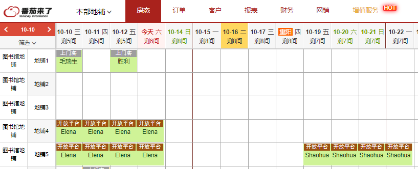
4. 让沙发客填写表单 “706LifeLab Co-op Application Form 外国人” [http://youthsapce706.mikecrm.com/ark9TXT](http://youthsapce706.mikecrm.com/ark9TXT) （选填：short stay）

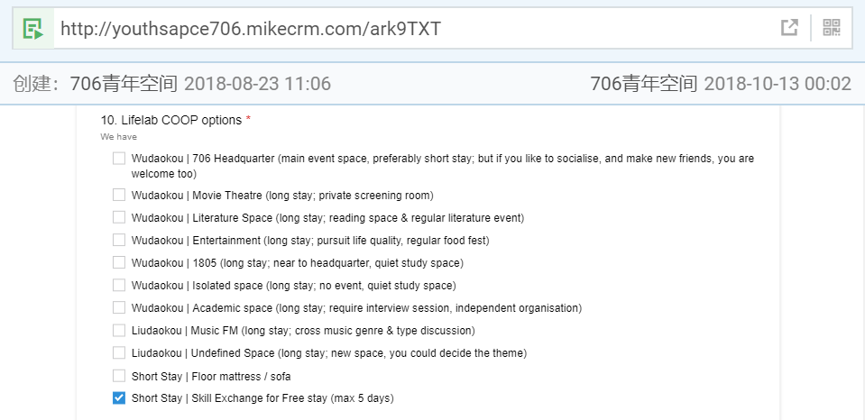
5. 审核表单后，做上标注 （蓝色对话框) 

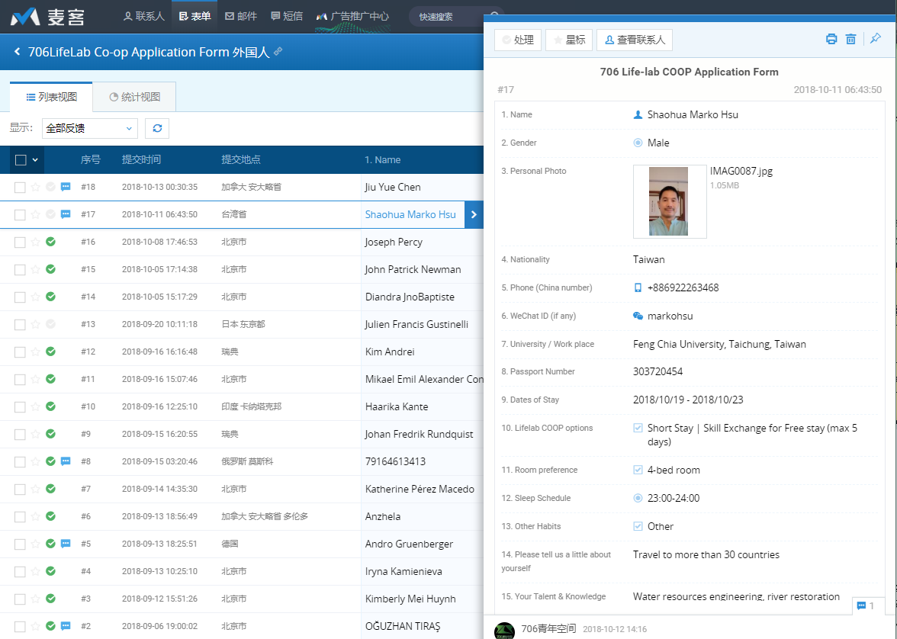
6. 将表单的信息 14,15 拷贝到番茄来了，以下列表，和节点青年。

**中国人版**

**一、管家版：**

706小管家审核（通过电话沟通或者需要对方提交活动策划资料），审核通过后，706小管家一方面给安排地铺/沙发，一般才艺换宿1到2天； 同时，706小管家负责才艺换宿人员的线下活动，面向生活实验室内部，一般规模不大。

审核条件（需满足至少1项）

- 理解青年空间或生活实验室理念，自己本来也要做青年空间或生活实验室的

- 个人确实可以策划发起个活动，可以活跃706社群氛围的

- 个人特别有才华或想法，这个需要看他的个人教育背景或社会经历，或者个人发布的作品，做的自媒体，个人简历等等网络材料来做一些辅助证明

其他备注

- 如果申请才艺换宿的人确实特别合适发起一个对外的活动，小管家需要联系706活动部

- 如果706小管家不确定对方是否适合，或者申请才艺换宿的人需要申请超过3天及以上的，那么，需要和706团队其他人员协商沟通

**二、杨树版：**

1、什么是才艺换宿项目？

才艺换宿项目是706青年空间为了活跃社群氛围，同时为各类才艺青年人提供的免费住宿申请渠道。项目仅适用于通过才艺换宿渠道申请住宿的706短期住客（居住天数少于30天），已经住进706青年空间的长住或者短住住客可通过706自治委员会或者706新媒体完成相关任务来领取活动补助。

2、哪些人可以申请才艺换宿项目？

1、如果你在哲学、社会学、人类学、政治学、自然科学、科技、公益、艺术等领域有所专长，可以联系706社群活动部发起706麻圆微沙龙或其他讲座类活动，将自己掌握的知识、技能、见闻、经验介绍给大家，并将沙龙内容整理成条理清晰的文字交付706青年空间新媒体运营部。

才艺换宿天数：根据活动次数及质量，可申请1-7天免费住宿

微沙龙介绍：[https://shimo.im/docs/UG25Q1DQ7cQ1UF3L](https://shimo.im/docs/UG25Q1DQ7cQ1UF3L)

2、如果你掌握写作、设计、音乐、绘画、摄影、摄像、舞蹈、看展、户外等技能，可以联系706社群活动部发起音乐会、摄影展、绘画展、观星、露营等活动，举办绘画、摄影、电影、舞蹈等工作坊活动。也可以联系706新媒体运营部，用你的技能为706青年空间提供写作、设计、绘画、摄影等内容服务。

才艺换宿天数：根据活动次数及质量，可申请1-15天免费住宿

才艺换宿案例：

（1）李尔阳发起音乐活动：[《李尔杨不插电原声独立音乐微型现场| 706音乐空间》](https://mp.weixin.qq.com/s/Pt-2PnvEJYLSXrmi4JjDAQ)

（2）为706新媒体提供人物采访稿件：

[《706个人 | 十四座山上上下下，这是人生，也是生死》](https://mp.weixin.qq.com/s/-Y-jPr3k8w7jKJVUjAGSAw)

[​《勇敢抗争，命运又能奈我何 | 706个人·第28个 端缭》](https://mp.weixin.qq.com/s/tGl0x0nWNxV67dtK3-Gv_Q)

（3）为706新媒体提供日常小故事记录：

[《706个日常：西西弗的哭泣》](https://mp.weixin.qq.com/s/WUXNrHRIsYB8fuCdivA4Yg)

（4）为新媒体提供纪录片或宣传片拍摄：[《706青年空间住客回访-外国人》](https://v.qq.com/x/page/w0837r7z4h6.html)

3、如何申请706青年空间的才艺换宿项目？

1、申请流程

（1）点击公众号菜单“才艺换宿”或联系706工作人员，获取才艺换宿申请表（[http://youthsapce706.mikecrm.com/0TyeI5V](http://youthsapce706.mikecrm.com/0TyeI5V)），填写才艺换宿申请表单。

（2）等待706官方审核（两日之内），审核通过后，706社群活动部或者706新媒体部相关工作人员会与您联系，协商才艺换宿的具体事宜。协商完成后，706小管家会添加您的微信，与您协商住宿相关事宜。

（3）入住成功后，与您对接的工作人员会联系您发起才艺换宿项目。

（4）如果居住期间，您未能履行承诺并完成才艺换宿项目，706相关工作人员会要求您补交住宿费用。

2、内部审核流程

（1）活动运营部和新媒体部门负责检查《706生活实验室才艺换宿申请表》，添加申请人好友，与其讨论才艺换宿的具体事宜，协商完成后，将其信息发送给管家，管家与其沟通住宿事宜。

（2）入住成功后，活动运营部或新媒体运营部联系其发起活动或产出内容，并对活动和内容进行质量审核。

### 1.5.2   志愿者住宿

706志愿者如果需要地铺或者沙发，需要706活动负责人告知706小管家，让706小管家安排地铺或者床位。不能自己私下住宿，私自住宿需要补缴住宿费(按照正常价格）。       

### 1.5.3   老住客临时住宿

706之前老住客或老朋友周末或偶尔来玩睡个沙发，提前和706小管家打个招呼（如果小管家不认识，706老住客可以沟通其他706工作人员，为其提供老住客的身份认证。），一般情况下都是允许的，除非是查住宿等特殊时间段，不过必须打招呼，不能自己私下住宿，私自住宿需要补缴住宿费(按照正常价格）。       

​            

老住客来706短期住宿一般打8折，100元/床位/天，沙发70元/床位/晚，地铺50元/床位/晚。需要提前通知706小管家。

### 1.5.4   离职工作人员住宿

706曾经的工作人员（小管家、长期实习生及志愿者）离职后，再来706，每年有1周的免费入住（沙发地铺或床，有床睡床，没有睡沙发或地铺）。免费住宿床位由706工作人员统一调配。不能自己私下住宿，私自住宿需要补缴住宿费(按照正常价格）。       

备注：离职工作人员至少工作满3个月，不满3个月提前离职的不享受免费入住待遇。

### 1.5.5   房租减免及免费入驻权利

对于积极建设社群的住客，706会给予一定的房租减免优惠。详情咨询706社群部和品牌部。

706负责人邬方荣会挖掘少量有潜力认可706理念和706未来有紧密合作的小伙伴，提供短期几天的免费住宿（床或沙发）。这个需要邬方荣提前和706小管家沟通好。

706共建人可以提供1到3天的免费住宿。（有床睡床，没有的话睡沙发。）

## 1.6  706生活实验室信息标准问题

### 1.6.1 706生活实验室规范名称

番茄来了和名称统一为小区名-楼号-房子号，对外名称可以用主题空间（比如音乐空间，文学空间等等。）

华清15#2007

华清15#1805

华清甲15#2007

~~华清6#1007~~ 华清5#403

~~华清6#503~~ 华清甲15#807

华清13#2008

华清19#1905

富润1A#1004

富润3#305

东升10#1108

### 1.6.2  床位名称统一格式：

建议需要用 1U，1D，这个格式。这个一方面让番茄来了 和实际床位是一一对应的。另外一方面，也防止检查的人看到是上铺下铺的意思，如果简单说1上，1下，就很明显。

## 床位命名专用床位统计单

 

>  数字代表顺序编号，后缀U代表上铺(Up),后缀D代表下铺(Down)，后缀S代表单体床(Single)。    

### 本部_15_2007

1. 女生五人间床位：001U、001D、002U、002D、003S。  

2. 女生二人间床位：004U、004D。  

3. 阁楼三小间床位：005S、006S、007S。  

4. 男生五人间床位：008U、008D、009U、009D、010S。  

  

### 聚餐_15_1805

1. 女大四人间床位：011U、011D、012U、012D。  

2. 女小四人间床位：013U、013D、014U、014D。  

3. 男生四人间床位：015U、015D、016U、016D。  

   

### 北区_06_1007

1. 男生四人间床位：017U、017D、018U、018D。  

2. 女内四人间床位：019U、019D、020U、020D。  

3. 女外四人间床位：021U、021D、022U、022D。  

   

### 会所_06_503

1. 男生六人间床位：023U、023D、024U、024D、025U、025D。  

2. 女生六人间床位：026U、026D、027U、027D、028U、028D。  

3. 女生四人间床位：029U、029D、030U、030D。  

   

### 书屋_19_1905

1. 男生三人间床位：031U、031D、032S。  

2. 女生四人间床位：033U、033D、034D、034U。  

3. 女生二人间床位：035U、035D。  

   

### 东升_10_1108

1. 男内三人间床位：036S、037U、037D。  

2. 男外三人间床位：038U、038D、039S

3. 女生三人间床位：040U、040D、041S  

  

### 富润_03_305

1. 女生二人间床位：042U、042D。  

2. 女生四人间床位：043U、043D、044U、044D。  

3. 男生三人间床位：045U、045D、046S。  

 

### 富润_A1_1004

1. 大床房床位：047S

2. 男生四人间床位：048U、048D、049U、049D。  

3. 女生五人间床位：050U、050D、051U、052D、053S。  

### 天台_13_2008

1. 男生五人间床位：054U、054D、055U、055D、056S。  

2. 男生二人间床位：057U、057D。

**柜子问题**

如果柜子数和入住人数刚好是一致的，那么， 柜子编号和床位编号和对应的入住人员是需要一一对应的。

如果柜子数比原定房间入住数量多，那么，除了给予个人的柜子按照规则编号后，剩下多余的柜子可以编号为公共柜子。

建议假如一个屋子住4个人，就先把柜子分成6个部分，4个私人2个公共，私人的要做好编号，私人的部分哪怕空着也不能被其他人占用，或者是万一占用了，大家也能很方便地看到应该把哪里空出来，而不是像现在这样商量来商量去。

### 1.6.3 微信标准化

1. 706生活实验室3号群：

只保留现有的长住客（所有生活实验室的所有长住客），和虽离开706，不过还在北京，经常回来706的前住客们。

2. 706五道口群 及城市群

这个群主要包括所有来706青年空间短住的，并且还不错的，可以加到相应的群

  

## 2. 空间购物及维修流程

### 2.1  购买流程

1. 购买申报

目前706各个生活实验室的购物渠道分为2种：

第1种是706大管家和706空间设计师去各个空间收集缺失的物品清单，填写到购物清单表格。 第2种是各个空间的所有成员都可以自己填写需要的空间购物链接，到我们的购买清单表格。 

购买任何物品，均需管家审批，购买物品的价格超过500元的，需要方荣审批。

第1种不用审批，直接购买。 第2种需要706大管家审批后，才可以购买。

2. 购买方式

审核通过后，再看东西是某个空间某个住客自己买，（如果住客购买的话， 报销给管家，管家需要截图留凭证，自己填写报销单，做个财务记录。明确是哪个空间哪个人购买的，包括这个人的名字电话。）还是由706这边购买，如果是706这边购买的话，就是706大管家或者委托小管家专人购买，写清楚报销单。

###  2.2 大家具相关规则

1. 706应该给每个空间提供基本家具和基本设备，同时根据各个空间的个性需求，协商购买合适的家具设备，除此以外，如果706自己主动给某空间添置设备或家具，需要经过此空间同意。

备注：此条规则根据 [18.11.30 会议记录 706&各生活实验室](https://shimo.im/docs/mZH83NJLnYAeEWHV)  会议投票 3.2 决定

2. 如果某个706生活实验室需要处理或扔掉某个大件物品（比如旧的电视机，沙发，床垫等），也需要填写处理杂物清单到上面的表格。然后经过706大管家同意后，才可以处理。

### 2.3 大扫除原则

706在每个月定期（需要706自己确定时间）和各个生活实验室商量整体大扫除，征得空间同意，才进行大扫除，大扫除将无人认领物品放置1周，1周后所有权直接划分为706所有；如果某空间觉得空间还算干净，没有必要大扫除，可以拒绝大扫除。

（前提是不需要大扫除的空间，需要确保不至于因为空间脏乱而导致新人不想入住，影响706收益及里面成员的住宿体验。）

备注：此条规则根据 [18.11.30 会议记录 706&各生活实验室](https://shimo.im/docs/mZH83NJLnYAeEWHV)  会议投票 3.4 决定

### 2.4   维修原则

最常用的方案是各个706生活实验室成员可以自己在石墨维修表格填写维修事项，包括哪个生活实验室，故障名称，故障说明，故障图片或短视频，报修人名字及电话。

706工程部会在石墨维修表格里面备注维修进度，比如当天维修，或者具体截止维修日期。维修金额超过500元的需要706负责人审核批字。

第2种补充方案是706生活实验室成员在706生活实验室通知群里面@706工程部小能手，并且说明以下5项信息：哪个生活实验室，故障名称，故障说明，故障图片或短视频，报修人名字及电话，然后706工程部将这些故障写到相应的石墨维修表格。 

**紧急方案**： 比如涉及到壁挂炉问题煤气问题停电等紧急问题，可以在通知群里面@706工程部小能手，或者直接给706工程部小能手手机号13031003736 沟通（第二紧急电话工程部刘伟手机：）

### 2.5  706工程部其他常规工作

706空间工程部工作人员须在每月的第一个周一和第三个周一去各个空间定期检查燃气表与电表的余额，电表余额低于100度，燃气表余额低于100方时应及时通知管家充值。管家应根据其反馈信息及时缴费。

### 2.6  706工作人员进入各生活实验室规则

 706工作人员（主要是管家和工程部）应当在带人看房或维修进大门无需敲门可直接输入密码，进宿舍小门前应当敲门确认。（不包括甲15） 

备注：此条规则根据[ 18.11.23 会议记录 706&各生活实验室](https://shimo.im/docs/wQVUVP3op80XLTwN)  1.1  1.2 会议投票决定

### 2.7   水电气充值问题

**水费缴纳**

自来水公司工作人员有时候需要我们辅助给水表拍照，然后，他们后台会生成一张自来水交费清单，上面有自来水缴费数字编码和条形码，这时候：

1. 打开支付宝，选择水费；

2. 会提示扫码缴费，直接扫描缴费条形码，或者手动输入数字编码，缴费即可.

3. 缴费完成之后及时按要求打印支付凭证，并填制财务凭证。

**电费缴纳**

706空间工程部工作人员须在每月的第一个周一和第三个周一去各个空间定期检查燃气表与电表的余额，电表余额低于50度，燃气表余额低于50方时应及时通知管家充值。管家应根据其反馈信息及时缴费。

电费充值，目前最简单的方式是支付宝充值；

1. 打开支付宝，电费；

2. 输入客户编号和充值金额，即可；

3. 缴费完成之后及时按要求打印支付凭证，并填制财务凭证。

注意：

- 因欠费已自动断电的空间，缴纳电费后需自行推上门外电表箱下面开关才能通电。

- 因欠费已自动断电的空间（富润家园），缴纳电费后需联系小区物业来重新通电。

- 由于阶梯电价，需要补缴阶梯之间的差价，所以，充值金额未必就是入表（读数）金额

  

### 燃气充值

706空间工程部工作人员须在每月的第一个周一和第三个周一去各个空间定期检查燃气表与电表的余额，电表余额低于100度，燃气表余额低于100方时应及时通知管家充值。管家应根据其反馈信息及时缴费。

富润A-1004燃气费充值需要携带燃气卡去北京银行，同时携带北京银行卡，其他银行卡有时候会刷不上。

**PLAN A**

注意：需要携带NFC燃气卡和带有NFC功能的手机

1. 燃气充值：

北京燃气APP，NFC充值燃气；充值前需确定燃气卡数值为零。

2. 充值操作流程：

充值完成，携带燃气卡插到燃气表卡槽里，听到嘀一声长鸣，燃气表显示数字，充值成功.

3. 充值完成，打印充值凭证，并及时按要求填制财务凭证.

**PLAN B**

注意：需要携带燃气卡和建设银行储蓄卡（有钱），必须是建设银行储蓄卡才可以充值

1. 燃气充值点：

所有建设银行柜台，都可以充值；

离706最近的24小时充值点：同方大厦楼下建设银行燃气充值机.

2. 充值操作流程：

选定北京燃气充值，插入燃气卡，认证通过；

提示插入建设银行储蓄卡，输入密码，以及充值金额；

充值完成，打印充值凭证即可.

3. 充值完成，打印充值凭证，并及时按要求填制财务凭证.

**燃气壁挂炉补贴**

使用壁挂炉自采暖空间，每年供暖前后数据需要记录，数据申报成功后可以去建设银行领取相应补贴（带着燃气卡去银行）。

供暖前后时间段判定：以楼道内燃气公司张贴公告为准。

壁挂炉数据记录：机械转轮数（表底数，即黑底白字数，不要红底白字数）+液晶剩余数。

数据申报：北京燃气APP或者电话申报，以楼道内燃气公司张贴公告为准。

### 2.8 午餐菜品购买清单

1. 打开旧小管家手机（黑色的）桌面上，进行点击“美菜商城”标签

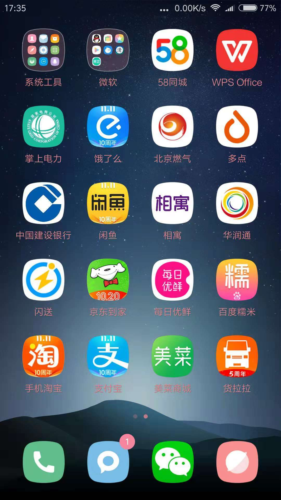

2. 点击后进入买菜桌面，可以挑选想要购买的菜品。

**第一次：（买蒜需要带皮，方便存放；买大葱不买小葱）**

娃娃菜5斤

西葫芦5斤

尖椒3斤

西红柿5斤

绿豆芽5斤

土豆5斤

黄瓜5斤

油麦菜5斤

前臂尖5斤

五花肉5斤

**第二次：**

空心菜3斤

木耳2斤

油菜5斤

苦瓜3斤

金针菇5斤

红苋菜2斤

茄子5斤

猪肝4斤

三黄鸡5只

里脊肉 5斤

**第三次**

玉米甜3斤

生菜2斤

散花菜5斤

菠菜2斤

螺丝椒2斤

藕5斤

红薯5斤

香菇2斤

鸡大胸5斤

五花肉5斤

**买菜频率**

一周两次：鲜鸡蛋10斤 

一周一次：大白菜10斤 白萝卜10斤 冬瓜25斤 南瓜1个 四季豆10斤

偶尔买：葱、蒜、姜、米、油、酱油（生抽/老抽）、醋、蚝油、淀粉、盐、鸡精、白糖

## 3  场务，设备问题

### **3.1 、现场场务流程**

1）主办方人员需要在活动开始前**30分钟**来现场，**调试麦克投影及电脑设备**，现场有任何投影或麦克风等问题，请联系对应场务负责人 。活动开始前或现场有任何需要（白板笔，胶带，5号电池，剪刀，投影笔，移动投影等需求），请直接去706咖啡馆吧台自取。

2）主办方根据活动要求，提前**30分钟**来布置活动场地。

3）活动完毕20分钟内，值班人员请拿走咖啡杯等相关咖啡馆用品。

4）活动完毕30分钟内，值班人员确认活动会场一切归位，移动投影和投影笔归活动部，麦克需要归位原处。

5）活动完毕30分钟内，主办方需要将桌椅归位。 

### **3.2、现场投影设备介绍**

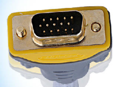

上图为投影自带的接口。

* 如果你是 windows 电脑：

如果你有如下图所示的**接口1**，那就可以直接插上投影了。

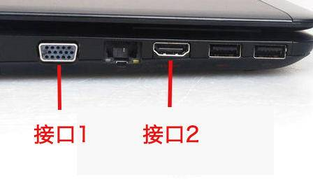

如果没有接口1，那你需要找以下的**转接线**来连接投影接口与你电脑的**接口2**。接上就可以用了。

* 如果你是mac：

大部分情况你需要找以下**转接线**。左边连接投影接口，右边连接你的电脑。

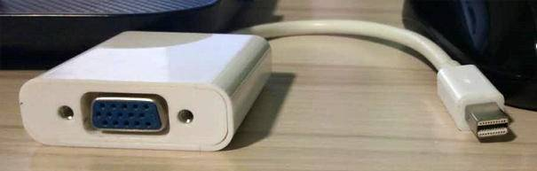

如果你的mac有**接口2**，你也可以用这样的**转接线**。

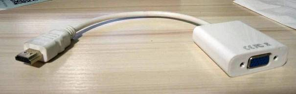

**移动投影**（如果你的活动在小会议室或咖啡馆小角落都是使用移动投影）**：**

* 如果你是mac，706会提供这样的线，左边插投影仪，右边连你的mac。

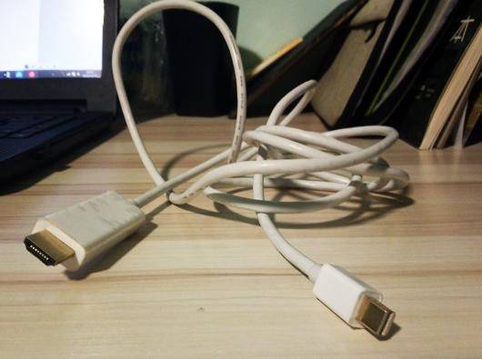

* 如果你是windows，706会提供这样的线，一边连投影，另一边连你的mac。

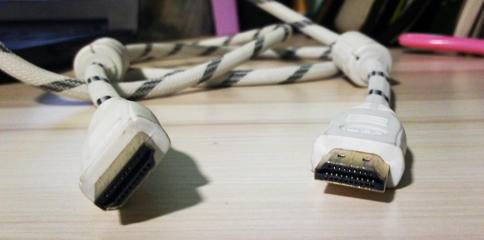

## 4 财务及管家权限问题

### 4.1 管家权限问题

涉及到706生活实验室实体空间里面的物品添加采购或处理，只需要706大管家及小管家团队审核通过就可以；

涉及到706生活实验室的一些个人或职位的资金的事情，比如承诺给社群活动管理员等特殊身份的住客一些补贴，或者给某个做出贡献的成员住宿打折等问题，如果在规则里面没有，就需要706青年空间负责人审核。

涉及到706生活实验室的信息安全问题，比如有生活实验室成员或外来人员需要706的麦克表单账号密码，这个也需要706青年空间负责人审核。

### 4.2    居住证问题

### 外国人居住证办理流程：

**2019.7.18日更新：**

近期不建议外国伙伴入住，即使入住也不方便办理登记，具体情况可以沟通方荣。

**2019.6.26日更新：**

**五道口华清嘉园**

1.先沟通是否可以办理

2.准备资料（目前是本部15-2007）

a.租房协议书

b.房东身份证

c.租房税税票（已用706公司身份缴纳本部整体租房税至2019.11.21日）

d.房权证

e.外国伙伴护照复印件

3.联系外国伙伴前往办理

4.办理地点：华清嘉园警务室（华清嘉园3号楼一楼、午休及周末时间不办公）

**六道口富润家园**

与中介沟通，协助办理。

**外国伙伴租房税办理（本部目前是以706公司身份缴纳本部整体租房税）**

1.租房协议书

2.房东身份证复印件

3.房权证

4.公司营业执照（如果是以公司身份缴纳）

5.房东授权办理书（房东XX授权XX全权办理租房税事务，对应身份证号码及手机号码）

6.只接受现金或银行账户转账

7.办理地点：东升园社区服务站，午休（11:30-14:00）及周末时间不办公。

**历史借鉴版本：**

1. 材料：

(1) 706准备 - 房租合同

[租房合同.doc](https://uploader.shimo.im/f/FJQzKB4EOmYsRzT0.doc?fileGuid=T3MUDJUuVCQyDrlR)

(2) 706准备 - 房东资料（证件复本，产权证，税收表）

(3) 外国人准备 - 外国护照

2. 办理地点：华清嘉园警务室（华清嘉园3号楼一楼）

### 非外国人居住证办理流程：

### 2019.10.18更新：

1. 准备材料：

（1）一寸或两寸证件照片（蓝底或白底，不能用红底）一张

（2）身份证原件

（3）房屋租赁合同（1905我爱我家合同，中介电话：我爱我家主管刘宝龙18310500568）

2. 办理地点：东升园社区服务站，午休（11:30-14:00）及周末时间不办公。

3.  填写居住证表单

**历史借鉴版本：**

1. 材料：

（1）一寸或两寸证件照片（蓝底或白底，不能用红底）

（2）身份证原件

（3）房屋租赁合同

（4）房产证

2. 办理地点：东升园服务站（东升园东南门进去直行）

3. 准备人员信息：电话号码、工作单位

4. 填写居住证表单

### 4.3 费用的报销单据填写规范

1、费用报销单据分两部分，第一部分是需按要求填写的“费用报销单”，第二部分是粘贴单据附件的 “原始凭证粘贴单”。

2、“费用报销单”后必须附上发票、或其他由卖方开具的可清晰反映具体费用情况的单据，如购物小票，卖方开的收据等所有附件，并在这些附件背面签上自己的姓名和日期后将这些附件整齐的粘在‘原始凭证粘贴单’上，一份报销单后可按需求附多张‘原始凭证粘贴单’，一张‘原始凭证粘贴单’上也可分块或分层粘贴多张附件，但必须整齐清晰，没有清晰附件的不予报销；

粘贴附件的时候保证粘贴牢固的基础上用胶水把附件的一角或一边粘贴在‘原始凭证粘贴单’上即可。

3、“费用报销单”和附件内容、大小写金额必须一致，如有不一致者，按最小金额报销；

4、原则上每笔报销业务需要单独写一份报销单据，具体操作中，可将多笔金额小但归属于同一类项目的写在同一张报销单上，但必须将他们的明细分开列示，并在摘要中将它们各自的数量金额等信息写清楚（比如买了稿纸，胶水，订书钉，这些都属于办公用品的，可以写在一张上）。并在“备注”栏中写清楚所用地及用途（如：用于会所，读书会活动。）

而对不同项目的必须分别写在不同的报销单上（如买的菜和书）。

5、支付款项票据必须保证干净、整洁、书写规范、大小写数据清晰且一致。

6、数字大小写字样：

小写：    1    2    3   4    5    6   7     8   9    0

大写：    壹   贰  叁  肆   伍   陆   柒   捌   玖   零

例如：押金和门禁卡押金填写规范模板

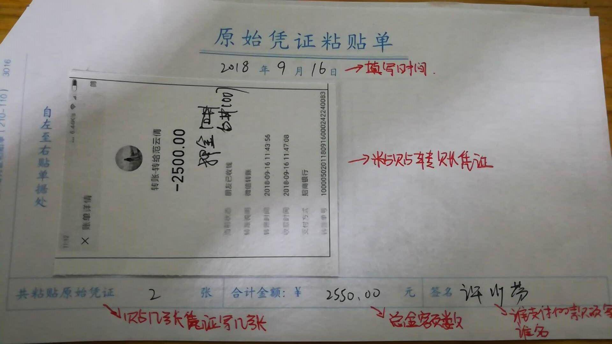

### 4.4 收据

如果新成员需要收据，管家应为其当场书写收据，收据可以将房费和押金写在同一个收据，房费应写明金额和对应租赁日期，收款单位注明"706青年空间"，缴费者签字后将副联交付对方保留。新成员需要开具发票的，管家可以与财务负责人联系办理。

**A.收据本子模样**

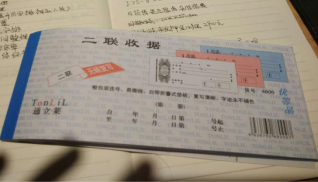

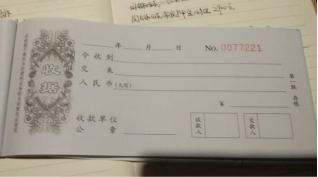

**B.开收据的时候要把后面的硬纸板放在第二页复写纸后面，否则会导致后面页数出现复写的情况。**

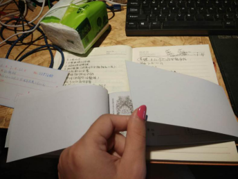

​       

       C.**租金收据范本**

**D.押金收据范本**

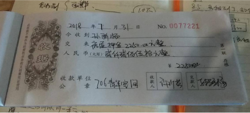

### 4.5 增值税开票流程

1. 税控盘和发票放置在办公室先锋电脑桌下第二个柜子里，将其取出来。

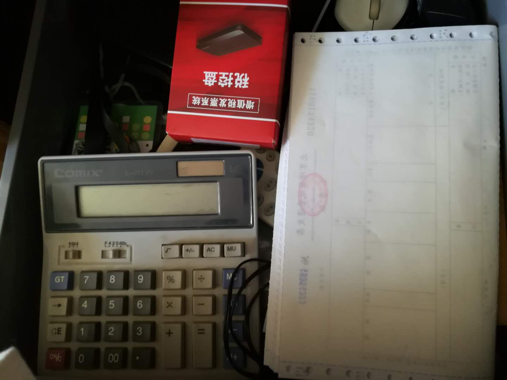

2. 取出来的税控盘连接到主机上的USB接口上。

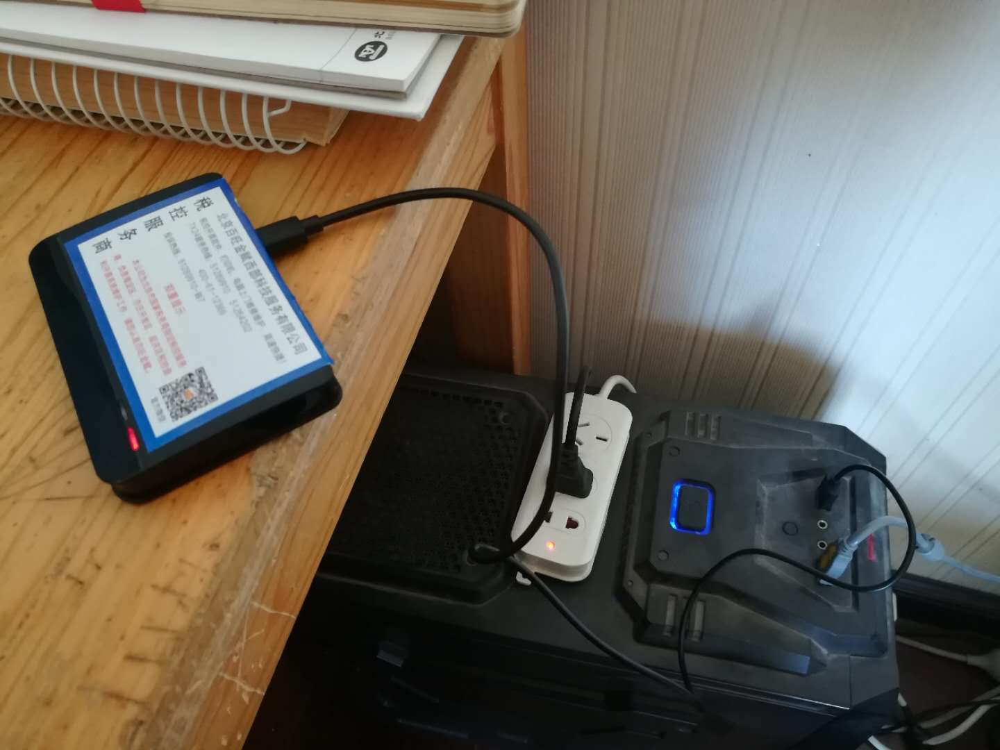

3. 打开电脑桌面上的增值税发票税控开票软件(税控盘版)，

4. 会出现一个是否允许未知设备进行更改的信息，点击“是”。

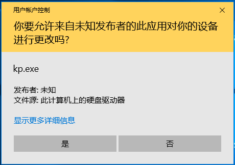

5. 出现主界面，点击主界面上方的“发票管理”

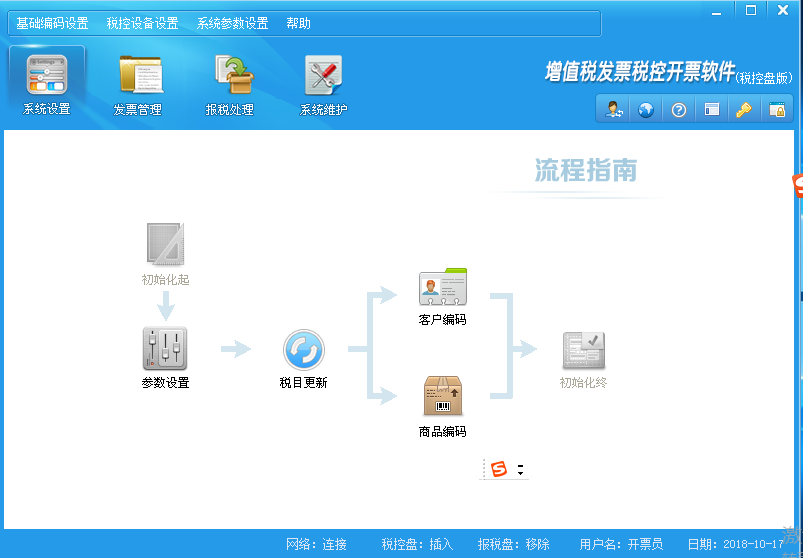

6. 点击发票管理中的“发票填开”

7. 点击“确定”

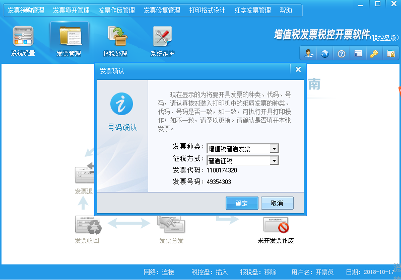

8. 拿出发票单，对准开票号码N49354303,纸质发票也应该是这个号码。

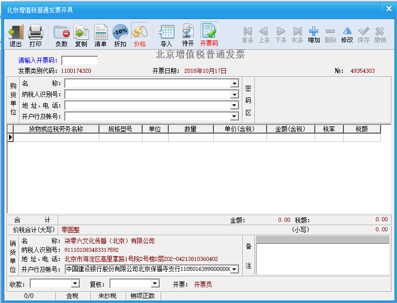

9. 在“购货单位”一栏中录入名称和纳税人识别号，录入完后需要核对是否输入错误。

10. 在货物或应税劳务名称中点击三个点

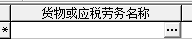

11. 出现该界面后点击生活服务中的“文化体育服务”，点击后的右边栏里有文化服务，双击

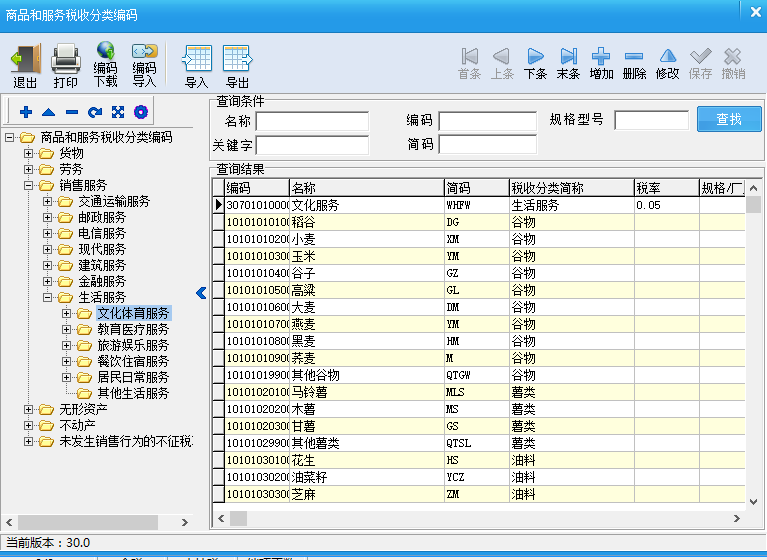

12. 双击后该框会出现“生活服务*文化服务”，接着在该界面中录入“单价”和“金额”。

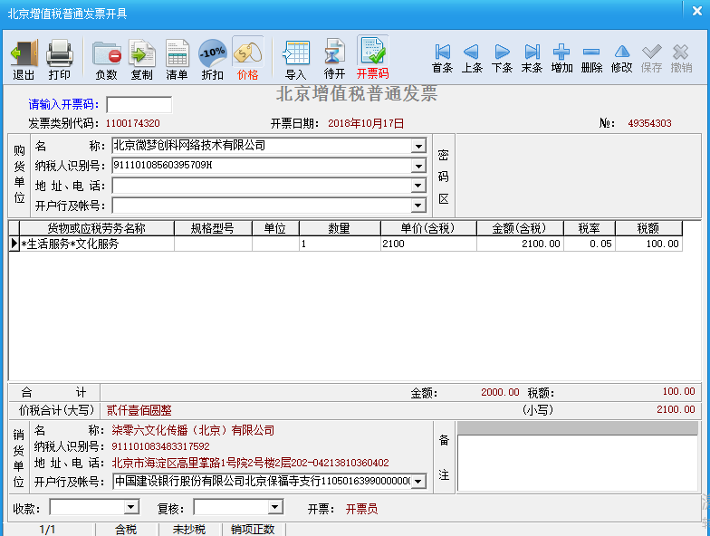

13. 将与上述发票号码“N49354303”一致的纸质发票撕下，放入打印机内。

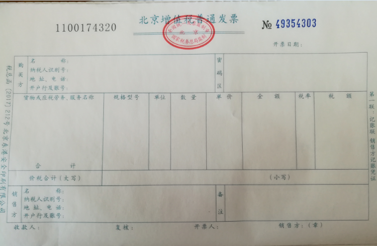

14. 最后再确认下名称和纳税人识别号是否有错误，没有错误则可以点击最上行中第二个“打印”进行打印

### 706开票信息

名称：柒零六文化传播（北京）有限公司

纳税人识别号：911101083483317592

地址：北京市海淀区高里掌路1号院2号楼2层202-042

开户行及账号：中国建设银行股份有限公司北京保福寺支行11050163990000000111

住客开票格式：

## 5 圆通韵达快递

北京同城第一公斤6块，第二公斤4块

外地 第一公斤8块，第二公斤6块（除海南、甘肃、宁夏、云南、广西、贵州、青海、西藏、新疆除外）

手机识别二维码可下单，会有快递小哥上门取件的。

韵达寄件二维码：

圆通寄件二维码：

  

# 706工程部

706工程部工作内容及做事流程【暂定】【试行】

注意：做事之前，一定要注意安全，绝对安全，怎么强调都不为过.

706工程部隶属于空间运营，做的是706基础设施的安全施工与维护工作，解决706各个空间里的软硬件故障，工作内容包括但不限于：

一、网络安全与设备维护【光猫、路由器、集线器、AP控制器、网络服务器、AP、监控系统等】；

二、电力安全与设备维护【配电箱、空开、照明开关、插座、插座转接头、插线板、电线等】；

三、燃气安全与设备维护【燃气阀、燃气表、壁挂炉、燃气灶、燃气管道等】；

四、用水安全与设备维护【包括壁挂炉、热水器以及自来水管道、空调管道等】；

五、门锁以及密码锁安全与设备维护【门锁、密码锁、球形锁、插锁等】；

六、床铺设施安全与维护【上下铺、沙发床、单人床、行军床等】；

七、用电设备安全与维护【照明、空调、电脑、打印机、电热水器、电冰箱、洗衣机、电饭锅、电磁炉、电热水壶，投影与幕布等】；

八、空间其他硬件与维护【墙体防水、墙体修复、桌椅、衣架衣柜、书柜等】.

以上，是706工程部所辖工作内容.

706工程部工作流程：

A.首先，住客或者工程部发现问题，报修；

B.工程部先行评估，预算投入时间和资金，酝酿解决方案；

B1.事件涉及其他相关部门的首先进行部门间沟通，综合考虑，制定相对全局化、长远化实施方案，并随时反馈沟通。

C.采购原材料【现有就用】，并且通知相关人员和住客何时何处施工，然后，试着按照既定的方案解决问题；

C1.相关施工一定尽早通知住客处理个人物品，如有必要前期还应咨询调研相关长期住客。

D.问题解决之后，发通知告知相关人员和住客，何事已经完成；

E.问题未解决，则或者经由失败总结经验，重新拟定解决方案，或者呼救外援，找专业人员解决；

F.工程部每日工作内容做好记录，写入相应石墨文档，以备查询，工作内容记录格式：何日处理何种事宜；

G.工程部每个月月初可以从小管家财务那里预支5000元【资金池】，需要缴上上个月报销账目，备案；如果事项超支，且紧

**燃气灶维修**

故障描述：打不着火

1. 没有燃气：请小管家NFC充值；

2. 没有火花：更换电池；

3. 有了火花，仍然点不着火：

a. 清理燃气灶气孔，恢复正常供气；

b. 检查燃气灶打火针和感应针，重新打磨清理感应针；

4. 有了火花，以上清理完毕，可以点火，持续不久，自行熄灭：

a. 重新调节燃气电磁阀门

b. 或者请师傅更换燃气电磁阀门.

**本部图书馆地板边缝线维修**

本部图书馆地板边缝线短期内再次固定原因之一为图书馆活动较多，特别是凳子拖动时会卡住并使之松动、崩起。

解决方案：目前用透明胶带将其保护固定，观察效果。

**门锁维修**

遇到故障时，首先排除电池及密码因素！！！

1.输入正确密码后有时打不开门，需要多次重复尝试。

可能因素：电池电力不足。

解决方案：用螺丝刀打开电池盖，更换电池。

2.按密码后门锁无反应，一直为黑屏状态。

可能因素：电池松动。

解决方案：用移动电源及数据线与电子锁连接供电，先打开门。用螺丝刀打开电池盖，调整加固电池。

3.可更换密码的电子锁（华清甲15）无需密码也可直接打开。

可能原因：密码设置故障。

解决方案：重新设置密码。

**壁挂炉维修**

1.无热水供应。

1.1 没有燃气：请小管家NFC充值；

1.2壁挂炉没有启动：重复开关数次，然后重启。

2.热水供应不足，时断时续。

2.1壁挂炉水压不足：底部水压棒左旋为放水加压，水压表加至刻度1-1.2左右，然后向右旋回。

**抽油烟机噪音**

1.打开后发出金属摩擦似的噪音。

2.抽油烟机墙壁固定装置是否松动，导致转轴不能保持平衡或产生共振。

解决方案：墙壁固定螺丝加固。

**暖气开通季节相应注意点**

1.壁挂炉地暖模式开启，并检查壁橱内相应分水阀是否打开。

2.壁挂炉水压注意经常检查，保持在1pa以上，多注意燃气值，提前充值保证供暖。

3.暖气片供暖的空间（东升园、富润）冬季供暖时候注意进行暖气片的排气处理。

如果简单排气后效果不佳，则升级版:先把家中暖气片的出水口关闭，入水口打开，然后按照热水进屋顺序，每个暖气片放气到排气阀门出水。当最后一组暖气片放气结束后，再打开出水口阀门，这样才能将存气排干净。

4.本部二楼男生间屋内储物室壁挂炉为二楼地暖供应，有些分水阀暂时不能打开，会漏水。

|**本部阳台工具柜（1-4为自上而下排序）**|    |    |    |    |    |
| ---- | -------- | ---- | -------- | ---- | -------- |
| 坐标 | 工具大类 | 坐标 | 工具大类 | 坐标 | 工具大类 |
|左1|插排、插座、淋浴配件、空调挡风板|中1|螺丝盒子、密封胶/枪、角向磨光机（砂轮切割机）、充气枪|右1|门锁、铁架、工程钻机|
|左2|锯子、钉子、刷子、刷轮、砂纸|中2|电锤（常用）、降噪门贴、淋浴配件、热封器|右2|监控摄像头、电源线|
|左3|网线（小段）、装饰灯（长串）、塑料管道加热器、鼓风机、小取暖器|中3|无线路由器、电钻、石材切割机、淋浴配件|右3|探照灯、床头灯|
|左4|装修材料（瓶装、袋装粉）|中4|电钻、花生食堂闪光牌|右4|网线（大段）、通气管路（卫生间用）|
|**办公室内工具柜（1-4为自上而下排序）**|    |    |    |    |    |
|1|钻头、螺丝刀、钳子、剪刀、壁纸刀、手电筒、锤子、扳手、螺丝盒子（常用）|    |    |    |    |
|2|胶带、润滑剂、尺子、灯泡（常用）、万用电表、手套|    |    |    |    |
|3|空调清洗剂、电磁炉线、电缆线、VR眼镜、钥匙|    |    |    |    |
|4|电保护开关、钥匙、706卡片、精密电子元件工具|    |    |    |    |
|    |    |    |    |    |    |
|PS|更新日期：20181003|    |    |    |    |

### 规则补充

一次性用品成套（拖鞋*1+沐浴露*1+洗发露*1+牙具*1+肥皂*1），每套售价为五元。          

**杀虫资料**

[https://www.zhihu.com/question/21536977](https://www.zhihu.com/question/21536977)

