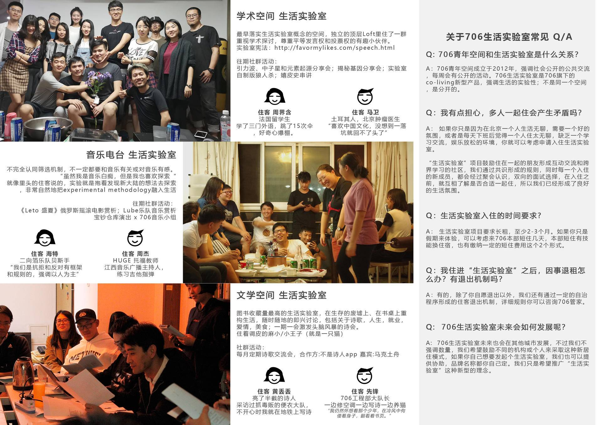
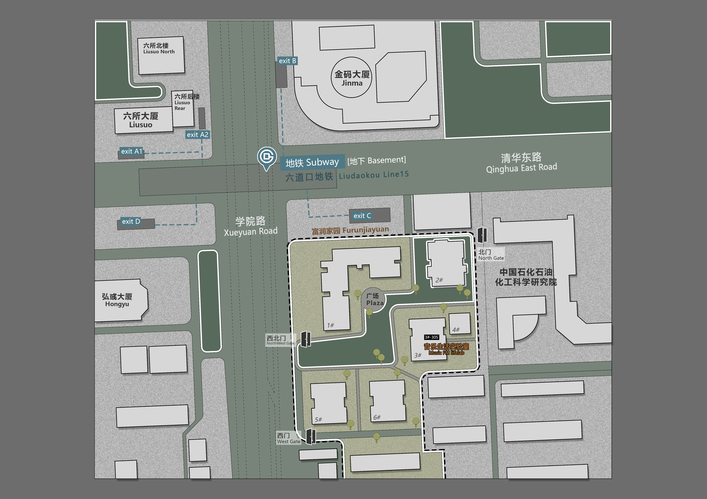

# 1）宣传手册

其中包含：

1. 生活实验室理念 [（706生活实验室手册（凡泛版）](https://shimo.im/docs/ifkE709f6hE8QDfB)

2. 生活实验室空间图片 + 介绍 

3. [生活实验室_small (updated 20181013).pdf](https://attachments-cdn.shimo.im/cPJUqoVGjxAvF2cc/生活实验室_small_updated_20181013_.pdf?fileGuid=x7Iy0X2gbiIHTxxU)住宿价格，住宿咨询，常见问答 

三折页模板：

### 生活实验室介绍

1. 706 本部 空间

**/文字介绍/**

周末经常举办讲座、沙龙、工作坊、夜聊、桌游等活动，人员流动大，吵闹，适合不介意吵闹、爱好社交、积极参与活动人员。

**/人物介绍/**

尼克拉：乌克兰小哥，逢人过招酒量和棋艺

小艺：全球知识雷锋执行主编

雨彬：法国留学生，从事教育相关

**/活动介绍/**

2. 1805 | 706 附属空间

**/文字介绍/**

阿姨中午在这里为工作人员及住客做午饭，社群人员在这里聚餐的空间，较吵闹，适合喜爱与人一起做饭，积极社交，不介意被聚餐打扰的人员。

**/人物介绍/**

榛子：歌德学院

某男：剪辑奇葩说

**/活动介绍/**

包饺子活动，寿司活动，外国小哥准备家乡菜

3. 503 | 会所

**/文字介绍/**

客厅有大沙发，投影幕布，适合爱好电影放映人员居住，也有厨房可做饭。

**/人物介绍/**

顾梦澜 monica :

光斌：

**/活动介绍/**

生日聚餐，电影放映

4. 1007 | 私密空间

**/文字介绍/**

空间活动比较少，较安静，适合考研、作息规律的住客。（优先长租）

**/人物介绍/**

郭霆佑：台湾人，目前在清华做研究助理，发起活动：如何做一份好的履历表

江又禾：创作歌手

**/活动介绍/**

# 2）服务手册

### 原有文件：

[服务手册3.3.pdf](https://attachments-cdn.shimo.im/MFG8nC4IPCsBOUVT/服务手册3.3.pdf?fileGuid=x7Iy0X2gbiIHTxxU)[706 hand book translation.docx](https://attachments-cdn.shimo.im/OXgy0a9j0OMPemsv/706_hand_book_translation.docx?fileGuid=x7Iy0X2gbiIHTxxU)[Handbook+English+Kondi version.docx](https://attachments-cdn.shimo.im/hjiaAyS0660PYaGo/Handbook_English_Kondi_version.docx?fileGuid=x7Iy0X2gbiIHTxxU)

## + 增加 交通指南（五道口篇）

### 1) 如何抵达706 ？How to reach us ?

从机场 from Beijing Capital International Airport 

1) city bus 机场大巴 0650am - 0100am

airport departure point : T3 1st floor exit 7/9 ; T2 1st floor exit 11

arrival point: take the 中关村 ZHongguancun line, get off at 清华科技园 qinghuakejiyuan

price 价格 : 30RMB 

2) Subway 地铁 0620am-2250pm

airport departure point : T3 2nd floor; T2 2nd floor

interchange at 三元桥sanyuanqiao (line10) - 知春路zhichunlu (line13) - 五道口Wudaokou (final destination）

price 价格 :25RMB 

3) Taxi 出租车/滴滴 24 hours

address : 海淀区中关村五道口华清嘉园东门 Haidian district Zhongguancun Wudaokou Huaqingjiayuan East gate

Landmark 地标 :  

price 价格:150RMB

## +增加 入住指南

+ 

确认入住时间，管家值班时间

1. 前台办理入住：

2. 身份号核对

3. 缴费房费&押金

4. 领取门禁卡（另缴押金50），三件套

+ 空间图片（尤其住宿睡觉空间）

参考：

[「房子是租來的，但生活不是」：「玖樓」打造共生公寓，讓青年住進有生命力的空間 _ 社企流 _ 華文界最具影響力的社會企業平台 Social Enterprise Insights.pdf](https://attachments-cdn.shimo.im/FklmvGa52FQBrSzz/_房子是租來的_但生活不是_玖樓_打造共生公寓_讓青年住進有生命力的空間_社企流_華文界最具影響力的社會企業平台_Social_Enterprise_Insights.pdf?fileGuid=x7Iy0X2gbiIHTxxU)

